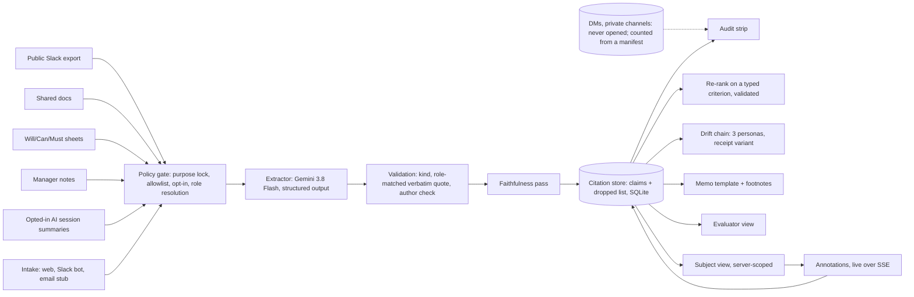

# PRD: Receipts, the evidence layer for people decisions

Working title **Receipts**. Team hyderabaddies: Carl Kho, Steven Yang. Recruit Innovation Cup 2026, San Francisco (DG717). **v2**, Sat Sep 26 2026, ~07:15 PDT, by Claude (Fable 5.1) in Steven's session. v1 (Sat ~04:00) was reviewed by fifteen independent verifiers on PR #3; v2 folds in every finding (list in [sync.md](sync.md) §K) and deepens the build spec. Companion file: [sync.md](sync.md) holds the reasoning behind every decision here, with evidence pointers, so nobody has to re-derive it.

---

## 0. How to read this document

- **Purpose.** Anyone can build, demo and pitch this product from this file without asking a question. If something is missing, add it here, not in chat.
- **Deadline.** Sunday Sep 27, **11:00 AM PDT**, posted in Slack `#announcements-all`: (1) public GitHub repository link, (2) demo link or video **≤ 90 seconds**, (3) deck as PDF. No changes after; late is disqualified. Preliminary pitch Sun 1:30–2:45 PM (**3 min + 1.5 min Q&A**, all teams, order announced Sat 6:30 PM). Final Sun 3:10–3:55 PM (**6 min + 6 min Q&A**, three teams, same slides allowed with more detail, **no setup time after prelim results**). Stage logistics from the deck: prepare your PC in advance, monitor below the stage, wait behind the judges during the previous team, mic and clicker in the final, bring your own PC. Source: Day 1 deck pp17–19 (`codex-packet/work/event.txt`).
- **Rubric.** Potential Impact 40% (social impact and business potential together), Creativity & Innovation 30%, Technical Architecture 30% ("PoC shows that the key technical idea works", "clear path to making the solution work in practice"). Deck p14.
- **Number labels.** The organizer template (slide 05) requires every number to carry one of four labels and its "inputs × method × source × assumptions". This document uses the same labels everywhere: **VERIFIED** (we observed or measured it ourselves; an interview statement carries its transcript timestamp), **RESEARCH** (a published source, with URL), **CALCULATED** (formula shown, inputs labelled), **ILLUSTRATIVE** (assumed, and the slide says so).
- **Organizer rules that bind this document.** "No personal information in prompts" and "Don't reuse AI-suggested ideas as-is" (Day 1 deck p27); "no code written before the Opening Ceremony" (p15, the one rule the deck ties to disqualification); "disclose substantial third-party components in README" (p15). Consequences: every demo person, message, document and company is invented (our rule, adopted to satisfy p27 and the customer's accountability norm); the scripts in §9 are **drafts for you to rewrite in your own words before you say them**, the innovation frame is Steven's own, and the product decisions are yours; nothing in `prototype/` or the product repo predates Friday 5 PM.
- **Who does what with other people.** Every message to the VP, Shion, mentors, organizers or judges is a draft until Carl approves the exact text. **Carl posts the submission; no agent submits.** (Runsheet and HANDOFF ground rules.)
- **Public-repo rule.** This research repository (`syang0624/hyderabaddies`) is public at the time of writing. Facts and figures the VP gave us in a private, late-night, interpreted conversation are referenced here by transcript timestamp and a placeholder tag, and are **not restated** until he or Shion clears them (§15.3). The tags: `[VP-FIG-1]` per-person cost of the exchange, `[VP-FIG-2]` the replacement-budget figure, `[VP-FIG-3]` the first-line-manager population, `[VP-FIG-4]` years of data, `[VP-FIG-5]` the skill-tag count and scale, `[VP-FIG-6]` his organization's size, `[VP-FACT-1]` an internal data-use matter, `[VP-FACT-2]` an internal product attempt, `[VP-FACT-3]` an AI-screening fairness example; each is indexed with its timestamp in `sync.md` §E. Nothing about the FACTs, and no FIG value, goes into this file, README, deck, video, fixtures or code comments. Self-check before any push: `grep -nE '2 ?億|200 million|100 million|1 ?億|800 (skill|tag)|3,?000 first|executive-only|not told|言ってない' PRD.md sync.md` must return only the line that contains this command.
- **Conventions.** "VP" = Hidetoshi Ebina, VP and Head of the HR Centre of Excellence at Recruit Co., Ltd. (organizing team; his name is never spoken on tape, his role is: "Center of Excellence HR" `[R 0:00:55]`). `[R h:mm:ss]` = offset into `interviews/5_VP_MEETING_TRANSCRIPT_RECONCILED.md`; the recording started at about 00:09:40 PDT Sat, so wall-clock ≈ 00:09:40 + offset. `[2_shion_20-40-00 03:13]` = raw interview file in `interviews/raw/` and its own offset. Japanese quotes are the VP's words; the English after them is a translation, not the in-room interpretation, unless marked.
- **What "evidence layer" means here.** The phrase was coined by the summarizing agent at ~01:30 Sat as an inference; on tape the nearest words are Carl's "collects all of the evidence" `[R 0:55:30]` and Shion's rendering 「決定の根拠にするとか」 ("as grounds for a decision") `[R 0:56:18]`. We use it as the product's job, not as something the VP said.

---

## 1. The product in one paragraph

**Receipts** is a purpose-locked evidence page for one high-stakes people decision. For each person being considered, it assembles what they themselves wrote (**declared will**), what they chose to do (**revealed will**) and what their manager wrote about them (**the paraphrase**), from sources a policy file explicitly allows, and turns them into short claims that each carry a verbatim receipt from a named source. The evaluator reads the evidence against a criterion typed in her own words; the person being evaluated sees the **same evidence** and can add context or contest a line before the decision is made; the decision memo carries every footnote and an audit strip of what was read and what was never read. **No score is presented as a verdict; a human decides.** The demo decision: an HR planner at a fictional Japanese company choosing one of three people for a two-year overseas exchange. It is reachable from Slack (a real bot, shown live in the final), by email (an interface with a working local stub), and on the web (the page itself), so nobody has to open yet another system to start. The longer arc: this is the first module of an evidence-first HR operating system, with a 2050 epilogue where the same page and the same rules cover a mixed workforce of humans and humanoid workers.

One sentence for the deck: **evidence, with receipts, that both the evaluator and the employee can see, for one high-stakes people decision.**

---

## 2. Problem definition

### 2.1 The decision, and how it is made today

**The decision.** Who goes on the two-year exchange between the Japanese parent company and its US partner. It is expensive, it is a two-year commitment, and it changes a career. The VP named the exchange himself as the company's main tool for merging two opposite working cultures `[R 0:13:48–0:19:11]`, gave its length as two years `[R 0:20:51]` and its per-person cost `[VP-FIG-1, R 0:20:57–0:21:03; not cleared]`. The demo company's version, "exchange-2027, one slot at the US partner Northwind Labs, starts April 2027", is fictional and keeps that shape.

**How it is made today, in the VP's own account.**

| Step | What happens | Source |
|---|---|---|
| Twice a year, each employee fills a **Will / Can / Must** sheet under the MBO process, discusses it with their direct boss, and HR sees it | The only structured input about what a person wants | Shion `[R 0:29:58–0:30:24, 0:51:14]`; VP: "MBO system" `[R 0:30:03]` |
| "Will" has **no metric**; HR "always asks" | 「ない、ないね。ただ、常に問うようにはしてます。」 | VP `[R 0:29:38–0:29:43]` |
| Matching people to roles ran on **human intuition**; HR is now trying AI-generated skill tags to support it | 「人の勘でマッチングしてたところを…AIで今補助しよう」 | VP `[R 0:31:30–0:33:24]`; count and scale `[VP-FIG-5]` |
| The boss's paraphrase travels up; HR interviews the person directly to catch drift and negotiates with a boss who does not want to lose them | 「2 つ目の問題を防いでます」 | VP `[R 0:35:16–0:35:57]` |
| No evaluation input other than the boss exists today | 「今はない。」 | VP, answering Carl `[R 0:41:49]` |
| Using workplace data beyond the boss's evaluation is limited today by accountability to employees, not by law | 「理屈上は使えます…説明責任、透明性」 | VP `[R 0:44:24]`; internal specifics `[VP-FACT-1, R 0:48:06–0:55:14]` are not for public artifacts |

**Why this decision and not another.** It is the one people decision the VP quantified, it is made rarely enough that a purpose-locked page is credible (not a standing profile), and it is where the paraphrase problem bites hardest: the boss who writes the note is the boss who loses the person.

### 2.2 The four pains, each with its evidence

| # | Pain | Evidence (who said it, where) | Product mechanic |
|---|---|---|---|
| P1 | **Will is invisible.** The company cannot see what people want to do; it asks twice a year and remembers. | VP: no metric `[R 0:29:38]`; the biggest management topic is which careers and team shapes reach an organization nobody can yet describe `[R 0:26:32–0:26:47]`; teams must form around people who "really want to do this" 「合理的じゃないこと」 included `[R 0:24:36–0:25:10]` | Declared will (the sheet, in the person's words) next to revealed will (what they volunteered for), each with receipts |
| P2 | **Meaning drifts up the chain.** A person's words are paraphrased at every level; HR's only defense is to interview the person again. | VP: 「どっちもそうです」 to the two-gaps framing `[R 0:34:48]`; HR's workaround `[R 0:35:36–0:35:57]`. Note: the framing and the "Shion → loves flying → Saudi Arabia" example were Carl's `[R 0:34:00–0:34:54]`, so this is a led confirmation plus an unprompted description of the workaround | The paraphrase is shown beside the source, never instead of it; the drift chain makes the loss visible |
| P3 | **Evidence exists but cannot be used.** Slack and documents could show whether the boss's rating is right; the blocker is not law but accountability and "creepiness" toward employees. | VP: 「ポテンシャリティとしてはすごくあると思ってる」 `[R 0:42:26]`; 「理屈上は使えます…説明責任、透明性」 `[R 0:44:24]`; 「すげえ気持ち悪ぃ」 `[R 0:55:14]` | Purpose lock, allowlisted sources, DMs excluded by config, the audit strip, and the two-sided mirror |
| P4 | **A wrong AI output can push a wrong promotion or transfer.** | VP: the thing he most wants to avoid `[R 0:48:34]` | No score as verdict; claims dropped when unsupported; the subject can contest before the decision |

### 2.3 Five load-bearing passages, three readings each

This was a 72-minute conversation after midnight, interpreted consecutively and only partly, with several of our questions never translated before he answered. Steven's instruction for this document: put the alternative readings side by side; do not take the convenient one. The full ledger is in `sync.md` §E; here are the five that carry the product.

| Passage | Reading A (strong) | Reading B (moderate) | Reading C (weak) | What the product bets on |
|---|---|---|---|---|
| 「それが一番困ってる」 `[R 0:26:10]`, "Yes, exactly" `[R 0:26:30]` | Operational team formation under blurred roles is his number-one problem | The problem is strategic: what the ideal organization is and which careers lead there; "allocation" was Steven's word, untranslated | Conversational agreement with a laugh to an English framing | **B.** The product serves one decision inside that strategic problem; it does not claim to form teams. Against C: he had steered to this topic himself `[R 0:23:12]` and called it the hottest management topic unprompted |
| 「どっちもそうです」 `[R 0:34:48]` | Both gaps (gut feel; drift up the chain) are live pains | Both are true in principle, and HR already mitigates the second by interviewing the person | Polite agreement to a two-part leading question | **B.** Drift is real and has a manual workaround; Receipts automates the workaround (the person's words travel intact) rather than claiming HR is helpless |
| "That's right" `[R 0:31:27]` after Shion's 「思いついた順」 | Matching from memory is today's pain | The problem is known and the skill-tag system already targets it, so we must beat the internal tags | Assent to a leading 「…しかないんじゃないか？」 | **B.** We adopt their taxonomy as the schema and add provenance; we do not claim they have no system |
| The endorsement `[R 0:56:18–0:56:43]`: Shion 「決定の根拠にするとか」, VP 「めちゃくちゃあると思う」, "It's very good value, I think so", then `[VP-FACT-2]` | Evidence as grounds for decisions has high value to him | The value is real, and we would not be the only supplier | A courteous close at ~01:05 after an hour | **Between A and B.** The only idea he endorsed on value; no pilot commitment exists ("would be willing to try?" was never translated). The difference we must show is the employee's side of the page, which nothing he described has |
| The replacement-budget passage `[VP-FIG-2, R 0:37:33–0:40:16]` | Willingness to pay for a team-formation tool | A replacement budget: he would bet his current Japan spend on training systems plus matching AI only if the product replaced all of it | A hypothetical price with no time basis, said right after "I've heard this before" 「聞いたことある話ですね」 and before "many players, Workday" | **B.** Use it only as "the customer already spends on this category", label the time basis unconfirmed, never as our revenue, and only if cleared |

### 2.4 What we supplied and he agreed to (do not present as his findings)

Led by us and confirmed with a word or two: matching from memory `[R 0:31:05–0:31:27]`; the two gaps `[R 0:34:00–0:34:48]`; "allocation" `[R 0:25:27–0:26:10]`; "understand every person, best team for every department" `[R 0:26:22–0:26:30]`; Japan being more AI-averse (「言ってくれてる通り」, "just as you said") `[R 0:10:14]`; legal-first Korea/Japan vs build-first SF `[R 0:45:07–0:45:50]`. Steven's "runs in the background without people knowing" `[R 0:43:40]` and Carl's "more quiet with the data collection" `[R 0:46:33]` were answered, respectively, with the accountability line `[R 0:44:24]` and with a description of internal practice `[VP-FACT-1]`, not with enthusiasm. His own, unprompted: AI dismantling job categories `[R 0:23:16]`; will has no metric; the skill-tag system; the boss resisting transfers and HR negotiating; accountability over legality; the pace judgment 「見極め」 `[R 0:50:22]`; "creepy"; the private/public split for wearables `[R 1:00:26, 1:02:19]`; and, when Carl described an evidence page, his own description of what such a page should look like: a statement about the person, then the exchanges that show it `[R 0:56:39–0:56:43]`, which is exactly the shape of an evidence card.

### 2.5 What is not the problem

- **Tool consolidation.** "Salesforce + Slack + Excel + Gmail in one dashboard" is plumbing, it is common, Workday is entering the space `[R 0:38:58]`, and he has "heard this pitch before" `[R 0:37:33]`. Steven's brief (02:30 Sat) says the same: too common, and it does not beat robotic arms.
- **Recruiting throughput.** Indeed already sells AI sourcing and screening (Recruit Holdings results post, Sep 4 2026, verified). A candidate-summary product is a substitution question waiting to happen.
- **Covert monitoring.** Legal at the company, and it still would not ship, because employees would find it creepy and managers might misuse it `[R 0:44:24, 0:49:34, 0:55:14]`. Both of our covert framings were answered with accountability. The careless version of this product is the default everyone builds.
- **Scoring people.** Indeed's Smart Screening ships a "Smart Fit Score" and says hiring stays a human process. Workday scores. The VP's fear is a wrong score driving a wrong decision. We cite instead.

### 2.6 The bet, in one line

The blocker is design, not data: the same data, shown to both sides with receipts, for one named purpose, is something a one-sided design cannot do and the vendors do not do.

---

## 3. The innovation frame, and the rules it produces

Steven's frame, captured on the glasses right after the meeting (`interviews/6_STEVEN_INNOVATION_FRAME.md`, ~01:30 Sat; attribution inferred, wording may be misheard):

> "Innovation has to be very careful. The way that we perfectly design for the humans." (01:30:08)
> "Innovation is changing the way you think." (01:30:23)
> "I guess we can define innovation as something that works for a company." (01:32:44)

Steven owns the story; Carl reviews it before it is said aloud (01:33:49). Skip the "nukes" line on stage. Steven's own worry, "how this would land with the American audience" (01:30:41), is answered in §4.

**How the frame becomes product rules.** The third column says exactly where each rule is enforced. "Code" means a check that fails closed; "prompt" means the model is asked; "template" means deterministic text. A rule that is only a prompt is listed as such, so nobody claims more than the build does.

| Frame | Rule | Enforced by |
|---|---|---|
| Careful | **No score is presented as a verdict.** Ranking re-orders evidence for a stated criterion; the number is "how much of the evidence bears on the criterion", never shown to the subject, never in the memo, never aggregated across criteria | Code: `scope_ranking` strips `support` for subjects; memo template has no numbers; UI label |
| Careful | **Citations or nothing.** A claim needs a 5–25-word verbatim quote found in the body of a cited item whose role matches the claim's kind; otherwise it is dropped and listed in the visible dropped list | Code: `validate_claim` (§11.4); `RerankOut` validated too |
| Careful | **Purpose limitation.** The page exists for one named decision; the policy's purpose must equal the decision id or the server refuses; closing the decision deletes every derived row for it and blocks reads and writes | Code: purpose lock, `/close` → 410 on all routes under the decision |
| Careful | **DMs and private channels are never read**, by configuration; the audit strip counts them from a manifest the API process cannot rebuild | Code: `Corpus` allowlist; manifest built by a script the API never imports; a test asserts no excluded path is opened |
| Designed for humans | **Two-sided mirror.** The subject sees every claim and every source the evaluator sees about them, can add context or contest any line, and the note lands on the evaluator's side before the decision. The subject does not see comparisons with other people or the support number | Code: server-side scoping by role; live annotations over SSE; banner copy states the boundary exactly |
| Designed for humans | **The person's words travel intact.** Every claim links to the original; the manager's paraphrase is shown next to the source, never instead of it; if a page has a paraphrase but no declared-will claim, the declared column says "no sheet on file" rather than staying blank | Code: `WillStrip` requires both kinds or shows the explicit empty state; role-matched span check |
| Designed for humans | **A human decides.** The memo ends in questions to ask the person, not a recommendation | Template: three fixed open questions built from the claim kinds present; the optional AI summary may add up to three more |
| Changes how you think | **Declared vs revealed will** as first-class kinds, shown apart; revealed requires the subject to be the author | Code: `ClaimKind` + author check |
| Changes how you think | **Borrow the customer's taxonomy** (their skill tags) as the schema and attach receipts to it, instead of inventing a new profile | Code: tag filter to the decision's taxonomy; UI chips |
| Works for a company | **Invisible UX.** Start from Slack or email; the page is where the decision is made, not one more system to log into | Code: intake adapters (§7); Slack shown live in the final |

---

## 4. The cultural insight, and why it lands with each judge

Steven's point in the 02:30 brief: the pitch touches the pain "in a more nuanced way via the cultural differences conversation", and that nuance may open the eyes of the American judges. The inventory below is what we actually have on tape; the columns say who raised it and whether the VP confirmed it, so nobody over-claims on stage.

| Nuance | On tape | Raised by | VP confirmed? |
|---|---|---|---|
| Employees fear AI will take their jobs; management cannot judge the pace | `[R 0:04:16–0:04:34]` | VP | Unprompted |
| Fear of being read and evaluated from Slack; the current work is deciding which data is used for which purpose and announcing it | `[R 0:07:38–0:08:06]` | VP | Unprompted |
| Japan learns from US backlash cases to find how far social consensus allows | `[R 0:15:18]` | VP | Unprompted (his recollection of an Amazon case; do not repeat as fact) |
| **CEO-ship** ("everyone works as if they were the business owner", blurry job boundaries) versus the US partner's job-based, fast-decision model; the two are "opposite" | `[R 0:18:04–0:19:11]` | VP | Unprompted |
| People exchange is the only integration tool the company has found | `[R 0:17:05–0:17:36]` | VP | Unprompted |
| **Accountability and transparency to employees matter more than legality** | `[R 0:44:24]` | VP | Unprompted |
| Company policy would allow using everything; employees would find it **creepy** | `[R 0:54:57–0:55:14]` | VP, after Steven's DM point | Unprompted |
| Private and public talk are mixed; they must be separated | `[R 1:00:26, 1:02:19]` | VP | Unprompted |
| Japan is more AI-averse than the US | `[R 0:10:14]` | Steven | "just as you said" |
| Korea/Japan ask about legal limits first; SF builds first | `[R 0:45:07–0:45:50]` | Steven, Shion | 「そう思う」 |
| A week of travel abroad needs the manager first; a one-hour 1-on-1 runs on personal connection (two examples, not a rule) | `[2_shion_20-40-00 04:06–05:07]` | Shion | Not the VP |
| A formal "data council" meeting must approve any new use of HR data across teams | `[2_shion_20-40-00 02:24–02:54]` | Shion | Not the VP |
| Mentor discovery runs on "human knowledge", asking other HR "do you know this person?" | `[2_shion_20-40-00 01:24–01:54, 06:07–06:27]` | Shion | Not the VP |
| "PM decides, because you can debate all day"; approvals shrinking to "one Slack away" but nobody wants to be the approver | `[1_koki_20-00-00 05:39–07:05; 1_koki_19-56-22 00:36–01:46]` | Koki | Not the VP |

Words that appear nowhere in our evidence and should not be used as observed facts: ringi, nemawashi, hanko, honne/tatemae. The ringi approval survey in §10 is external RESEARCH, cited as such.

**The insight in one sentence for the stage:** in this company the constraint on using workplace evidence is not law or data; it is accountability to the employee, and the version that ignores that cannot ship. So the careful design is not a hedge; it is the only version that can.

**Judge map.** Public backgrounds only (from `codex-packet/work/judges-research.md`, verified Sep 26); nothing here predicts how anyone will judge, and the fictional council transcripts are never to be quoted as a judge's view.

| Judge | Public background | The part of Receipts that speaks to that background | The question to expect |
|---|---|---|---|
| Jim Giles, CTO, Indeed | Led Google Docs/Sheets/Slides/Drive engineering; founded the Workspace AI platform; "how technology can improve the way work gets done" | Grounded citations applied to the HR chain of custody; a product that lives inside existing tools (Slack/email intake) | "How is this not Smart Screening pointed inward?" Answer: it produces receipts for both sides, not a fit score for one |
| Robert Hohman, co-founder and former CEO, Glassdoor | Built a company on making workplace information visible to workers | The two-sided mirror: the employee sees the evidence | "Why would an employer show the employee this?" Answer: because a one-sided design is blocked by exactly that asymmetry (P3) |
| Damien Contreras, Data Cloud Specialist, Strategic AI, Google Cloud | Authored a live Godot + Gemini game demo with a published repo | A live changed-condition demo on Gemini with a visible truth table; DMs excluded by config and counted from a manifest | "Is data collection necessary and proportionate?" (our inferred question, not his stated concern). Answer: purpose lock, allowlist, delete-on-close |
| Ho Joon Cha, Applied AI Architect, OpenAI | May 2026 webinar on workspace agents, approvals, safeguards, governance | The model extracts and explains; software validates, scopes and deletes; the human decides | "What does the model decide?" Answer: nothing consequential; every claim and every ranking row is validated and no ranking is a verdict |

(`PREP-HOJOON-CHA.md` was written before this document; §9.8 supersedes its Q&A table.)

---

## 5. Users and personas

All demo people are fictional and already exist in `prototype/data/company.json`; keep the names **and the ids** so the storylines survive the migration (ids stay `wcm-rin`, `mn-yui`, `sl-023`, `doc-kei-1`, `ses-rin-1`; see §11.2).

| Persona | Who | What they need from Receipts | Demo identity |
|---|---|---|---|
| **HR planner (evaluator)** | Aya Nakamura, HR planner in the COE at Kaede Works. Owns the exchange decision. Today she has three Will/Can/Must sheets, three manager notes and what she remembers. | See each person's own words next to the manager's paraphrase; read the evidence against the criterion she actually has; take one page into the decision meeting with receipts; know what was and was not read. | `aya`, role `evaluator`; token generated at `make seed` (never a guessable default) |
| **The subject** | **Rin Mori** (senior marketing analyst, Growth, manager Hayashi, 6 years). Her sheet: "Lead the Tokyo pricing analytics team next year and build the junior analyst program. I would like to stay close to the Japan market for the next two years." Her manager's note: "Rin is our strongest analyst and presents well. Would represent us well overseas. Ready for a bigger stage." Her public words: "Thanks, though I'd rather build the team here first." **Yui Sato** (product operations, Pricing, manager Okada, 3 years). Her sheet: "I want to work with the US product team on pricing experiments. My spoken English in meetings is weak but my writing is strong, and I want to fix the speaking part by being immersed." Her manager's note: "Yui loves travel and is flexible on location. English is a concern for a US posting." She volunteered for the partner's notes, ran six weeks of English practice, then ran a partner sync in English. **Kei Tanaka** (software engineer, Platform, manager Fujii, 4 years). His sheet: "I want to understand why our partner ships faster than we do and bring that back. I am less interested in a bigger title than in changing how we work." His manager's note: "Not sure he wants to move. Key person for the migration, hard to release." He pushed back on a job-based reorg and ran a one-owner pilot that cut lead time from 6.1 to 3.4 days. | See exactly which claims and sources the evaluator sees about them; add context or contest a line before the decision; never see a number about themselves or anyone else, and never see other candidates. | `rin` / `yui` / `kei`, role `subject`; tokens generated at seed |
| **Line manager** | Hayashi, Okada, Fujii. Author the paraphrases. | See their own reports' pages; understand that their note is shown next to the source, not instead of it. (Read-only in the demo.) | role `manager` (optional) |
| **Executive sponsor** | The VP (real): runs HR strategy, systems, payroll and recruiting for his organization `[VP-FIG-6, R 0:00:47–0:01:27]`; decides the pace of AI rollout; blocked by accountability to employees. | A version of his own idea (statement + the exchanges behind it) that he could show to a first-line manager and to the employee without it being creepy. §9.6 gives him a six-step card. | Not a demo identity |
| **Recruiter (roadmap)** | Shion (real): assembles candidate dossiers for engineer mentors by exporting Salesforce to Excel and using corporate Claude; finds mentors by word of mouth; a week abroad needed the manager first `[2_shion_20-40-00, 20-50-00]`. | The same engine on a second decision type: "who should mentor these interns", with the mentor's own opt-in and the manager's approval as a first-class step. Roadmap, not Sunday. | None |
| **Observer** | A judge holding the phone or typing on the drift page. | Type a sentence into the drift chain; see the audit strip; hold the phone that shows the subject view (as Rin, with Rin's token). | `obs`, role `observer` (drift + public audit only) |
| **2050 fleet supervisor (epilogue)** | Same Aya, 2050, deciding which humanoid unit to reassign to the Nagoya site. | The same page, with declared capability (the manifest) beside revealed performance (task logs), incident reports as "gaps", telemetry excluded by policy. Seeded and labelled as such (§8.3). | `reassign-2050`, subject `hw-07` |

---

## 6. Jobs to be done and the user pipeline

**JTBD 1 (evaluator):** "When I have to choose one person for an expensive, career-shaping posting, help me decide from what each person actually said and did, so that I am not deciding from a paraphrase, and let me show my reasoning."

**JTBD 2 (subject):** "When a decision about me is being made, let me see the same evidence the decider sees and correct it before the decision, so that a bad summary does not become my career."

**JTBD 3 (sponsor):** "Let me put workplace evidence in front of managers without it being creepy or misused, so that workplace evidence can be used for decisions at all."

### 6.1 The pipeline

```
intake (Slack / email / web)
  → policy gate (allowed sources only; excluded files never opened; opt-in enforced; purpose == decision)
  → role resolution (declared / revealed / paraphrase per item, with the subject's manager's posts as paraphrase)
  → extraction (LLM proposes claims with kind, source ids, verbatim quote; keyword mode builds them from quotes)
  → validation (quote 5–25 words, found in the BODY of a cited item whose role matches the kind; revealed requires the subject as author; drop otherwise, with a reason)
  → faithfulness (Gemini mode: every surviving claim is checked against its cited items; unsupported → dropped)
  → evidence page (evaluator view; subject view scoped server-side)
  → criterion re-rank (support per subject; receipts; full claim order; output validated and repaired)
  → annotation (subject adds context / contests; lands live on the evaluator side)
  → decision memo (footnotes to every source; three open questions; no numbers)
  → audit strip (used / never read from manifest; rules; view events by role; dropped counts by reason; backend per page)
  → close (every derived row for the decision deleted; all routes under it return 410)
```

### 6.2 Sequence: the evaluator starts from Slack (final only; the video starts on the web)

```mermaid
sequenceDiagram
    participant Aya as Aya (Slack)
    participant Bot as Receipts bot (Socket Mode)
    participant API as FastAPI
    participant Corpus as Corpus + policy
    participant LLM as Gemini (Vertex)
    participant Web as Browser (evaluator view)
    Aya->>Bot: /receipts exchange-2027 rin
    Bot->>API: POST /decisions/exchange-2027/intake {channel: slack, action: open_page, subject_id: rin, on_behalf_of: aya}
    API->>API: resolve persona (aya → evaluator); refuse with the purpose message if unmapped
    API->>Corpus: load allowed sources only (dm.json never opened)
    API->>LLM: extract claims (schema ExtractionOut) if not cached
    LLM-->>API: claims with quotes
    API->>API: validate kinds/roles/quotes, faithfulness pass, store
    API-->>Bot: IntakeResult {page_url with aya's token, top_receipts scoped to aya's role}
    Bot-->>Aya: ephemeral card: declared / paraphrase / revealed + "Open evidence page" + "Add context"
    Aya->>Web: opens page_url (LAN address)
    Web->>API: GET page (Bearer aya-token); POST views
```

### 6.3 Sequence: the subject contests a line from a phone

```mermaid
sequenceDiagram
    participant Rin as Rin (phone: web composer in the video; Slack or email in the final)
    participant In as Web page / Receipts bot / email stub
    participant API as FastAPI
    participant SSE as SSE stream
    participant Aya as Aya's browser
    Rin->>In: add context on mn-rin ("Would represent us well overseas") and tick "I contest this reading"
    In->>API: POST /annotations (web, Bearer rin-token) or POST /intake {action: add_context, on_behalf_of: rin, target: mn-rin, contests: true}
    API->>API: scope: rin may annotate only her own page
    API->>API: store Annotation(origin=web|slack|email); append event annotation.created {annotation_id}
    API-->>SSE: event: annotation.created (ids only)
    SSE-->>Aya: client refetches annotations; LiveBadge "Rin added context · 3 s ago"; the note sits beside the paraphrase
```

### 6.4 Sequence: the drift chain

```mermaid
sequenceDiagram
    participant J as Judge or presenter
    participant Web as DriftPage
    participant API as FastAPI
    participant LLM as Gemini
    J->>Web: pick a seeded example (subject + source) OR type a sentence (no source; "typed" mode)
    Web->>API: POST /decisions/exchange-2027/drift {sentence, subject_id?, source_id?}
    API->>API: if source_id: sentence must occur in that item's body, else 422; if none: mode = typed
    API->>LLM: level 1 persona paraphrase
    API->>LLM: level 2 paraphrase of level 1
    API->>LLM: level 3 paraphrase of level 2
    API->>LLM: receipt framing per level (quote inserted verbatim by code; source chip only in sourced mode)
    API-->>Web: DriftChain {mode, drift[3], receipt[3], lost[], added[], backend}
    Web-->>J: stepper: original → L1 → L2 → L3 with struck words; toggle "Same sentence, with a receipt"
```

### 6.5 Sequence: close

`POST /decisions/{d}/close` (evaluator) deletes every row for that decision in `pages`, `claims`, `dropped_claims`, `rankings`, `annotations`, `view_events`, `intake_requests`, `drift_chains`, `llm_cache` and `events`, removes `state/inbox/handled/<d>-*`, and sets `status=closed`; every later request under `/decisions/{d}/` (GET or POST, including `/admin/warm` for that decision) returns 410 with the retention note from `policy.json`. `make reset` reopens the demo decision by clearing the status. This is purpose limitation as behaviour, not as a sentence on a slide.

---

## 7. Surfaces: the debate and the decision

Steven's constraint (02:30 brief): "One thing I don't want is being yet another app they have to open… Salesforce, everything is already taking their time." His reference: Mercury, where you can categorize in the UI or just forward the bill to an address and it is handled; "great UX is invisible"; and "why choose one or the other? Make it a hybrid."

### 7.1 The debate

| Option | For | Against | Demo risk | Build cost (Sun 11:00) |
|---|---|---|---|---|
| **A. Slack bot only** | Zero new UI; lives where HR already talks (Koki: "heavily use Slack"; Shion asks mentors by DM) | A Block Kit card cannot show three columns of evidence, hover receipts or a drift chain; the decision page has to exist somewhere | Socket Mode needs venue internet to Slack; 3-second ack rule | ~6 h incl. workspace setup |
| **B. Email intake only** | Mercury's pattern exactly; works for people who live in mail; no Slack admin needed | Inbound mail needs a provider webhook or IMAP polling and sender verification; slow to demo; the decision page still has to exist | Low if stubbed; high if real | Stub ~1 h; real ~5 h |
| **C. Web app only** | The page is the product; hover receipts, view flip, animation, drift stepper all need a real UI | It is "one more app"; the pitch loses the invisible-UX line | Lowest | Already required |
| **D. Hybrid (Mercury pattern)** | The page exists once; every intake adapter produces the same `IntakeCreate` and returns a link; starting from Slack or mail costs the user nothing | Three surfaces to keep truthful in the truth table | Slack real-or-cut at Sun 09:00; email stubbed | Web (required) + Slack (~6 h) + email stub (~1 h) |

**Decision: D, with one scoping change from v1.** Build the web page fully (it is where the four wow beats happen). Build the Slack app for real in Socket Mode on a throwaway workspace and **show it live in the final only**; the submitted video's mirror beat is recorded from the phone's web composer, so the video never depends on Slack and never needs a Sunday re-take. Ship the email adapter as a documented interface with a working local stub and a process that runs it. There is **no simulated Slack page**: if the real bot is not posting cards by Sunday 09:00, the final uses the phone's web composer for the mirror beat and the truth table says "Slack: not shown". (v1 had a simulated Slack pane; the review found it created a second build, an impersonation path, and a false "real Slack" label in the video.)

### 7.2 Slack, exactly

- Command: `/receipts <decision-id> <subject-id>` (e.g. `/receipts exchange-2027 rin`). The bot acknowledges within 3 seconds, calls the API's intake endpoint with `decision_id`, `subject_id`, the Slack user id and the mapped persona, and replies with an ephemeral Block Kit card: header (subject and decision), a context line with the purpose and the never-read count, three quoted lines (declared will `wcm-rin`, manager's paraphrase `mn-rin`, revealed will `sl-034`), and two buttons: **Open evidence page** (a LAN URL carrying the acting persona's token) and **Add context** (opens a modal). If the API refuses (unmapped user, or a subject asking for another person's page), the bot replies with the API's message: "This page exists for exchange-2027 and is available to the people in that decision."
- Modal: shows the targeted source's rendered text, a multiline field (max 500 chars), and one checkbox "I contest this reading". Submission becomes an annotation with `origin=slack` and the author from the persona map; the evaluator's browser receives it live.
- Identity: Slack user ids map to demo personas through `SLACK_ROLE_MAP="U0AAAA:aya,U0BBBB:rin"`. **Unmapped users are refused by the API** (the bot only relays the message). **Slack display names are never rendered anywhere**, so a throwaway workspace with real account names cannot leak into the demo.
- The Slack process never writes the database; it is an HTTP client of the API with a service token, so the API stays the single writer and live updates stay truthful.
- Platform facts that shape this: Slack requires an acknowledgement within 3 seconds and allows follow-ups for 30 minutes; internal (non-Marketplace) apps are exempt from the 2025 rate-limit change, so build it as an internal app; do not plan on mining Slack history (that is both rate-limited and the thing the VP called creepy). Sources in `sync.md` §F.
- Manifest, handlers and card JSON: §11.6.

### 7.3 Email, exactly (interface + stub + process for Sunday; transport proposed)

- Address convention: `receipts+<decision-id>+<subject-id>@kaede.example`. Subject line `[receipts] open` or `[receipts] add context: <source-id>` with an optional `!contest` suffix. The first paragraph of the body is the annotation text. Sender maps to a persona via `EMAIL_ROLE_MAP`; unknown senders are rejected with the purpose message.
- Stub: `make intake-watch` runs a watcher over `state/inbox/*.json` that converts a dropped message file into an intake request, posts it to the API, and moves the file to `state/inbox/handled/<decision>-<id>.json`. `make email-demo` creates the inbox if needed and drops a fixture message; the annotation appears live with an "email" origin chip. This is enough to show the pattern truthfully in the final's 6 minutes.
- Real implementation (not built; say "proposed"): Gmail API watch with Pub/Sub push, or IMAP IDLE; SPF/DKIM verification; allowlisted senders (Mercury's approved-vendor pattern); SMTP reply with the page link and purpose text; attachments ignored; bodies never stored beyond the annotation text. The stub keeps handled files only until close.

### 7.4 Web, exactly

Routes and components in §8. The web page is the only place where the drift chain, hover receipts, the view flip and the memo live, so every intake ends in a link to it. In present mode (`?present=1`) the developer chrome is hidden and type is larger for projection. The phone in the demo opens the subject page over the LAN with the subject's token.

---

## 8. UI and UX specification

The current `prototype/ui/index.html` reads as walls of text because each evidence row is a templated sentence wrapping a quoted message with no grouping; the memo is raw markdown in a `<pre>`; the ranking is crammed into a 260 px sidebar; and there is no summary, no hierarchy, and no way to see a source without reading it inline. Everything below exists to fix that.

### 8.1 Design principles for this UI

1. **Summary first, receipts on demand.** A card is one claim of ≤ 25 words; its sources are chips; the source text appears in a popover on hover or focus, never inline.
2. **Three colours carry the meaning**: teal for the person's own words (declared), amber for what they chose to do (revealed), violet for the manager's paraphrase; emerald marks a verified receipt; rose marks a gap or a dropped claim. Nothing else is coloured.
3. **The subject sees the same cards.** The subject view is the evaluator view minus the support number, minus the ranking strip, minus other people, and minus the seeded Can-level numbers; not a different layout.
4. **Copy the patterns that already work**: Granola's two-tone authorship with a per-line provenance icon; Hebbia's source chip per cell; Linear's "why" on hover with accept/dismiss; Rippling's rule that every number links to its record. Sources in `sync.md` §F.
5. **Honest badges everywhere**: which backend produced this artefact (Gemini, keyword mode, or seeded), whether a claim was span-checked and faithfulness-checked, whether an annotation or drift chain is seeded.
6. **Nothing that looks like a verdict.** No radar charts of people, no summed scores, no ranking medals. Support bars are labelled "evidence support for this criterion" and never appear in the memo or to subjects.

### 8.2 Routes

| Route | Page | Who |
|---|---|---|
| `/` → `/d/exchange-2027` | DecisionHome | evaluator |
| `/d/:decisionId` | DecisionHome: purpose banner, three candidate cards, criterion bar, ranking strip, audit strip | evaluator (subjects are redirected to their own page) |
| `/d/:decisionId/p/:subjectId` | EvidencePage | evaluator (all), subject (own only) |
| `/d/:decisionId/drift` | DriftPage | evaluator, observer |
| `/d/:decisionId/memo/:subjectId` | MemoPage | evaluator; subject (own, no numbers) |
| `/2050` → `/d/reassign-2050/p/hw-07` | EpiloguePage (EvidencePage with 2050 labels, a year banner and a "seeded, illustrative" badge) | evaluator |
| Query flags | `?present=1` hides dev chrome and enlarges type; `?token=` sets the viewer for this tab only (sessionStorage) and is stripped from the URL; `?preview=1` marks a window opened by ViewFlip so its view event is recorded as a preview, not as the subject's view | |

### 8.3 Screens (wireframe descriptions)

**DecisionHome.** Top: `PurposeBanner` in one line: "exchange-2027 · Two-year exchange to Northwind Labs, one slot · This page exists for this decision only · Sources: public Slack, shared docs, WCM sheets, manager notes, opted-in AI sessions · Never read: DMs ({n} counted from the manifest), private channels (excluded by policy, not exported)." Middle: three `CandidateCard`s side by side, each with name, role, team, tenure, claim count, backend badge, and a small line "viewed by Rin: not yet" / "viewed by Rin: 13:58, 2 notes" (evaluator only). Below: sticky `CriterionBar` (one input, placeholder "What do you actually need? In your own words.", empty in present mode so the typed criterion is a real live call; a Re-read button). Then `RankingStrip`: three rows, name, a thin bar labelled "evidence support for this criterion (not a score of the person)", one-sentence rationale with claim-id chips, and 1–4 receipt chips; an amber "repaired" note if the model's output had to be fixed (§11.4). Bottom: `AuditStrip`.

**EvidencePage (evaluator).** Header: subject name, role, team, `views` sentence ("Aya viewed this page 2 times, last 14:02. Rin has not viewed it yet. Aya previewed Rin's view once."), a `ViewFlip` button "See what Rin sees" that opens the subject's URL with the subject's token and `?preview=1` in a new window (`noopener`), a real second identity, server-scoped, whose view event is recorded as a preview. `WillStrip`: three columns, one card each: **Declared will (own words)** teal, **Revealed will (what they chose to do)** amber, **Manager's paraphrase** violet; each card is one claim with a `SourceChip` beneath; if a kind is absent the column shows "no sheet on file" / "nothing volunteered in the allowed sources" / "no manager note on file" in muted text. For Rin the strip is the whole argument in one glance: "stay close to the Japan market for the next two years" (wcm-rin) vs "Would represent us well overseas. Ready for a bigger stage." (mn-rin). Sticky `CriterionBar`. `EvidenceList`: one `ClaimCard` per claim in ranking order (FLIP animation on re-rank, 350 ms), each with a kind pill, the claim text, chips, a faithfulness mark (emerald check "verbatim receipt, checked"; amber "partially supported"), tag chips from the customer's taxonomy, an `AnnotationThread` if any (subject notes in violet-tinted cards with an origin chip "web" / "Slack" / "email"), and an inline `AnnotationComposer`. Receipt claims for the current criterion get an emerald left rail and a rank pip. `DroppedClaimsDisclosure`: a collapsed line "3 claims dropped: 1 had no source, 1 cited the wrong kind of source, 1 was not supported by its source" that expands to the struck-through list, because the dropped list is the technical proof. `PageFooter`: backend, model, prompt version, fixtures hash, generated-at.

**EvidencePage (subject).** Same components. Differences, all enforced server-side: only own page; no support number, no ranking strip, no other candidates, no Can-level numbers in popovers; a top banner "This is the evidence page Aya uses about you. You see every claim and every source she sees about you. You do not see comparisons with other people or any number. Add context or contest any line; she sees it before the decision."; the composer is always visible; a "contest" checkbox on each card.

**SourcePopover.** On hover or focus of a chip after 300 ms: the rendered source (`[sl-034] Slack #growth-analytics 2026-08-28 by rin: Thanks, though I'd rather build the team here first.`), date, channel and visibility, an opt-in mark for sessions, and, for the evaluator only, the seeded Can-level for the tag in question (the only place a 1–5 number appears; never summed; never shown to subjects). Click pins the popover and highlights every claim citing that id.

**DriftPage.** `DriftInput`: three example chips (one per candidate, each a sentence that occurs verbatim in that person's sheet), a text field (8–300 chars) for a typed sentence, a Run button. In typed mode a one-line notice above the field: "Typed sentences go to the model and are kept until this decision closes. Do not type anything about a real person." `DriftStepper`: four cards left to right: **Original** (green; source chip in sourced mode, "typed" tag otherwise), **L1 team lead, weekly report line**, **L2 department manager, headcount note**, **L3 division head, slide label**; each shows the persona title, the one-sentence paraphrase, and a `WordDiff` with dropped words struck in rose and added words in amber; beneath, `LostAddedSummary` (for Rin's example: "Lost: stay, close to the Japan market, two years, lead, junior analyst program · Added: flexible"). A toggle **"Same sentence, with a receipt"** re-runs the stepper in receipt mode: at every level the original sentence sits in green quotation marks (with its source chip in sourced mode), with only the persona's framing around it. Badge: "Gemini 3.8 Flash, 6 calls" / "cached earlier (Gemini)" / "simulated (no LLM)".

**MemoPage.** Rendered markdown (react-markdown + remark-gfm; footnote definitions are included in the markdown so markers render, and the UI also turns them into `SourceChip`s) as cards: Decision and purpose; Declared will; Revealed will; Manager's paraphrase (beside the source); Strengths; Gaps; Notes from the person (annotations, with origin); Three questions to ask them (templated); optional "AI summary from the claims above (Gemini)" ≤ 60 words, no numbers, with up to three more questions; What was read / never read; Views. Buttons: copy as markdown, print.

**AuditStrip.** One row of small tiles, scoped by role: Purpose; Policy version; Used sources with counts from the loaded corpus (e.g. "Slack public: {n}", "WCM: 3", "Sessions: {opted_in} of {n} opted in"); Never read with counts and "counted from manifest, sha {prefix}" (private channels: "excluded by policy, not exported"); Rules (five one-liners); Views per role (evaluator sees all; a subject sees only their own page's line); Dropped counts by reason; Backend per page; Retention note.

**EpiloguePage.** The same EvidencePage components with labels from `reassign-2050`: "Declared capability (manifest)", "Revealed performance (task logs)", "Supervisor's note", "Strength", "Incident"; a banner "Kaede Works, 2050. Unit HW-07. Same page, same rules."; a persistent badge "seeded, illustrative: these claims were written by the team, not extracted"; sources listed as capability manifest, task logs, maintenance logs, incident reports, supervisor notes; excluded: `telemetry_private.json` (never read, counted from the manifest). It is a static page rendered from `seed/claims.json` through the real components; it does not run the extraction pipeline (§14.3 says why that is fine).

### 8.4 Component tree (props)

- `AppShell{children}`: header with product mark, decision title, `BackendBadge{health}`, `ViewerSwitcher{viewers, current, onChange}` (dev only; hidden in present mode), `EpilogueToggle{active}`.
- `DecisionHome` → `PurposeBanner{decision, policy, audit}`, `CandidateRow{subjects, pages, views}` → `CandidateCard{subject, claimCount, backend, viewedBySubject, onOpen}`, `CriterionBar{value, onSubmit, pending, lastRanking}`, `RankingStrip{ranking, subjects, repaired}`, `AuditStrip{audit}`.
- `EvidencePage` → `SubjectHeader{subject, labels, views}`, `WillStrip{declared, revealed, paraphrase, labels}`, `CriterionBar` (evaluator only), `EvidenceList{claims, order, items, annotations, highlightIds, onAnnotate}` → `ClaimCard{claim, rank, isReceipt, faithfulness, annotations, onAnnotate}` → `SourceChip{sourceId, item}` + `SourcePopover{item, tagScore?}`, `AnnotationThread{annotations}`, `AnnotationComposer{target, onSubmit, canContest}`, `LiveBadge{count, pulse, lastFrom}`, `ViewFlip{subjectId, subjectToken}`, `DroppedClaimsDisclosure{dropped}`, `PageFooter{backend, model, promptVersion, fixturesHash, generatedAt}`.
- `DriftPage` → `DriftInput{value, mode, onRun, examples, onPickExample}`, `DriftStepper{chain, mode, step, onStep}` → `WordDiff{before, after}`, `LostAddedSummary{lost, added}`.
- `MemoPage` → `MemoView{markdown, footnotes, summary}`, `MemoActions{onCopy, onPrint}`.
- `EpiloguePage` (EvidencePage + banner + seeded badge).
- Shared: `Skeleton`, `EmptyState{title, hint}`, `ErrorState{error, onRetry}` (on `llm_unavailable` in `MODE=auto` offers "use keyword mode", which retries with the `X-Allow-Heuristic: 1` header; in `MODE=gemini` it shows the error and no retry), `Toast`.

### 8.5 State and data

TanStack Query for all server data (`api/queries.ts`: `useDecision`, `usePage`, `useRanking`, `useAnnotations`, `useAudit`, `useDrift`, `useMemoDoc`). `ViewerContext` (`state/viewer.tsx`: token, role, present) held in **sessionStorage**, so a second window with `?token=` never overwrites the first window's identity. `useDecisionEvents(decisionId)` (`api/sse.ts`) opens one `EventSource` per decision; events carry ids only and the client invalidates `['page', d, p]`, `['annotations', d, p]`, `['ranking', d]`, `['audit', d]` and refetches through the scoped routes; the server sends `id:` lines so reconnects resume via `Last-Event-ID`; a 10-second poll on annotations is the fallback so the live badge never depends on SSE alone. Types come from the API's OpenAPI (`make types` → `web/src/api/schema.d.ts`), generated from stub routes at 08:30 so the client is typed before the routes are real. No other global store.

### 8.6 Interactions that must feel right

- Criterion submit → skeleton "reading receipts…" on the ranking strip (a real 3–5 s call) → list re-orders with layout animation, receipt cards get the emerald rail and rank pip; the `WillStrip` stays fixed so the eye has an anchor.
- Annotation submit → optimistic append; SSE confirms; the other viewer's `LiveBadge` pulses and the card scrolls into view once.
- Drift → cards reveal as the response arrives (or all at once if streaming is cut); the receipt toggle swaps the stepper without leaving the page.
- Hover chip → popover; click chip → pinned popover and highlight of every claim citing that id; Escape closes.
- ViewFlip → new window with `noopener`, the subject's token and `?preview=1`; the evaluator's window keeps its own identity.
- Keyboard: chips and cards are focusable; popovers open on focus; `prefers-reduced-motion` disables the layout animation.

### 8.7 Tokens

Tailwind v4 `@theme` in `web/src/styles/tokens.css`; hex values copied from `prototype/ui/index.html :root` so the video and the old spike match: `--color-paper`, `--color-ink`, `--color-muted`, `--color-declared` (teal), `--color-revealed` (amber), `--color-paraphrase` (violet), `--color-strength`, `--color-gap` (rose), `--color-receipt` (emerald), `--color-dropped` (grey, struck), `--radius-card: 14px`, `--font-sans: "Inter", system-ui`. Type scale: 14 px body, 16 px claim text, 12 px chips and meta, 22 px page titles; present mode multiplies by 1.15.

### 8.8 Copy (exact strings)

- Purpose banner: "This page exists for this decision only. It is deleted when the decision closes."
- Subject banner: "This is the evidence page {planner} uses about you. You see every claim and every source she sees about you. You do not see comparisons with other people or any number. Add context or contest any line; she sees it before the decision."
- Criterion placeholder: "What do you actually need? In your own words."
- Ranking label: "Evidence support for this criterion (not a score of the person)."
- Repaired note: "The model's ordering was incomplete and was repaired; receipts are unchanged."
- Dropped disclosure: "{n} claims dropped: {a} had no source, {b} cited the wrong kind of source, {c} were not supported by their source."
- Live badge: "{name} added context · {t} ago"
- Views: "{planner} viewed this page {n} times, last {hh:mm}. {subject} has not viewed it yet." / "{subject} viewed it {n} times, last {hh:mm}, and left {k} notes." / "{planner} previewed {subject}'s view {m} times." (evaluator only)
- Drift notice (typed mode): "Typed sentences go to the model and are kept until this decision closes. Do not type anything about a real person."
- Backend badges: "Gemini 3.8 Flash · reachable · checked {hh:mm}" / "keyword mode (no LLM)" / per artefact "read by Gemini" / "keyword mode" / "seeded (illustrative)" / "cached earlier (Gemini)".
- Closed: "This page was deleted when the decision closed. {retention note}"
- Epilogue banner: "Kaede Works, 2050. Unit HW-07. Same page, same rules."

### 8.9 States

Loading skeletons per card; empty ("No claims yet. Refresh to read the sources."); error card with code and retry; stale hint when the page's `fixtures_hash` differs from the audit's `fixtures_hash` ("The sources changed since this page was read. Refresh."); backend badges; 410 closed state; offline SSE indicator ("live updates paused, polling").

### 8.10 Anti-walls-of-text rules (enforced by schema, prompt, or component)

Claim text ≤ 25 words (prompt and `max_length=220`); one claim per card; sources as chips, never as inline lists; memo sections ≤ 6 bullets and summary ≤ 60 words; drift steps one sentence each; audit strip is counts plus one line per tile; popovers instead of inline paragraphs; no paragraph longer than three lines without a disclosure; the subject view reuses the same cards.

---

## 9. Demo design

### 9.1 The problem the demo has to solve

Other teams will show robotic arms and glasses that translate Japanese live. A before/after of "Salesforce + Slack + Excel + Gmail merged into one" will not beat that (Steven, 02:30). What can: a moment the audience has never seen, about people, that visibly responds to something a judge typed, and that ends with a page they would want to be shown if it were about them. The demo proves one claim: **a people decision can be made of receipts instead of paraphrases, and the person can see it.**

### 9.2 The four beats, in order, with proof obligations

| # | Beat | What the audience sees | What must be real | Fallback |
|---|---|---|---|---|
| 1 | **The drift chain** | Yui's own sentence goes up three manager levels and comes out as two words ("Yui — travel-ready"). Struck words in rose, added in amber. Then the same sentence goes up with a receipt and survives every level in green. In the final, a judge types a sentence of their own (typed mode, no source chip). | Three sequential Gemini calls, one persona each, on the sentence, plus three framing calls; the receipt variant's verbatim guarantee is checked against the composed text and, in sourced mode, against the source body. | Cached chains from an earlier Gemini run, badged "cached earlier (Gemini)"; keyword drift badged "simulated (no LLM)". Never a Gemini badge on text no model wrote. |
| 2 | **The two-sided mirror** | "See what Rin sees": the same evidence, no numbers, no other people. From a phone, Rin adds context to her manager's line ("Would represent us well overseas. Ready for a bigger stage.") with "I said I'd rather build the team here first" and ticks contest. On Aya's screen the badge lights and the note sits beside the paraphrase. | Server-scoped subject view (different token, different response); annotation persisted; SSE delivery to the evaluator's browser. In the video the phone uses the web composer; in the final, Slack or email if built. | 10-second poll if SSE stalls; the web composer if Slack is cut. |
| 3 | **Judge-supplied criterion** | A judge types what they would actually need; the evidence list re-orders with new receipts; the support bar is labelled as evidence support, not a score. | A live re-rank call over the stored claims (never warmed); output validated and repaired; `ordered_claim_ids` drives the animation. | Keyword mode, labelled. |
| 4 | **2050 epilogue** | One toggle: the same page for unit HW-07, declared capability beside revealed performance, incidents as gaps, private telemetry never read. Five seconds, badged "seeded, illustrative". | The same components rendering a seeded page; the badge is the truth. | None needed; it is static. |

Supporting beats that carry the four: the WillStrip contrast for Rin (own words vs "ready for a bigger stage") and Yui (own words vs "loves travel"); hover a chip to see the source; the dropped-claims disclosure ("3 claims dropped: …"); the memo with footnotes and the audit strip ("DMs: {n}, never read, counted from manifest").

### 9.3 The 90-second video, beat by beat (submitted artifact; prerecorded is allowed and the first frame says so)

Record at 1920×1080, browser 1440 px wide at 110% zoom, `?present=1`, after `make video-mode` (pages, faithfulness and memo templates are warm; the ranking is **not** warmed, so the typed criterion is a real call; the drift call is live too). Word budgets are at 150 wpm per beat, not just in total.

| t (s) | Beat | On screen | Narration budget | Real / seeded |
|---|---|---|---|---|
| 0–3 | Disclosure card (first frame) | "Recorded {date}. Fictional company and people. Live: extraction with receipts, drift, re-ranking, annotations. Templated: memo." | silent | Text |
| 3–10 | Stuck moment | Purpose banner; three candidate cards; caption "Aya has to pick one of three people for a two-year overseas exchange." | ≤ 17 words | Seeded |
| 10–26 | Drift chain | Yui's sentence → team lead → department manager → division head: "Yui — travel-ready"; struck and added words; lost/added summary | ≤ 40 | Live Gemini (badge visible) |
| 26–42 | Receipts | Rin's page: WillStrip ("stay close to the Japan market" vs "ready for a bigger stage"); hover the mn-rin chip; verbatim-receipt marks; dropped-claims line | ≤ 40 | Live extraction, warmed |
| 42–54 | Criterion | Type "someone who will push back on a job-based culture rather than absorb it"; progress state; list re-orders; Kei's pushback (sl-013) and pilot (sl-016) surface as receipts | ≤ 30 | Live call (not warmed) |
| 54–72 | Mirror | "See what Rin sees" (preview window); phone: Rin adds context on mn-rin from the web composer; badge lights on Aya's screen; note beside the paraphrase | ≤ 45 | Live (web composer) |
| 72–82 | Memo + audit | One page; footnote chips; audit strip: used, never read (DMs {n}, counted from manifest), dropped by reason, views by role | ≤ 25 | Live (templated memo) |
| 82–90 | Close + epilogue flash | 2050 toggle for two seconds with the "seeded, illustrative" badge; end card: "Fictional company. Seeded data. Live on Gemini: extraction with receipts, drift, re-ranking. Live: annotations. Templated: memo. Backend shown on every artefact." | ≤ 20 | Seeded |

**Narration (179 words over 87 s of speech; every beat at or under 150 wpm; the earlier 220-word draft overran three beats):**

> [3–10] Each year HR picks who gets the two-year overseas posting. It runs on what the boss remembers.
>
> [10–26] Watch one sentence travel. Yui wrote: "I want to work with the US product team on pricing experiments." Team lead. Department. Division head. "Travel-ready." That is a translation problem, at every level.
>
> [26–42] Innovation has to be careful, designed for the humans in it. So we did not build a score. We built receipts. Every line links to what she wrote or did, word for word. Hover it.
>
> [42–54] Type what you actually need, in your own words. The evidence re-orders, live, and shows you why.
>
> [54–72] Here is the careful part. Rin sees the same evidence about herself. Her manager wrote "ready for a bigger stage." From her phone she adds: "I said I'd rather build the team here first." It lands on the evaluator's desk before the decision.
>
> [72–82] One page. Every claim sourced. What we read, what we never read, and who has seen it.
>
> [82–90] Innovation is changing the way you think: decide from what the person did, and let them see it.

Per-beat counts: 17, 32, 35, 17, 43, 17, 18 (179 words). Rehearse with a timer; if a beat runs long, cut words, not the visual.

### 9.4 Preliminary pitch, 180 seconds (template order; ≤ 450 words including the demo narration)

| s | Section | Content |
|---|---|---|
| 0–8 | Title | "Receipts. Evidence, with receipts, that both the evaluator and the employee can see, for one high-stakes people decision." |
| 8–35 | Problem | "This week the head of HR at a large Japanese enterprise walked us through how internal placement works: twice a year, a Will-Can-Must sheet and a conversation with the boss. He told us there is no metric for what people want, and that the company is trying AI skill tags to support what used to be matched by intuition. We asked whether words drift as they pass up the chain. He agreed, and said HR's fix today is to interview the person again." (Every sentence is either his unprompted statement or marked as our question; say "a large Japanese enterprise" and "the head of HR" only if cleared, otherwise "an HR leader at a large enterprise".) |
| 35–55 | Insight | "Everyone in this space, Workday included, builds the same thing: mine the data, produce a score, show managers. It is legal, and it does not ship, because employees find it creepy and nobody is accountable to them. The blocker is not data. It is design. Innovation has to be careful." |
| 55–125 | Solution (demo) | Play the video from 10 s to 80 s, or run beats 1–3 live if the network holds. Say "this is a recording" if it is. |
| 125–147 | Impact | Two numbers with labels: the measured one ("in our demo corpus, N of M model-proposed claims were dropped by validation: no source, wrong kind of source, or not supported. That is the reliability number." VERIFIED at demo time, Gemini mode) and, only if cleared, the population of first-line managers `[VP-FIG-3]`; otherwise no second number, and one sentence on stakes: "a two-year commitment, decided today from a paraphrase". |
| 147–160 | Differentiation | "One difference: the person being evaluated sees the same evidence and can contest it before the decision. Everything else follows from it: verbatim receipts on every claim, the customer's own skill tags as the schema. Workday scores. We cite." |
| 160–172 | Architecture | One diagram: sources → policy gate (purpose, allowlist, DMs excluded by config) → extractor → validation and faithfulness → citation store → two views over one store → memo. "Fixtures are fictional. Live: extraction with receipts, drift, re-ranking, annotations. Templated: the memo." |
| 172–180 | Roadmap | "One decision type with one HR team. Then mentor discovery and onboarding on the same engine. Same rules for a mixed workforce in 2050." |

Word budget: 180 s at 150 wpm = 450 words; the quoted lines above are ~280 spoken words plus ~165 words of video narration in the 70-second window, which is at the limit. Rehearse with a timer; cut Insight first if over. The drafts are for you to rewrite in your own words before the stage (organizer rule, §0).

### 9.4b Slide content map (the template's black labels, each with a source)

The template (`attachments/hackathon_template.pptx`, verified Sat) requires slides 01–08 in order and every black content label addressed unless marked optional; delete the instructions slide 00; member names and roles go in the Slack post, not the deck. Eight content slides, no extra 2050 slide (the 2050 line lives on the Roadmap slide).

| Slide | Label | Content (source in this document) | Cap |
|---|---|---|---|
| 01 Title | Title, subtitle + one-line pitch, team name, date | "Receipts" · the one sentence from §1 · hyderabaddies · Sep 27 2026 | |
| 02 Problem | WHO | The HR planner choosing one person for an expensive, two-year posting (§2.1) | Problem + Insight ≤ 200 words across 02–03 |
| | WHAT | The decision is made from a twice-yearly sheet and the boss's paraphrase; will has no metric (§2.1, VP unprompted) | |
| | WHY IT MATTERS NOW | A two-year commitment decided from a paraphrase; the customer already runs AI matching on skill tags but trusts none of it as a verdict (§2.1); `[VP-FIG-1]` only if cleared | |
| | WHY CURRENT OPTIONS FALL SHORT | Score-based tools (Workday, Smart Screening) show managers a number the employee never sees; the covert version does not ship for accountability reasons (§2.5, §4) | |
| 03 Inspiration | WHAT WE OBSERVED | The paraphrase drift the VP confirmed and the workaround he described (HR re-interviews the person) (§2.2 P2) | |
| | WHAT IT REVEALED | The constraint is accountability to the employee, not law or data (§4 insight sentence) | |
| | WHY IT UNLOCKS A SOLUTION | Same data, shown to both sides with receipts, for one named purpose, is something a one-sided design cannot do (§2.6) | |
| 04 Solution | WHO IT IS FOR | Aya, Rin/Yui/Kei (§5) | |
| | HOW THE SOLUTION WORKS (visual required) | The four-beat storyboard as four stills (§9.3) | |
| | WHAT CHANGES | Decide from what the person wrote and did; the person sees it and can contest it before the decision (§1) | |
| 05 Impact | PRIMARY NUMBER | N2, measured at demo time, with inputs × method × source × assumptions (§10.1) | one number required |
| | NUMBER 2 (optional) | `[VP-FIG-3]` if cleared; else omit | |
| | NUMBER 3 (optional) | N11 formula with blanks, labelled ILLUSTRATIVE | |
| | HOW THE NUMBERS WERE CALCULATED | the label line under each (§10.1) | |
| 06 Differentiation | HOW IT IS DIFFERENT (one differentiator) | The subject sees the same evidence and can contest it (§9.4 Differentiation) | ≤ 100 words |
| | WHY IT IS POSSIBLE AND HARD TO COPY | Symmetry is a design commitment incumbents' score products would have to unwind; the customer's own taxonomy is the schema; purpose lock and delete-on-close are behaviour, not policy (§3). Say "hard to copy for a score-based product", not "impossible". | |
| 07 Technical | ARCHITECTURE OR DATA-FLOW DIAGRAM (required) | §11.13 mermaid, drawn | ≤ 150 words |
| | STACK (only what is actually used) | Python 3.13, FastAPI, Pydantic v2, SQLite, google-genai (Gemini 3.8 Flash on Vertex), Slack Bolt (if shown), React, Vite, TypeScript, Tailwind, TanStack Query (§11.12); edit at 09:00 Sun if Slack is cut | |
| 08 Roadmap | NEAR TERM: timeframe + milestone | 0–3 months: one HR COE, one decision type; measure N2, contest rate, evaluator minutes (§14.1) | ≤ 75 words |
| | MEDIUM TERM | 3–12 months: mentor discovery and onboarding on the same engine; connectors; Japanese UI (§14.2) | |
| | LONG TERM | 2050: the same page and rules for a mixed workforce; humans protected first (§14.3) | |

### 9.5 Final, 360 seconds: what to add to the prelim

1. **Judge-typed drift sentence** (live, typed mode): the presenter reads the notice aloud first ("typed sentences go to the model and are kept until this decision closes; please type something about a fictional person or a job, not about a real one"), then runs it, then the receipt variant.
2. **Judge-supplied criterion** (live), typed on the evaluator laptop.
3. **Email intake** (`make email-demo` with `make intake-watch` running): a message dropped in the inbox becomes an annotation with an "email" chip. Thirty seconds, proves the hybrid.
4. **Real Slack, if built by 09:00**: `/receipts exchange-2027 rin` from a phone in the throwaway workspace; the card; "Add context". If cut, skip without comment.
5. **Cultural insight, 40 s**: CEO-ship vs job-based; accountability over legality; "creepy" (paraphrased; nothing internal). This is the part that "opens eyes": the constraint is social, and the careful design is the only one that ships.
6. **Architecture deep-dive with the truth table on screen** (§13.1): what is seeded, what runs, what is proposed; the dropped list by reason as the reliability proof; the manifest as the never-read proof.
7. **2050 epilogue, 30 s**: the same page for HW-07, badged seeded; "the accountability mirror is about the workforce, not about carbon"; Japan context numbers with labels (§14.3).
8. **Why not Workday, in one breath**: "Score-based tools produce a number for managers. We produce receipts for both sides. That difference is what unblocks rollout." (Never name the customer's internal work.)

### 9.6 The VP self-demo card (only if he is reachable and willing; every message to him is a draft for Carl to approve)

His actual offer on tape was "Please feel free to reach out" `[R 1:04:27]` (the line "you can bother me anytime" was Carl's). Ask through Shion, in writing, for five minutes on our laptop with his own decision type. The card:

1. Here are three people for one exchange slot. Pick one from the manager notes alone.
2. Open a candidate. Read the declared will next to the manager's paraphrase.
3. Type a criterion in your own words. Watch the evidence re-order.
4. Switch to the employee's view. It is the same evidence.
5. Is a decision like this one yours to make, or a business unit's? (the D3 reversal fact)
6. Would you show this page to a first-line manager? To the employee? Does anything you use today show the employee this? (the D1 reversal fact)

A yes on the first half of step 6 is the sign-off, and a quote we can ask permission to use. A no gives the next build item. Either way, ask the clearance list (§15.3) at the end, in writing. Owner: Carl drafts by 09:00 Sat, sends when he approves, before the 12:30 gather.

### 9.7 Contingencies

| Failure | Detection | Response |
|---|---|---|
| Gemini unreachable at demo time | `/health` badge; `make llm-check` at 08:30 Sat, again at 09:00 Sun | `MODE=auto` falls back to keyword mode for a whole artefact, badged; drift uses cached chains badged "cached earlier (Gemini)" if any exist, else "simulated (no LLM)"; never mix backends in one artefact |
| Slack Socket Mode fails on venue Wi-Fi | Bot does not ack | Phone opens the subject page on the LAN and uses the web composer; truth table says "Slack: not shown" |
| SSE stalls behind a proxy or hotspot | Live badge stale | 10-second annotation poll; heartbeat every 15 s; `Last-Event-ID` replay on reconnect |
| Projector mirror hides the second window | Rehearsal | Use the phone as the subject device |
| Latency on a live call | Progress state after 12 s | 45-second budget then labelled fallback; rehearse the fallback once on purpose |
| Demo state polluted by a rehearsal | `make reset` restores the seeded start (and reopens a closed decision); tests and smoke use a scratch state dir | Run `make video-mode` before every take; it fails loudly if reset or warm fail |
| Venue network dead | Everything | Play the recording; say so |

### 9.8 Q&A lines (both rounds)

- **Who pays?** The HR COE, for one decision type, inside a matching-and-training budget line it already spends on. Priced per decision cycle, not per seat (hypothesis, §10.2).
- **Why not Workday or a score-based tool?** They produce a score for managers. We produce receipts for both sides. The difference is what unblocks rollout to first-line managers.
- **What if the summary is wrong?** The person it is about sees it and contests it before the decision; unsupported claims are dropped and the dropped list is visible; nothing is a verdict.
- **Isn't "support" a score?** It is how much of the listed evidence bears on the criterion the planner typed; it is never aggregated, never in the memo, never shown to the subject. In present mode the number is hidden and only the bar is shown; the audit strip still says support values exist.
- **Which data, and who consented?** Public channels, shared documents, sheets the employee already gave HR, AI sessions the employee opted in. DMs and private channels are excluded by configuration and counted from a manifest the tool cannot rebuild. The subject sees every claim and source about them.
- **Why opted-in AI sessions?** Because what a person chose to work on is the clearest revealed will there is; it is opt-in from their own machine, and we never use it as a measure of effort or volume (session counts and hours are the wrong metric and would be creepy).
- **How do you know DMs were not read?** The API process has no code path that opens the excluded files; a test asserts it; the audit strip shows the manifest hash.
- **What if the model hallucinates?** Every claim must carry a 5–25-word verbatim span from a cited source of the right kind; the claim is then checked against its sources; failure drops the claim into the visible dropped list. That list is our reliability metric.
- **Won't managers write less if the employee can see it?** The paraphrase is shown beside the source anyway; the manager's note becomes a reading, not the record. Today HR re-interviews the person to catch drift; this makes that the default.
- **What is hard-coded?** The company and people. What runs: extraction with citations, faithfulness, re-ranking on a free-text criterion, the drift chain, the annotation round-trip, the memo template, the audit strip.
- **How does this scale past one decision?** Each decision is its own purpose-locked page with its own policy; the taxonomy is the customer's; connectors replace fixtures. The second decision type is mentor discovery (§14).
- **Why 2050?** Because the accountability mirror is a property of the workforce, not of humans only; a robot's manifest and logs are the same declared-vs-revealed shape, and the excluded telemetry is the same never-read line. The 2050 page is seeded; we say so on it.

---

## 10. Quantification and business value

Steven's instruction: the thing to get done is "quantifying and helping the other judges see value in it." Every number below has a label and its inputs × method × source × assumptions line. Numbers from the VP conversation are referenced by placeholder until cleared (§15.3).

### 10.1 The numbers

| Tag | Number | Label | Inputs × method × source × assumptions | Where it goes |
|---|---|---|---|---|
| N1 | Demo corpus today: 3 people, 34 public Slack messages, 5 docs, 3 WCM sheets, 3 manager notes, 5 AI-session summaries (4 opted in), 2 DMs never read. Target if time allows: ~120 Slack messages; the other files stay as they are | ILLUSTRATIVE (fixture sizes); the on-screen counts are read from the manifest at demo time, never typed | Fixture files × manifest count × `fixtures/decisions/exchange-2027/manifest.json` × fictional | Audit strip; truth table |
| N2 | **Model-proposed claims dropped by validation: N of M**, by reason (no source / wrong kind of source / quote not found / not supported), measured at demo time in Gemini mode | VERIFIED (system measurement; reported only when the page was produced by Gemini; keyword-mode claims are built from quotes and are not counted) | Extraction output × `validate_claim` + faithfulness pass × `dropped_claims` table × Gemini 3.8 Flash on the demo corpus | **Primary impact number** (technical credibility) |
| N3 | The first-line-manager population | VERIFIED (interview) | `[VP-FIG-3, R 0:49:34]` × his statement × **clearance required**; if not cleared, no number and no rollout claim | Impact slide only if cleared |
| N4 | Per-person cost of the two-year exchange | VERIFIED (interview) | `[VP-FIG-1, R 0:20:57–0:21:03]` × his statement × what it includes is not stated × **clearance required** | Stakes line only if cleared; otherwise "a two-year commitment" |
| N5 | Current spend the customer would consider replacing (Japan training systems + matching AI) | VERIFIED (interview), time basis unconfirmed | `[VP-FIG-2, R 0:39:34]` × his "low estimate" × scope moved from Tokyo HQ to Japan during the exchange × conditional on replacing all of it × **clearance required** | "The customer already spends on this category" only; never as our revenue |
| N6 | In a 2024 survey of 312 users of a Japanese e-signature product, 73.5% said formal approval requests (ringi) take a day or more; 52.5% take 2–3 days; the top pain is "too many approvers" (41.0%) | RESEARCH | Bengo4.com / CloudSign survey, Sep 25–Oct 31 2024, n = 312, digitally mature respondents; not this customer | Cultural context; the "approval chain" line in the final |
| N7 | Loaded cost of an hour of HR administrative staff time in Japan ≈ ¥2,800–3,000 | CALCULATED from a WEAK RESEARCH input | ¥4.934M average annual income for HR administration (MHLW job-tag site, FY2023 wage survey, via a secondary page) ÷ 2,000 h = ¥2,467 unloaded × 1.15–1.20 employer on-costs = ¥2,837–2,960 | Only inside a formula, with the caveat |
| N8 | Knowledge workers spend ~20% of the week finding information or colleagues | RESEARCH (2012, widely over-cited) | McKinsey Global Institute, "The social economy", 2012 | Avoid on stage; background only |
| N9 | Labour supply shortfall of about 11 million by 2040; ~3.41 million by 2030 | RESEARCH | Recruit Works Institute, "未来予測2040", March 2023; Recruit's own think tank | Roadmap slide only |
| N10 | Government target: AI robots that learn, adapt and act alongside people by 2050; 2030 milestone of robots more than 90% of people feel comfortable with | RESEARCH | Cabinet Office Moonshot Goal 3 | Roadmap slide only |
| N11 | Evaluator time per candidate: today vs Receipts | ILLUSTRATIVE until timed | `t_today` = minutes assembling sheet + notes + asking around (ask Aya's real counterpart); `t_receipts` = review minutes of the generated page including contest handling; hours freed = cycles × candidates × (t_today − t_receipts) ÷ 60 | Show the formula with blanks; no number until measured |
| N12 | "A large Japanese enterprise" of roughly fifty thousand people | RESEARCH | Recruit Holdings employee count ≈ 47–49.5K (PitchBook, via STEVEN-RESEARCH.md) | Say "large Japanese enterprise" unless naming the customer is cleared |

**Slide 05 recommendation.** Primary number: N2, because it is ours, measured, and answers the 30% technical criterion ("PoC shows the key technical idea works"). Second number: N3 only if cleared, otherwise none. Third: the N11 formula with blanks, labelled ILLUSTRATIVE, to show we know what to measure in a pilot. Show the "inputs × method × source × assumptions" line under each, as the template requires. If the demo runs in keyword mode, N2 is not shown; say so.

### 10.2 Social impact and business potential (the 40%)

**Social impact.** The people decision becomes something the person can see and correct. Concretely: the paraphrase drift the VP confirmed (a boss's summary deciding a two-year posting) is replaced by the person's own words with receipts, and a one-sided analytics design becomes unnecessary. The population affected in one customer: every employee considered for placement, and the first-line-manager population `[VP-FIG-3]`. Beyond one customer: any organization where evaluation data is held above the people it describes, which in Japan is shaped by the accountability norm the VP named `[R 0:44:24]` and the fear of being read `[R 0:07:38]`.

**Business potential.** Buyer: the HR Centre of Excellence, which owns HR strategy and systems `[R 0:01:16]`. Entry: one decision type per year with a purpose-locked page (exchange or transfer selection), because that is a bounded, high-stakes, rare event where a page-per-decision is credible. Expansion: mentor discovery for interns (Shion's workflow), onboarding matching, then every placement decision. The customer already spends on this category (N5, if cleared) and told us the space has many players and Workday; our position is not "replace the matching system" (he said he would bet only if everything were replaced) but "the receipts layer on top of the taxonomy you already have". Recruit's grand-prize acceleration program explicitly offers "User Validation (PoC) leveraging Recruit's and Indeed's assets" (Day 1 deck p21); the pilot in §14 is designed to fit it.

**Pricing hypothesis (ILLUSTRATIVE).** Per decision cycle (a purpose-locked page for one decision type, all subjects, all evaluators), not per seat, so the buyer pays for the decision it cares about and nothing runs as a standing profile. The number is unknown; the reversal fact is a customer saying the category budget is fully committed to the matching vendor.

### 10.3 Competitive positioning (market scan, Sep 26; URLs in `sync.md` §F)

| Player | What they ship | What they do not do | The one-line gap |
|---|---|---|---|
| Workday (Skills Cloud, Talent Marketplace, HiredScore; Agent System of Record; Sana front door) | Skills graph, mobility matching, agents registered like staff; Sana reaches into Slack/Salesforce | A cited, two-sided evidence page for one decision; anything for people without a Workday seat | Scores and matches inside its own system, for its own users |
| Eightfold | "Digital Twin" from work-app signals; career coach agent | The subject's side; provenance to the sentence; purpose lock | The nearest thing to revealed will, built for the employer |
| Gloat | Mentor matching; Policy Navigator with citations | Chat or email intake; evidence pages | Marketplace destination, not a decision page |
| Glean | Expert search from what people authored; inherits source permissions | Anything the viewer could not already open; no HR policy | The mentor sees nothing from Salesforce by design |
| Rippling AI | Every number links to its record; every action staged for a human | Expert finding; enterprise HR | The trust UX to copy, mid-market, own data only |
| Salesforce Agentforce HR | Employee self-service in Slack (time off, cases, escalation) | Decisions about people; evidence | Answers employees about their own records |
| ServiceNow + Moveworks | Intake and case routing at scale | Person-to-person matching; cited dossiers | Routes tickets to queues |
| Indeed Smart Sourcing / Smart Screening / Talent Scout | AI matching, outreach, a "Smart Fit Score", "hiring stays a human process" | The internal last mile: placement, transfers, mentors, the subject's view | External candidate flow up to the ATS |

Anything the customer may be doing internally is `[VP-FACT-2]` and stays off every public artifact; the clearance list asks the one question that matters about it (§15.3).

**"Why not Workday" in one breath:** score-based tools produce a number for managers; we produce receipts for both sides; the difference is what unblocks rollout.

Watch item: Workday Rising, Oct 12–15 2026, two weeks after the event.

### 10.4 What would make the business case false

- Something the customer already uses shows the employee their own evidence (ask: §9.6 step 6, §15.3 item 8).
- A branching template plus corporate Claude produces an equally trusted page in the evaluator's own time (the packet's baseline objection; test it in the pilot).
- Managers refuse to write notes if the subject can see them, and HR prefers their silence to the receipts.
- No HR team will buy per decision; they only buy platforms (then Receipts is a feature of a matching vendor, and the accelerator's PoC is how to find out).

---

## 11. Architecture and codebase

Design pass by the planning agent (Sat 03:15–04:10), reconciled with the prototype audit and revised after the PR #3 review (fifteen verified findings; each fix is marked "(review)" where it changes the design). A owns `api/` (engine, LLM, Slack, fixtures, tests), B owns `web/` (UI, video, deck). The old `prototype/` stays frozen as reference; nothing imports from it.

### 11.0 Repo decision (review)

The research repo `syang0624/hyderabaddies` is public and already contains the VP transcripts. The product cannot be submitted from it without exposing them, and building the product inside it and then extracting a clean repo on Sunday morning is the riskiest possible sequencing. **Decision: create the public product repo `hyderabaddies-receipts` at 08:30 Sat (A, first task), with the product at its root; make this research repo private the same minute** (`gh repo edit syang0624/hyderabaddies --visibility private --accept-visibility-change-consequences`). PRD.md and sync.md stay here (private) and a copy of the README, truth table and this file's §11–§13 go to the product repo's `docs/`. If you decide to keep one repo instead, the research files must leave `main` first; that is the slower option and it is not the plan. All paths below are relative to the product repo root.

### 11.1 Repo layout (product repo `hyderabaddies-receipts`)

```
hyderabaddies-receipts/
├── README.md                                   # submission README: product, run in 3 commands, truth table, OSS disclosure, fictional-data statement
├── .claude/launch.json                         # repo-relative api/web configs
├── .gitignore                                  # api/.venv, web/node_modules, state/, .env, *.db
├── Makefile                                    # §11.10
├── .env.example                                # §11.10 (comments on their own lines)
├── docs/{PRD-excerpt,DEMO_SCRIPT,TRUTH_TABLE,SLACK_SETUP,INTAKE,ARCHITECTURE}.md
├── fixtures/                                   # READ-ONLY input; the API opens only files a policy.json names, plus the config files listed in §11.3
│   ├── company.json                            # {"id":"kaede","name":"Kaede Works (fictional)","decisions":["exchange-2027","reassign-2050"]}
│   ├── viewers.json                            # demo identities and roles ONLY (aya evaluator; rin/yui/kei subject; obs observer); tokens are generated, never stored here
│   ├── personas.json                           # drift personas, 3 levels (Ito, Sakai, Murakami)
│   └── decisions/
│       ├── exchange-2027/
│       │   ├── decision.json                   # title, purpose, planner, subjects[3] (kind: person), tags, tag_scores, labels
│       │   ├── policy.json                     # allowlist with per-source role, excluded sources, rules, retention
│       │   ├── manifest.json                   # GENERATED by scripts/build_manifest.py: count + sha256 per file, including excluded ones
│       │   ├── slack.json                      # sl-001..sl-034 today (target ~120), with `mentions` and `visibility`
│       │   ├── docs.json wcm.json manager_notes.json sessions.json
│       │   ├── dm.json                         # EXCLUDED; on disk to prove it is never opened
│       │   └── seed/{annotations.json, email_rin.json, drift_examples.json?}   # drift_examples.json exists only after `make freeze-drift` ran in Gemini mode
│       └── reassign-2050/
│           ├── decision.json policy.json manifest.json   # labels swapped; subjects[1] = HW-07 as a person-shaped record
│           ├── sources.json                    # generic items {id, kind, date, subject_ids, author_id, visibility, body}
│           ├── telemetry_private.json          # EXCLUDED
│           └── seed/claims.json                # the page; backend "seeded"
├── api/
│   ├── pyproject.toml                          # fastapi, uvicorn[standard], pydantic>=2, google-genai, slack-bolt, python-dotenv, pytest, httpx
│   ├── evidence/
│   │   ├── __init__.py  __main__.py            # `python -m evidence --port 8787 [--reload]` → uvicorn evidence.api.app:app
│   │   ├── config.py                           # Settings from env/.env
│   │   ├── ids.py                              # id regexes, claim_id(), ranking_id(), drift_id(), cache_key(), corpus_hash(), fixtures_hash()
│   │   ├── models.py                           # Pydantic v2 domain models (§11.2)
│   │   ├── policy.py                           # load_policy(), PolicyViolation, allowed-path registry, purpose lock
│   │   ├── corpus.py                           # Corpus: allowed files only, opt-in filter, role resolution, items_for(), render(), hash
│   │   ├── store.py                            # SQLite WAL; schema §11.9; reset(); close_decision()
│   │   ├── events.py                           # in-process broadcaster + durable `events` table for SSE replay (ids only)
│   │   ├── llm/{client,schemas,prompts,heuristic,cache}.py
│   │   ├── services/{evidence,validate,faithfulness,ranking,memo,drift,audit,annotations,views,scoping,intake}.py
│   │   ├── api/{app,deps,errors,sse,routes_decisions,routes_pages,routes_rankings,routes_annotations,routes_drift,routes_intake,routes_admin}.py
│   │   └── intake/{base,email_stub,slack_app,slack_blocks}.py
│   ├── scripts/{build_manifest,seed,gen_tokens,smoke_live,llm_check,gen_slack_fixture}.py   # build_manifest is never imported by `evidence`
│   └── tests/{conftest,test_policy_gate,test_ids,test_validate,test_faithfulness,test_drift,test_scoping,test_golden_storylines,test_api_smoke,test_hygiene}.py
└── web/
    ├── package.json  package-lock.json         # react, react-dom, react-router-dom, @tanstack/react-query, motion, react-markdown, remark-gfm, tailwindcss, @tailwindcss/vite
    ├── vite.config.ts                          # host:true, 5173, proxy /api → 127.0.0.1:8787 with a bypass for /api/admin and /api/viewers
    ├── index.html tsconfig.json
    └── src/
        ├── main.tsx App.tsx routes.tsx
        ├── styles/tokens.css                   # @import "tailwindcss"; @theme {...}
        ├── api/{schema.d.ts (GENERATED via openapi-typescript),client,queries,sse}.ts
        ├── state/viewer.tsx                    # sessionStorage
        ├── components/                         # §8.4
        └── pages/{DecisionHome,EvidencePage,DriftPage,MemoPage,EpiloguePage}.tsx
```

**Fixture migration from `prototype/data/` (review: keep the ids).** Copy the seven files. Keep every id exactly (`wcm-rin`, `mn-yui`, `sl-023`, `doc-kei-1`, `ses-kei-2`, `dm-001`). Add to every item: `kind` (the discriminator), `subject_ids` (author plus explicit mentions, built offline by `gen_slack_fixture.py` from `@id` markers and a hand-checked list for the three storylines), `author_id` (Slack, sessions, docs, WCM = the subject; manager notes = the manager id), `visibility`, and `body` (the text used for span checks: `text` for Slack, `excerpt` for docs, `will` + `can` + `must` joined for WCM, `text` for notes, `problem/approach/outcome/quoted_prompt` joined for sessions). Add `"kind": "person"` to every subject. `company.json` already keeps `tag_scores` at the top level keyed by subject; move it under the decision unchanged. Do not renumber anything.

### 11.2 Domain model (`api/evidence/models.py`)

**Id conventions (`ids.py`).** Stable, content-addressed where derived, and (review) scoped by decision and backend where a collision would otherwise be possible.

| Entity | Pattern | Example |
|---|---|---|
| Decision | slug, equal to `policy.purpose` | `exchange-2027`, `reassign-2050` |
| Subject | slug | `rin`, `hw-07` |
| SourceItem | `^(sl\|doc\|wcm\|mn\|ses\|dm\|src\|tel)-[a-z0-9-]+$` (prototype ids kept) | `sl-023`, `wcm-rin`, `doc-kei-1` |
| Tag | slug of the label | `experiment-design` |
| Claim | `cl-{decision}-{subject}-{sha1(kind\|norm(text)\|sorted(source_ids))[:8]}`; duplicates within one extraction are merged before storing | `cl-exchange-2027-rin-3f2a9c1d` |
| Ranking | `rk-{decision}-{sha1(norm(criterion)\|fixtures_hash\|backend)[:8]}`; `put_ranking` is an upsert | `rk-exchange-2027-8b1c0e2f` |
| Annotation | `an-{token_hex(4)}` | `an-9f3a1c2e` |
| DriftChain | `dr-{decision}-{subject or 'typed'}-{sha1(norm(sentence)\|personas_hash\|backend)[:8]}`; seeded rows are never overwritten by warm | `dr-exchange-2027-rin-51aa0c7d` |
| IntakeRequest | `in-{channel}-{token_hex(4)}` | `in-slack-0a1b2c3d` |
| ViewEvent / Event | SQLite autoincrement | `42` |

```python
SOURCE_ID = re.compile(r"^(sl|doc|wcm|mn|ses|dm|src|tel)-[a-z0-9-]+$")
def norm(s: str) -> str: return " ".join(s.lower().split())
def claim_id(decision_id: str, subject_id: str, kind: str, text: str, source_ids: list[str]) -> str
def ranking_id(decision_id: str, criterion: str, fixtures_hash: str, backend: str) -> str
def drift_id(decision_id: str, subject_id: str | None, sentence: str, personas_hash: str, backend: str) -> str
def corpus_hash(rendered_items: list[str]) -> str            # sha256 of sorted rendered items, 12 hex
def fixtures_hash(decision_dir: Path) -> str                  # sha256 over decision.json, policy.json, every allowed file, personas.json; 12 hex
def cache_key(task: str, backend: str, model: str, prompt_version: str, fixtures_hash: str,
              decision_id: str, subject_id: str | None, extra: str = "") -> str
```

**Models.**

```python
class SourceKind(str, Enum): slack="slack"; doc="doc"; wcm="wcm"; manager_note="manager_note"; session="session"; dm="dm"; private_channel="private_channel"; generic="generic"; telemetry_private="telemetry_private"
class SourceRole(str, Enum): declared="declared"; revealed="revealed"; paraphrase="paraphrase"; observed="observed"
class Visibility(str, Enum): public="public"; shared="shared"; private="private"
class ClaimKind(str, Enum): declared_will="declared_will"; revealed_will="revealed_will"; manager_paraphrase="manager_paraphrase"; strength="strength"; gap="gap"
class Backend(str, Enum): gemini="gemini"; heuristic="heuristic"; seeded="seeded"
class ViewerRole(str, Enum): evaluator="evaluator"; subject="subject"; manager="manager"; observer="observer"; service="service"
class Origin(str, Enum): web="web"; slack="slack"; email="email"; seed="seed"; preview="preview"
class IntakeChannel(str, Enum): slack="slack"; email="email"; web="web"

class Company(BaseModel): id: str; name: str; decisions: list[str]

class Labels(BaseModel):                 # per-decision UI strings; lets 2050 reuse every component
    declared_will: str = "Declared will (own words)"
    revealed_will: str = "Revealed will (what they chose to do)"
    manager_paraphrase: str = "Manager's paraphrase"
    strength: str = "Strength"; gap: str = "Gap"
    subject_noun: str = "candidate"; paraphraser_noun: str = "manager"

class Person(BaseModel):                 # 2050's HW-07 is a Person-shaped record with a robot's role/team (review: no separate humanoid model)
    kind: Literal["person"] = "person"
    id: str; name: str; role: str; team: str; manager_id: str; tenure_years: int
class Planner(BaseModel): id: str; name: str; role: str
class Tag(BaseModel): id: str; label: str
class Decision(BaseModel):
    id: str; company_id: str; title: str; purpose: str; year: int
    planner: Planner; subjects: list[Person]; tags: list[Tag]
    tag_scores: dict[str, dict[str, int]] = {}     # seeded "Can" levels; evaluator popover only, never summed, never sent to subjects
    labels: Labels = Labels(); status: Literal["open", "closed"] = "open"

class SourcePolicy(BaseModel):
    kind: SourceKind; file: str; note: str; role: SourceRole
    visibility_allowed: list[Visibility] = [Visibility.public, Visibility.shared]
    requires_opt_in: bool = False
class ExcludedSource(BaseModel): kind: SourceKind; file: str | None; note: str
class Retention(BaseModel): delete_on_close: bool = True; note: str
class Policy(BaseModel):
    version: str; purpose: str                     # == decision.id (purpose lock)
    allowed_sources: list[SourcePolicy]; excluded_sources: list[ExcludedSource]
    rules: list[str]; retention: Retention

class SourceItemBase(BaseModel):
    id: str = Field(pattern=SOURCE_ID.pattern); kind: SourceKind; date: date
    subject_ids: list[str]                # author + explicit mentions
    author_id: str | None = None; visibility: Visibility
    body: str                             # the text the span check searches (never includes the rendered header)
    rendered: str = ""                    # "[sl-034] Slack #growth-analytics 2026-08-28 by rin: ..."
    role: SourceRole | None = None        # resolved at load: policy role, overridden to `paraphrase` when author_id == subject.manager_id
class SlackMessage(SourceItemBase):  kind: Literal[SourceKind.slack]; channel: str; text: str; mentions: list[str] = []
class SharedDoc(SourceItemBase):     kind: Literal[SourceKind.doc]; title: str; excerpt: str
class WcmSheet(SourceItemBase):      kind: Literal[SourceKind.wcm]; will: str; can: str; must: str
class ManagerNote(SourceItemBase):   kind: Literal[SourceKind.manager_note]; manager_id: str; text: str
class SessionSummary(SourceItemBase): kind: Literal[SourceKind.session]; opted_in: bool; problem: str; approach: str; outcome: str; quoted_prompt: str
class GenericItem(SourceItemBase):   kind: Literal[SourceKind.generic]; label: str      # 2050 sources
SourceItem = Annotated[Union[SlackMessage, SharedDoc, WcmSheet, ManagerNote, SessionSummary, GenericItem], Field(discriminator="kind")]

class Faithfulness(BaseModel):
    verdict: Literal["supported", "partially_supported", "unsupported"]
    checker: Literal["span+gemini", "span", "heuristic", "seeded"]
    quote: str; note: str | None = None
class Claim(BaseModel):
    id: str; decision_id: str; subject_id: str; kind: ClaimKind
    text: str = Field(max_length=220); source_ids: list[str] = Field(min_length=1); tags: list[str] = []
    quote: str; faithfulness: Faithfulness; backend: Backend
DropReason = Literal["no_valid_source", "bad_kind", "bad_quote", "role_mismatch", "not_authored", "unsupported", "too_long", "duplicate"]
class DroppedClaim(BaseModel): reason: DropReason; text: str; source_ids: list[str] = []; kind: str | None = None
class EvidencePage(BaseModel):
    decision_id: str; subject_id: str; backend: Backend; model: str | None; prompt_version: str
    corpus_hash: str; fixtures_hash: str
    claims: list[Claim]; dropped: list[DroppedClaim]; truncated_item_ids: list[str] = []; generated_at: datetime

class RankRow(BaseModel):
    subject_id: str; support: int | None = Field(default=None, ge=0, le=100)   # None when scoped for a subject
    rationale: str; receipt_claim_ids: list[str]
    ordered_claim_ids: list[str]          # a permutation of the subject's claim ids (validated and repaired)
class Ranking(BaseModel):
    id: str; decision_id: str; criterion: str; backend: Backend; model: str | None; rows: list[RankRow]; repaired: bool = False; created_at: datetime

class AnnotationTarget(BaseModel): type: Literal["source", "claim", "page"]; id: str | None = None
class Annotation(BaseModel):
    id: str; decision_id: str; subject_id: str; author_id: str; author_role: ViewerRole
    target: AnnotationTarget; text: str = Field(min_length=1, max_length=500)
    contests: bool = False; origin: Origin; seeded: bool = False; created_at: datetime
class ViewEvent(BaseModel): id: int; decision_id: str; subject_id: str; viewer_id: str; viewer_role: ViewerRole; origin: Origin; at: datetime
class ViewSummary(BaseModel):
    by_role: dict[str, dict]     # {"evaluator":{"count":2,"last_at":"..."},"subject":{"count":0,"last_at":null},"preview":{"count":1}}
    sentence: str

class Persona(BaseModel): id: str; level: int; name: str; title: str; artifact: str; style: str; max_words: int
class DriftStep(BaseModel): level: int; persona_id: str; text: str; dropped: list[str] = []; added: list[str] = []
class ReceiptStep(BaseModel): level: int; persona_id: str; text: str; verbatim_ok: bool   # code-verified against the composed text AND, in sourced mode, the source body
class DriftChain(BaseModel):
    id: str; decision_id: str; mode: Literal["sourced", "typed"]
    subject_id: str | None; source_id: str | None; original: str
    drift: list[DriftStep]; receipt: list[ReceiptStep]; lost: list[str]; added: list[str]
    backend: Backend; model: str | None; seeded: bool = False; created_at: datetime

class IntakeCreate(BaseModel):            # the request body (review: the v1 spec required server-set fields)
    channel: IntakeChannel; decision_id: str; subject_id: str | None = None
    requester_external_id: str; on_behalf_of: str | None = None
    action: Literal["open_page", "add_context"]; payload: dict = {}
class IntakeRequest(IntakeCreate):
    id: str; received_at: datetime; status: Literal["received", "handled", "rejected"] = "received"
class IntakeResult(BaseModel):
    ok: bool; message: str; page_url: str | None = None; top_receipts: list[Claim] = []; annotation: Annotation | None = None

class AuditStrip(BaseModel):
    purpose: str; decision_id: str; policy_version: str; fixtures_hash: str; manifest_sha: str
    used: list[dict]          # [{"kind":"slack","count":34,"note":"public channels only","role":"revealed"}]
    never_read: list[dict]    # [{"kind":"dm","count":2,"note":"private messages, never read","counted_from":"manifest"}, {"kind":"private_channel","count":null,"note":"excluded by policy, not exported"}]
    rules: list[str]; views: dict[str, ViewSummary]; dropped: dict[str, dict[str, int]]
    backend_per_page: dict[str, str]; retention: Retention
```

**LLM response schemas (`llm/schemas.py`; deliberately flat, strings validated in code, because nested unions and enums can be rejected by Vertex structured output).**

```python
class ExtractedClaim(BaseModel): text: str; kind: str; source_ids: list[str]; tags: list[str]; quote: str
class ExtractionOut(BaseModel): claims: list[ExtractedClaim]
class FaithResult(BaseModel): claim_id: str; verdict: str; quote: str; note: str
class FaithfulnessOut(BaseModel): results: list[FaithResult]
class RankRowOut(BaseModel): candidate: str; support: int; rationale: str; receipt_claim_ids: list[str]; ordered_claim_ids: list[str]
class RerankOut(BaseModel): ranking: list[RankRowOut]
class DriftStepOut(BaseModel): paraphrase: str; dropped: list[str]; added: list[str]
class DriftFramingOut(BaseModel): framing_before: str; framing_after: str
class MemoOut(BaseModel): summary: str; open_questions: list[str]
```

**`policy.json` for `exchange-2027`.**

```json
{"version": "2026-09-26.2", "purpose": "exchange-2027",
 "allowed_sources": [
  {"kind":"slack","file":"slack.json","role":"revealed","note":"public channels only","visibility_allowed":["public"]},
  {"kind":"doc","file":"docs.json","role":"observed","note":"shared documents","visibility_allowed":["shared","public"]},
  {"kind":"wcm","file":"wcm.json","role":"declared","note":"Will Can Must sheets, already shared with HR by the employee","visibility_allowed":["shared"]},
  {"kind":"manager_note","file":"manager_notes.json","role":"paraphrase","note":"manager notes, shown beside the employee's own words, never instead of them","visibility_allowed":["shared"]},
  {"kind":"session","file":"sessions.json","role":"revealed","note":"AI assistant session summaries, only where opted_in is true","requires_opt_in":true,"visibility_allowed":["shared"]}],
 "excluded_sources": [
  {"kind":"dm","file":"dm.json","note":"private messages, never read"},
  {"kind":"private_channel","file":null,"note":"excluded by policy, not exported"}],
 "rules": [
  "Every claim must carry a verbatim quote from an allowed source of the right kind, or it is dropped.",
  "Every claim must be supported by the text of its cited sources, or it is dropped.",
  "The subject sees every claim and source about them that the evaluator sees, and can add context or contest.",
  "No score is presented as a verdict; ranking re-orders evidence for a stated criterion.",
  "The page exists for one named decision and is deleted when it is closed."],
 "retention": {"delete_on_close": true, "note": "Every derived record for this decision (claims, dropped claims, rankings, notes, intake requests, view events, drift chains, cached model output) is deleted when the decision is closed."}}
```

### 11.3 Policy gate, purpose limitation and scoping (in code, not in prompts)

```python
class PolicyViolation(RuntimeError): ...
ALLOWED_CONFIG = {"company.json", "viewers.json", "personas.json", "decision.json", "policy.json", "manifest.json"}   # + seed/*.json
class Corpus:
    @classmethod
    def load(cls, decision_dir: Path) -> "Corpus"
    items: dict[str, SourceItem]      # allowed kinds + allowed visibility + opted_in where required, with `role` resolved
    hash: str; fixtures_hash: str
    def items_for(self, subject_id: str) -> list[SourceItem]   # `subject_id in item.subject_ids`
    def render(self, item: SourceItem) -> str
def read_fixture(path: Path, decision_dir: Path) -> Any        # the ONLY file-open helper in the `evidence` package; raises PolicyViolation unless
                                                              # path is an allowed source named in policy.json, an ALLOWED_CONFIG file, or under seed/
```

- **Every file open in the API process goes through `read_fixture`** (review: v1 guarded only `Corpus`). Config files (`decision.json`, `policy.json`, `manifest.json`, `viewers.json`, `personas.json`, `seed/*.json`) are on an explicit allowlist; anything else, including `dm.json` and `telemetry_private.json`, raises. `test_policy_gate.py` monkeypatches `builtins.open` and `Path.read_text`/`read_bytes` for the whole API process during a full smoke run and asserts no excluded path was ever opened.
- **Role resolution at load.** Each item's role is the policy role for its file, overridden to `paraphrase` when `author_id == subject.manager_id` (so Hayashi's public post about Rin, `sl-033`, lands in the paraphrase column, not the revealed one); `revealed` requires `author_id == subject_id` (or an opted-in session of the subject). `subject_ids` for Slack = author + `mentions`; `mentions` is a fixture field built offline, not a runtime substring match.
- **Manifest.** `scripts/build_manifest.py` writes `{"built_at": …, "files": [{"file":"slack.json","kind":"slack","count":34,"sha256":"…"}, {"file":"dm.json","kind":"dm","count":2,"sha256":"…"}, {"file":"sessions.json","kind":"session","count":5,"opted_in":4,"sha256":"…"}]}`. It lives in `scripts/`, is never imported by `evidence`, and `seed.py` never calls it (a test greps for both). `services/audit.py` builds `used` from the loaded corpus and `never_read` from the manifest (`counted_from: "manifest"`, sha prefix displayed); an excluded source with `file: null` is reported as "excluded by policy, not exported" with no count. A missing manifest is an error at startup, not a fallback to counting.
- **Purpose lock.** `deps.get_decision(d)` loads `fixtures/decisions/{d}/`; missing → 404; `policy.purpose != d` → 500 `policy_violation`; `status == closed` → 410 for **every** route under `/decisions/{d}/` and for `/admin/warm` of that decision (review). `POST /close` deletes every derived row for the decision (§11.9) and handled inbox files, sets the status, and publishes `decision.closed`.
- **Server-side scoping** (`services/scoping.py`, `deps.get_viewer`): `Authorization: Bearer <token>` (or `?token=` for `EventSource`) → `state/viewers.json` (tokens generated at `make seed`, printed by `make tokens`, never in fixtures or the repo). The `service` role (the Slack bot, the email stub) always **acts as the persona in `on_behalf_of`** and is refused when that persona is unmapped (review: v1 gave the service role evaluator-level reads regardless of persona).

| role | pages | rankings | tag_scores | annotations | memo | audit | drift | SSE |
|---|---|---|---|---|---|---|---|---|
| evaluator | all | all rows + `support` | all (popover) | read all; write | yes | full, all views | run + all examples | all events |
| subject | own only (403 others) | own row; `support` = null; rationale, receipts, order kept; rationale validated to cite only own claims | none | own page | own, no numbers | purpose, policy, used, never_read, rules, own view line, own dropped counts | run (typed) + own example | own page events |
| manager | own reports | 403 | own reports | own reports | no | public part | 403 | own reports |
| observer | 403 | 403 | none | none | no | public part (purpose, policy, used, never_read, rules) | run (typed) + no examples | none |
| service | acts as `on_behalf_of` persona with that persona's rights; unmapped → 403 with the purpose message | as persona | none | create as persona | no | none | none | none |

`scope_ranking(ranking, viewer)` returns a `Ranking` whose subject rows have `support=None` and are serialised with `exclude_none=True`, so `response_model=Ranking` stays valid; a test asserts `"support"` is absent from the subject's JSON. Decision-level SSE events carry ids only (`{"ranking_id": …}`, `{"annotation_id": …, "subject_id": …}`); clients refetch through scoped routes, so no payload can leak past scoping.

- **Real view events** (`services/views.py`): the frontend posts `…/pages/{p}/views {"preview": false}` on mount once per tab (sessionStorage guard keyed by viewer + page); a window opened by ViewFlip carries `?preview=1` and posts `{"preview": true}`, stored with `origin=preview` and excluded from the subject's count. Slack `open_page` records `origin=slack`. `view_summary()` is templated: "Aya (evaluator) viewed this page 3 times, last 14:02. Rin (subject) viewed it once, 13:58, and left 2 notes. Aya previewed Rin's view once." / "Rin has not viewed this page yet." Used by the memo and the audit strip.
- **LAN exposure** (review): Vite proxies `/api` to the loopback API but **bypasses `/api/admin/*` and `/api/viewers`** (returns 404 from the proxy), so those routes are reachable only on the laptop that runs the API; `/api/viewers` additionally requires the admin token; `/api/admin/*` requires the admin token and a loopback client address. Tokens are random (`make seed`), not `demo-<name>`.

### 11.4 LLM layer (`api/evidence/llm/`)

```python
class GeminiClient:
    def __init__(self, settings: Settings):
        self._client = genai.Client(vertexai=True, project=settings.gcp_project, location=settings.gcp_location,
                                    http_options={"base_url": settings.gcp_base_url, "timeout": settings.llm_timeout_ms})
    async def generate_json(self, prompt: str, schema: type[T], *, temperature: float, max_output_tokens: int = 4096,
                            attempts: int = 3, budget_s: float = 45) -> tuple[T, LlmMeta]:
        # self._client.aio.models.generate_content(model=..., contents=prompt,
        #   config={"response_mime_type":"application/json","response_schema":schema,"temperature":temperature,"max_output_tokens":...})
        # returns resp.parsed or re-validated json.loads(resp.text); `llm_check.py` confirms whether thinking tokens count against the cap on this model
    async def probe(self) -> ProbeResult       # tiny call, cached 60 s; drives /api/health and the header badge
@dataclass
class LlmMeta: backend: Backend; model: str | None; latency_ms: int; attempts: int; input_tokens: int | None; output_tokens: int | None; cached: bool
```

- **Retries:** backoff 0.5 s, 1.5 s, 4 s (+ jitter ≤ 0.3 s) on 429/5xx/timeout/`JSONDecodeError`/`ValidationError`; on `ValidationError` the retry appends `"Your previous output failed validation: {err}. Return only the JSON object."` Per-attempt HTTP timeout 20 s; per-task budget 45 s.
- **Modes:** `gemini` → failure raises `LlmUnavailable` → 503, and the `X-Allow-Heuristic` header is ignored (no fallback, ever). `heuristic` → no client. `auto` → on failure, the whole artefact is produced in keyword mode and labelled; the `X-Allow-Heuristic: 1` header on a request forces keyword mode for that artefact in `auto` only (this is what the UI's "use keyword mode" retry sends). Never mixed within one artefact. Artefacts are stored with their backend and, in `MODE=gemini`, only Gemini-produced rows are served (a heuristic row from an earlier `auto` session is regenerated, not served) (review).
- **Temperatures:** extraction 0.2, faithfulness 0.0, rerank 0.2, drift step 0.8, receipt framing 0.3, memo 0.3.
- **Cache (`cache.py`):** `cache_key(task, backend, model, prompt_version, fixtures_hash, decision_id, subject_id, extra)` in SQLite `llm_cache`; `fixtures_hash` covers `decision.json`, `policy.json`, every allowed source file and `personas.json`, so any fixture, role, label, taxonomy or persona edit invalidates the cache (review); `extra` = `norm(criterion)` or `norm(sentence)|level`. `POST …/refresh` bypasses and overwrites.

**Prompts (`prompts.py`, with `PROMPT_VERSIONS`).**

Extraction (`extract-v2`, `ExtractionOut`, T=0.2):

```
You extract evidence for one named HR decision. You never score, never speculate, never use anything outside the items.
Decision: {decision.title}
Subject: {subject.name} ({subject.id}), {subject.role}, team {subject.team}.
The items below are the ONLY facts that exist. Each has an id in [brackets], a ROLE and an AUTHOR.

Return 6 to 12 claims. For each claim:
- text: one sentence, at most 25 words, plain English, no judging adjectives ("excellent", "weak").
- kind:
  declared_will   = what the subject wrote about what they want; cite only ROLE=declared items.
  revealed_will   = what the subject voluntarily did or chose (volunteered, opted in, took on unassigned work); cite only items whose AUTHOR is the subject.
  manager_paraphrase = a {labels.paraphraser_noun}'s description of the subject; cite only ROLE=paraphrase items; start with the author: "Manager Hayashi writes ...".
  strength / gap  = concrete and observable, with the item that shows it.
- source_ids: the ids that support the claim. No id, no claim.
- quote: a verbatim span of 5 to 25 words copied EXACTLY from the BODY of one cited item (same characters, same order; never from the id/date/author header). Do not paraphrase inside quote.
- tags: zero or more of: {tag_labels}
Include at least one declared_will claim if a ROLE=declared item exists and at least one manager_paraphrase if a ROLE=paraphrase item exists.

Items:
[wcm-rin] ROLE=declared AUTHOR=rin Will Can Must sheet 2026-03-15. WILL: Lead the Tokyo pricing analytics team next year and build the junior analyst program. I would like to stay close to the Japan market for the next two years. CAN: ... MUST: ...
[mn-rin] ROLE=paraphrase AUTHOR=hayashi Manager note 2026-08-20: Rin is our strongest analyst and presents well. Would represent us well overseas. Ready for a bigger stage.
[sl-034] ROLE=revealed AUTHOR=rin Slack #growth-analytics 2026-08-28: Thanks, though I'd rather build the team here first.
```

Faithfulness (`faith-v2`, `FaithfulnessOut`, T=0.0; **run for every claim that passes validation, in Gemini mode**, review):

```
For each claim, decide whether its cited items support it.
supported = the cited items state this in substance. partially_supported = they support a weaker version or only part. unsupported = they do not say this, or say the opposite.
Also copy a verbatim span (at most 25 words) from the BODY of a cited item that best supports or contradicts the claim, and a one-line note.
Claims:
[cl-exchange-2027-rin-3f2a9c1d] (declared_will) Rin writes ...  -- cites: wcm-rin
Items:
[wcm-rin] ...
Return one result per claim id.
```

Re-rank (`rank-v2`, `RerankOut`, T=0.2):

```
An HR planner is choosing one person for: {decision.title}.
Criterion, in the planner's own words: "{criterion}"
Read the EVIDENCE below for each subject. This is not a verdict about a person; it is a reading of the evidence against the criterion.
For each subject return:
- candidate: the subject id exactly as given in parentheses (e.g. "rin").
- support: 0-100 = how much of the listed evidence bears on the criterion and in which direction. If nothing is relevant, support must be 15 or lower.
- rationale: 1-2 sentences using only THIS subject's claims, naming claim ids in brackets. Do not mention other subjects.
- receipt_claim_ids: the 1-4 claims of this subject that are the receipts for the rationale.
- ordered_claim_ids: ALL of this subject's claim ids, most relevant to the criterion first, each exactly once.
Never invent claims. Never use knowledge outside the claims.
Subject Rin Mori (rin):
  [cl-exchange-2027-rin-3f2a9c1d] (declared_will) ...
```

Drift step (`drift-v1`, `DriftStepOut`, T=0.8; one call per level, each sees only the previous level's text):

```
You are {persona.name}, {persona.title} at a Japanese company. {persona.style}
The line below about an employee reached you from the level below. Pass it upward in your own words as you normally would in your {persona.artifact}.
Line you received: "{previous}"
Write the line you would send upward: one sentence, at most {persona.max_words} words, not a verbatim copy.
Then list the words or conditions you dropped (dropped) and the ones you added (added).
```

`fixtures/personas.json` (hashed into `personas_hash`; names do not collide with any fixture manager, review):

```json
[{"id":"lead","level":1,"name":"Ito","title":"team lead","artifact":"weekly report line","max_words":18,
  "style":"You compress to one line. You drop hedges and reasons. You turn preferences into availability."},
 {"id":"dept","level":2,"name":"Sakai","title":"department manager","artifact":"headcount planning note","max_words":12,
  "style":"You frame everything as team capacity. You convert individual wishes into resource statements and add a positive spin."},
 {"id":"div","level":3,"name":"Murakami","title":"division head","artifact":"one-line slide label","max_words":6,
  "style":"You speak in labels for a slide. You optimise for decisiveness and remove conditions."}]
```

Drift with receipts (`receipt-v2`, `DriftFramingOut`, T=0.3; one call per level; **two modes**, review):

```
You are {persona.name}, {persona.title}. You must pass this sentence upward WITHOUT changing it. You may only add framing before and after the quote; the system inserts the quote {and its source id} verbatim.
{Employee: {subject.name}. Source: {source_id} ({kind}, {date}).  |  The sentence was typed by the person themselves; there is no source document.}
Sentence: "{original}"
Return framing_before (at most 12 words, e.g. "For the exchange slot, Rin wrote:") and framing_after (at most 15 words, clearly your own note, e.g. "— my read: prefers to stay; confirm with her.").
```

Code composes `ReceiptStep.text = f'{framing_before} "{original}"{" [" + source_id + "]" if sourced else ""} {framing_after}'`, then sets `verbatim_ok` = (`original` occurs in the composed text) **and**, in sourced mode, (`original` occurs in the source item's `body`); the second condition is what makes the check non-circular. Typed mode shows a "typed" tag instead of a source chip.

Memo summary (`memo-v1`, `MemoOut`, T=0.3, optional; the memo body and its three questions are templated):

```
Write a neutral 40-60 word summary for a decision memo about {subject.name} for {decision.title}, using only the claims below. No numbers, no recommendation, no judging adjectives. Then list up to 3 open questions the planner should ask {subject.name} directly — things a conversation answers better than more data.
```

**Validation pipeline (`services/validate.py`, review: this is the key technical idea, so every step fails closed).**

1. `source_ids` filtered to the subject's items → none left → `no_valid_source`.
2. `kind` must be a `ClaimKind` → else `bad_kind`.
3. `quote` normalised (whitespace, case, curly quotes); must be 5–25 words → else `bad_quote`.
4. Role match: the quote must occur in the **body** of at least one cited item whose resolved role matches the kind: `declared_will` → `declared`; `manager_paraphrase` → `paraphrase`; `revealed_will` → an item authored by the subject (`not_authored` otherwise); `strength`/`gap` → any cited allowed item. A quote found only in an item of another role → `role_mismatch`; found nowhere → `bad_quote`.
5. Tags filtered to the taxonomy; `len(text) > 220` → `too_long`.
6. Duplicate claim ids within the extraction are merged → `duplicate`.
7. Gemini mode: one batched `faith-v2` call over every surviving claim; `unsupported` → dropped; `partially_supported` kept with the amber marker; `supported` gets `checker="span+gemini"`. Keyword mode: claims are built from quotes, so `checker="heuristic"`. If the faithfulness call fails after retries in `MODE=gemini`, the page is not produced (503); in `auto`, the artefact is rebuilt in keyword mode and labelled.
8. Assign `claim_id`, store page, claims and dropped list (with reasons), publish `page.refreshed`.

`RerankOut` validation (`services/ranking.py`): `candidate` must resolve to a subject id (exact id, else the display name exactly, else the row is dropped); `receipt_claim_ids` filtered to that subject's claims; `ordered_claim_ids` repaired to a permutation of the subject's claim ids (unknown and duplicate ids removed, missing ids appended in page order) with `repaired=True` shown as the amber note; the rationale's bracketed ids filtered to the subject's own claims, and a rationale that names another subject's id is replaced by "Receipts: {ids}" with `repaired=True`.

**Heuristic fallback (`heuristic.py`, always labelled "keyword mode").** `extract`: WCM → one `declared_will` quoting the first 5–25 words of `will` verbatim; each manager note → one `manager_paraphrase` quoting its first sentence; `revealed_will` from subject-authored Slack/sessions scored by a lexicon (`i'll take`, `i can take`, `happy to`, `signed up`, `volunteer`, `pilot`, `piloted`, `ran`, `started`, `pushed back`, `push back`, `lead time`, `proposal`, `practice`), top 3; `strength` from docs and opted-in sessions, top 2; `gap` lexicon (`struggled`, `missed`, `late`, `not yet`, `concern`, `hard to release`), top 1; cap 8; every quote is a verbatim body span so validation passes (`checker="heuristic"`). `rerank`: content-word overlap ×2 for declared/revealed; `support = min(100, 12*score)`; rationale "N claims share words with the criterion (keyword mode)". `drift`: L1 strips clauses after `,`/`and`, removes hedges, third person; L2 capacity vocabulary (`stay` → "location preference noted", `abroad` → "travel-ready"); L3 ≤ 3-word label; badged "simulated (no LLM)". `memo`: template only.

**Budget, cost, latency.** Per subject ≈ 15–40 items × ~60 tokens; extraction ≈ 3k in / ≤ 1.2k out; faithfulness ≤ 3k / 0.6k; rerank ≈ 2k / 0.6k; drift 3 × (0.4k / 0.15k) × 2; memo 2.5k / 0.3k. `MAX_ITEMS=60` per subject (keep declared + paraphrase, then newest); truncated ids are reported in `EvidencePage.truncated_item_ids`. A full warm-up ≈ 40k in + 10k out, on the order of $0.05 at Flash-tier list prices (verify with `make llm-check`); a day of rehearsal well under $2. Latency: 2–6 s per call; warm-up with `asyncio.gather` ≈ 20–30 s; live rerank 3–5 s; drift 3 sequential steps + parallel framing ≈ 7–9 s; beyond 12 s the UI shows "still reading receipts…"; at 45 s auto mode falls back, labelled.

### 11.5 API contract (FastAPI, prefix `/api`)

Auth `Authorization: Bearer <token>`; SSE via `?token=`. Errors: `{"error":{"code":"not_found|forbidden|gone|validation|policy_violation|llm_unavailable","message":"…","detail":{}}}` → 404/403/410/422/500/503.

| Method | Path | Body → Response |
|---|---|---|
| GET | `/health` | `{"status":"ok","mode":"auto","backend":{"gemini_reachable":true,"model":"gemini-3.8-flash","checked_at":"…","latency_ms":812},"version":"0.2.0","state_dir":"…"}` |
| GET | `/viewers` | loopback + admin token only → `[{"id":"aya","name":"Aya Nakamura","role":"evaluator","token":"…"},…]` |
| GET | `/decisions` | `Company` + `[{id,title,status,subject_count}]` |
| GET | `/decisions/{d}` | `Decision` scoped (subjects list scoped) + `policy` summary; 410 if closed |
| GET | `/decisions/{d}/audit` | `AuditStrip` scoped by role |
| POST | `/decisions/{d}/close` | evaluator → `{"closed":true,"deleted":{"claims":31,"dropped_claims":4,"annotations":4,"llm_cache":9,…}}`; every later request under the decision 410 |
| GET | `/decisions/{d}/pages/{p}` | page bundle (below); subject 403 for others |
| POST | `/decisions/{d}/pages/{p}/refresh` | evaluator → regenerate, bypass cache; 503 if `MODE=gemini` and unreachable |
| POST | `/decisions/{d}/pages/{p}/views` | `{"preview": false}` → `{"event_id":42,"views":ViewSummary}`; publishes `view.recorded {subject_id}` |
| GET | `/decisions/{d}/pages/{p}/memo?ranking_id=rk-…` | `{"markdown":"…","footnotes":[{"id":"wcm-rin","rendered":"…"}],"questions":["…","…","…"],"summary":{"text":"…","open_questions":[…],"backend":"gemini"}\|null,"backend":"gemini","generated_at":"…"}`; the markdown includes footnote definitions |
| POST | `/decisions/{d}/rankings` | `{"criterion":"someone who will push back on a job-based culture"}` (1–300 chars), evaluator → `Ranking` (validated, `repaired` flag); publishes `ranking.created {ranking_id}` |
| GET | `/decisions/{d}/rankings/latest` | `Ranking` scoped, or 404 |
| GET | `/decisions/{d}/annotations?subject_id=rin` | `Annotation[]` scoped |
| POST | `/decisions/{d}/annotations` | `{"subject_id":"rin","target":{"type":"source","id":"mn-rin"},"text":"I said I'd rather build the team here first; 'ready for a bigger stage' is Hayashi's wish, not my request.","contests":true}` → `Annotation` (author from token; a subject may annotate only their own page); publishes `annotation.created {annotation_id, subject_id}` |
| POST | `/decisions/{d}/drift` | `{"sentence":"…","subject_id":"rin","source_id":"wcm-rin"}` (8–300 chars; with `source_id` the sentence must occur in that item's body, else 422; without it, `mode=typed`) → `DriftChain` |
| GET | `/decisions/{d}/drift/examples` | seeded `DriftChain[]` scoped (evaluator all; subject own; observer none) |
| POST | `/decisions/{d}/intake` | `IntakeCreate` (service or evaluator) → `{"intake":IntakeRequest,"result":IntakeResult}`; 403 with the purpose message for an unmapped persona; publishes `intake.received` and, for `add_context`, `annotation.created` |
| GET | `/decisions/{d}/events?token=…` | SSE with `id:` lines; `Last-Event-ID` resumes |
| POST | `/admin/reset?hard=0` | loopback + admin → `{"ok":true,"kept_llm_cache":true,"reopened":["exchange-2027"]}`; `hard=1` also clears `llm_cache` |
| POST | `/admin/warm?wait=1` | loopback + admin → pages + faithfulness + memo templates + (if none seeded) drift examples; with `wait=1` returns when done; never runs a ranking (review: the typed criterion must be a live call) |
| POST | `/admin/freeze-drift` | loopback + admin, Gemini mode only → copies the current Gemini drift chains for the example sentences into `fixtures/decisions/{d}/seed/drift_examples.json` with `backend:"gemini"` and `recorded_at`; this is the only way a seeded chain gets a Gemini badge |

Page bundle (evaluator; fixture-accurate):

```json
{"decision_id":"exchange-2027",
 "subject":{"kind":"person","id":"rin","name":"Rin Mori","role":"Senior marketing analyst","team":"Growth","manager_id":"hayashi","tenure_years":6},
 "labels":{"declared_will":"Declared will (own words)","revealed_will":"Revealed will (what they chose to do)","manager_paraphrase":"Manager's paraphrase","strength":"Strength","gap":"Gap","subject_noun":"candidate","paraphraser_noun":"manager"},
 "page":{"backend":"gemini","model":"gemini-3.8-flash","prompt_version":"extract-v2+faith-v2","corpus_hash":"9c1e2b7a4d10","fixtures_hash":"1f0e2d3c4b5a","generated_at":"2026-09-26T14:02:11Z",
  "claims":[
   {"id":"cl-exchange-2027-rin-3f2a9c1d","kind":"declared_will","text":"Rin writes she wants to lead the Tokyo pricing analytics team and stay close to the Japan market for two years.","source_ids":["wcm-rin"],"tags":["pricing","mentoring"],"quote":"stay close to the Japan market for the next two years","faithfulness":{"verdict":"supported","checker":"span+gemini","quote":"stay close to the Japan market for the next two years"},"backend":"gemini"},
   {"id":"cl-exchange-2027-rin-77b0e1aa","kind":"manager_paraphrase","text":"Manager Hayashi writes that Rin would represent the company well overseas and is ready for a bigger stage.","source_ids":["mn-rin"],"tags":["public speaking"],"quote":"Would represent us well overseas. Ready for a bigger stage.","faithfulness":{"verdict":"supported","checker":"span+gemini","quote":"Would represent us well overseas. Ready for a bigger stage."},"backend":"gemini"},
   {"id":"cl-exchange-2027-rin-a1b2c3d4","kind":"revealed_will","text":"Rin declined the overseas presenting idea, saying she would rather build the team here first.","source_ids":["sl-034"],"tags":["initiative"],"quote":"I'd rather build the team here first","faithfulness":{"verdict":"supported","checker":"span+gemini","quote":"I'd rather build the team here first"},"backend":"gemini"}],
  "dropped":[{"reason":"role_mismatch","text":"Rin wants to present overseas.","source_ids":["sl-033"],"kind":"revealed_will"}],
  "truncated_item_ids":[]},
 "items":{"wcm-rin":{"id":"wcm-rin","kind":"wcm","date":"2026-03-15","subject_ids":["rin"],"author_id":"rin","visibility":"shared","role":"declared","will":"…","can":"…","must":"…","body":"…","rendered":"[wcm-rin] Will Can Must sheet 2026-03-15. WILL: … CAN: … MUST: …"},
          "mn-rin":{"id":"mn-rin","kind":"manager_note","date":"2026-08-20","subject_ids":["rin"],"author_id":"hayashi","visibility":"shared","role":"paraphrase","manager_id":"hayashi","text":"…","body":"…","rendered":"[mn-rin] Manager note 2026-08-20 by hayashi: …"}},
 "annotations":[],
 "views":{"by_role":{"evaluator":{"count":2,"last_at":"2026-09-26T14:02:30Z"},"subject":{"count":0,"last_at":null},"preview":{"count":0}},"sentence":"Aya (evaluator) viewed this page 2 times, last 14:02. Rin has not viewed this page yet."},
 "ranking_order":{"ranking_id":"rk-exchange-2027-8b1c0e2f","ordered_claim_ids":["cl-exchange-2027-rin-…"]},
 "viewer":{"id":"aya","role":"evaluator"}}
```

The dropped example is the sl-033 case: Hayashi's public post "Rin should be the one presenting overseas too, honestly" resolves to role `paraphrase` (author is her manager), so a `revealed_will` citing it is dropped with `role_mismatch`; the model may instead cite it as a `manager_paraphrase`.

Ranking (evaluator; a subject receives only their own row with `support` omitted):

```json
{"id":"rk-exchange-2027-8b1c0e2f","decision_id":"exchange-2027","criterion":"someone who will push back on a job-based culture rather than absorb it","backend":"gemini","model":"gemini-3.8-flash","repaired":false,"created_at":"…",
 "rows":[
  {"subject_id":"kei","support":72,"rationale":"Kei argued against copying the job-based structure without the reason [cl-exchange-2027-kei-1a2b3c4d] and ran a one-owner pilot that cut lead time from 6.1 to 3.4 days [cl-exchange-2027-kei-9e8f7a6b].","receipt_claim_ids":["cl-exchange-2027-kei-1a2b3c4d","cl-exchange-2027-kei-9e8f7a6b"],"ordered_claim_ids":["cl-exchange-2027-kei-1a2b3c4d","cl-exchange-2027-kei-9e8f7a6b","…"]},
  {"subject_id":"yui","support":31,"rationale":"…","receipt_claim_ids":["…"],"ordered_claim_ids":["…"]},
  {"subject_id":"rin","support":22,"rationale":"…","receipt_claim_ids":["…"],"ordered_claim_ids":["…"]}]}
```

(Kei's pushback is `sl-013` in `#all-hands-questions`, 2026-06-25; his pilot numbers are `sl-016` in `#platform`, 2026-08-05; both are authored by kei, so both qualify as `revealed_will`.)

DriftChain (sourced mode, Rin's example; the sentence occurs verbatim in `wcm-rin`):

```json
{"id":"dr-exchange-2027-rin-51aa0c7d","mode":"sourced","original":"I would like to stay close to the Japan market for the next two years.","subject_id":"rin","source_id":"wcm-rin",
 "drift":[{"level":1,"persona_id":"lead","text":"Rin prefers to stay near the Japan market for now.","dropped":["two years","would like"],"added":["for now"]},
          {"level":2,"persona_id":"dept","text":"Rin: Japan-focused this cycle, mobile later.","dropped":["stay","close"],"added":["mobile later"]},
          {"level":3,"persona_id":"div","text":"Rin — flexible.","dropped":["Japan","this cycle"],"added":["flexible"]}],
 "receipt":[{"level":1,"persona_id":"lead","text":"For the exchange slot, Rin wrote: \"I would like to stay close to the Japan market for the next two years.\" [wcm-rin] — my read: prefers to stay; confirm with her.","verbatim_ok":true}],
 "lost":["stay","close to the Japan market","two years"],"added":["flexible"],
 "backend":"gemini","model":"gemini-3.8-flash","seeded":false}
```

SSE (`sse.py`): `text/event-stream`, `Cache-Control: no-cache`, `X-Accel-Buffering: no`, a heartbeat comment every 15 s, `id:` on every event so `EventSource` resumes with `Last-Event-ID`, per-viewer scoping, ids-only payloads. Event types: `annotation.created`, `view.recorded`, `ranking.created`, `page.refreshed`, `intake.received`, `warm.progress`, `decision.closed`, `state.reset` (so open phones refetch after `make reset`).

CORS and proxy: in dev Vite proxies `/api` → `127.0.0.1:8787` with a bypass that 404s `/api/admin/*` and `/api/viewers`; `CORSMiddleware` allows `ALLOW_ORIGINS` (default `http://localhost:5173`). In build, FastAPI mounts `web/dist` at `/` (SPA fallback) when `SERVE_STATIC=1`. The API binds `127.0.0.1` unless `HOST=0.0.0.0`.

### 11.6 Slack app (Bolt for Python, Socket Mode; `intake/slack_app.py`)

The Slack process **never touches SQLite**; it is an HTTP client of the API using `API_SERVICE_TOKEN`, so the API is the single writer and in-process SSE works. Run with `make slack`. Shown live in the final only (§7.1).

Manifest (`docs/SLACK_SETUP.md`):

```yaml
display_information:
  name: Receipts (Kaede Works demo)
  description: Opens the evidence page for a named people decision. Fictional demo.
features:
  bot_user: { display_name: receipts, always_online: true }
  slash_commands:
    - command: /receipts
      description: Open the evidence page for a decision and a person
      usage_hint: "exchange-2027 rin"
      should_escape: false
oauth_config:
  scopes:
    bot: [commands, chat:write]
settings:
  interactivity: { is_enabled: true }
  socket_mode_enabled: true
  org_deploy_enabled: false
  token_rotation_enabled: false
```

Plus an App-Level Token with `connections:write`. Env: `SLACK_BOT_TOKEN=xoxb-…`, `SLACK_APP_TOKEN=xapp-…`, `API_BASE_URL=http://127.0.0.1:8787`, `API_SERVICE_TOKEN`, `WEB_BASE_URL` (**set to the laptop's LAN address on demo day**, e.g. `http://192.168.1.20:5173`, because the phone opens the link), `SLACK_ROLE_MAP="U0AAAA:aya,U0BBBB:rin"`. Unmapped users are refused by the API and the bot relays the message. Slack profile names are never rendered.

```python
app = App(token=SLACK_BOT_TOKEN)
api = ApiClient(API_BASE_URL, API_SERVICE_TOKEN)   # thin httpx wrapper; raises ApiError(status, message) on non-2xx
role_map = parse_role_map(SLACK_ROLE_MAP)

@app.command("/receipts")
def cmd(ack, respond, command):                  # "/receipts exchange-2027 rin"
    ack()
    try:
        decision_id, subject_id = parse(command["text"])       # ValueError → usage message
        res = api.post(f"/decisions/{decision_id}/intake", json={
            "channel": "slack", "action": "open_page", "decision_id": decision_id, "subject_id": subject_id,
            "requester_external_id": command["user_id"], "on_behalf_of": role_map.get(command["user_id"])})
        respond(response_type="ephemeral", blocks=card(res["result"], decision_id, subject_id))
    except ApiError as e:
        respond(response_type="ephemeral", text=e.message)     # 403: "This page exists for exchange-2027 and is available to the people in that decision."
    except ValueError:
        respond(response_type="ephemeral", text="Usage: /receipts <decision-id> <person-id>")

@app.action("add_context")
def open_modal(ack, body, client):
    ack(); client.views_open(trigger_id=body["trigger_id"], view=add_context_modal(json.loads(body["actions"][0]["value"])))

@app.view("add_context_modal")
def submit(ack, body, view, client):
    ack()
    meta = json.loads(view["private_metadata"]); text = view["state"]["values"]["ctx"]["text"]["value"]
    try:
        api.post(f"/decisions/{meta['decision_id']}/intake", json={
            "channel": "slack", "action": "add_context", "decision_id": meta["decision_id"], "subject_id": meta["subject_id"],
            "requester_external_id": body["user"]["id"], "on_behalf_of": role_map.get(body["user"]["id"]),
            "payload": {"target": {"type": "source", "id": meta.get("source_id")}, "text": text, "contests": "contest" in selected(view)}})
        client.chat_postEphemeral(channel=meta["channel"], user=body["user"]["id"], text="Added. It is on the evaluator's page now.")
    except ApiError as e:
        client.chat_postEphemeral(channel=meta["channel"], user=body["user"]["id"], text=e.message)

@app.action("open_page")
def noop(ack): ack()

if __name__ == "__main__": SocketModeHandler(app, SLACK_APP_TOKEN).start()
```

Block Kit card (`slack_blocks.card`; the URL comes from `IntakeResult.page_url`, which the API builds from `WEB_BASE_URL` and the acting persona's token):

```json
[{"type":"header","text":{"type":"plain_text","text":"Evidence page · Rin Mori · exchange-2027"}},
 {"type":"context","elements":[{"type":"mrkdwn","text":"Purpose-locked to *exchange-2027*. Sources: public Slack, shared docs, WCM sheet, manager notes, opted-in AI sessions. DMs never read ({n} counted from the manifest)."}]},
 {"type":"section","text":{"type":"mrkdwn","text":"*Declared will (own words)*\n> stay close to the Japan market for the next two years  `wcm-rin`"}},
 {"type":"section","text":{"type":"mrkdwn","text":"*Manager's paraphrase*\n> Would represent us well overseas. Ready for a bigger stage.  `mn-rin`"}},
 {"type":"section","text":{"type":"mrkdwn","text":"*Revealed will*\n> I'd rather build the team here first  `sl-034`"}},
 {"type":"actions","elements":[
   {"type":"button","action_id":"open_page","text":{"type":"plain_text","text":"Open evidence page"},"url":"{page_url}"},
   {"type":"button","action_id":"add_context","style":"primary","text":{"type":"plain_text","text":"Add context"},"value":"{\"decision_id\":\"exchange-2027\",\"subject_id\":\"rin\",\"source_id\":\"mn-rin\",\"channel\":\"C0…\"}"}]}]
```

Modal (`slack_blocks.add_context_modal`): `callback_id: add_context_modal`, `private_metadata` = the button value; blocks: a `context` block with the targeted source's rendered text, a `plain_text_input` (`block_id: ctx`, `action_id: text`, multiline, max 500), and `checkboxes` with one option "I contest this reading". Submission → the API creates the annotation as the mapped persona (`origin=slack`) → the evaluator's browser receives `annotation.created` → Live badge.

### 11.7 Email intake (`intake/base.py`, `intake/email_stub.py`, `docs/INTAKE.md`)

```python
class IntakeAdapter(Protocol):
    channel: IntakeChannel
    async def poll(self) -> list[IntakeCreate]: ...                     # pull new messages from the transport
    async def handle(self, req: IntakeCreate) -> IntakeResult: ...       # POST /api/decisions/{d}/intake
    async def reply(self, req: IntakeCreate, result: IntakeResult) -> None: ...   # transport-specific ack
```

Mailbox convention: `receipts+<decision_id>+<subject_id>@kaede.example`; subject line `[receipts] open` or `[receipts] add context: <source_id>` (optional `!contest` suffix); the first paragraph of the body is the annotation text; sender → persona via `EMAIL_ROLE_MAP="rin@kaede.example:rin"`; unknown senders are rejected with the purpose message.

Stub: `EmailIntakeStub` is a separate process (`make intake-watch`, review: v1 had no process to run it) that watches `state/inbox/*.json` every second, converts a message file into `IntakeCreate(channel="email")`, posts it to the API with the service token, and moves the file to `state/inbox/handled/<decision>-<uuid>.json`. `make email-demo` creates `state/inbox/` if needed and drops the fixture:

```json
{"from":"rin@kaede.example","to":"receipts+exchange-2027+rin@kaede.example","subject":"[receipts] add context: mn-rin !contest","body":"I wrote that I'd like to stay close to the Japan market for two years and build the junior program; 'ready for a bigger stage' is Hayashi's wish, not my request."}
```

The annotation appears live with an "email" origin chip. Proposed real implementation (not built): Gmail API watch → Pub/Sub push (or IMAP IDLE via `aioimaplib`), SPF/DKIM verification, allowlisted senders, an SMTP reply with the page link and the purpose text; attachments ignored; bodies never stored beyond the annotation text. The stub deletes handled files when the decision closes.

### 11.8 Frontend build

`web/package.json` (with a committed `package-lock.json`, review): react, react-dom, react-router-dom, @tanstack/react-query, motion, react-markdown, remark-gfm, tailwindcss, @tailwindcss/vite; dev: vite, typescript, @vitejs/plugin-react, openapi-typescript. `web/vite.config.ts`:

```ts
export default defineConfig({
  plugins: [react(), tailwindcss()],
  server: {
    host: true, port: 5173,
    proxy: { "/api": { target: "http://127.0.0.1:8787", changeOrigin: false,
                       bypass: (req) => (/^\/api\/(admin|viewers)\b/.test(req.url ?? "") ? false : undefined) } },
  },
});
```

(`bypass` returning `false` makes Vite answer 404 instead of proxying, so `/api/admin/*` and `/api/viewers` never reach the LAN.) SSE streams through Vite's proxy; the API's `Cache-Control: no-cache` and `X-Accel-Buffering: no` keep it unbuffered. Routes, components, state and tokens: §8. The TanStack hook for the memo is `useMemoDoc` (not `useMemo`, which shadows React's hook).

### 11.9 Storage (SQLite, stdlib `sqlite3`)

Why SQLite over JSON files: concurrent requests (uvicorn threads plus the async warm-up) while the Slack process, the email stub and a second laptop post annotations; JSON needed ad-hoc locks and produced the prototype's positional-id race; SSE replay needs a monotonic cursor (`events.id`); reset must restore the seeded start without losing the warm LLM cache; one file; zero dependencies. Fixtures stay JSON (read-only input, diffs well).

`state/receipts.db` (under `STATE_DIR`), `PRAGMA journal_mode=WAL; PRAGMA busy_timeout=5000`; one connection per request (`check_same_thread=False`, `isolation_level=None`, explicit `BEGIN`/`COMMIT` around multi-row writes).

```sql
CREATE TABLE meta (key TEXT PRIMARY KEY, value TEXT);               -- schema_version, seeded_at, decision:<id>:status
CREATE TABLE pages (decision_id TEXT, subject_id TEXT, backend TEXT, model TEXT, prompt_version TEXT, corpus_hash TEXT, fixtures_hash TEXT,
                    payload TEXT, generated_at REAL, PRIMARY KEY (decision_id, subject_id, backend));
CREATE TABLE claims (id TEXT PRIMARY KEY, decision_id TEXT, subject_id TEXT, backend TEXT, kind TEXT, text TEXT, source_ids TEXT,
                     tags TEXT, quote TEXT, faith_verdict TEXT, faith_checker TEXT, faith_quote TEXT, position INTEGER);
CREATE TABLE dropped_claims (id INTEGER PRIMARY KEY AUTOINCREMENT, decision_id TEXT, subject_id TEXT, backend TEXT, reason TEXT, text TEXT, source_ids TEXT, kind TEXT);
CREATE TABLE rankings (id TEXT PRIMARY KEY, decision_id TEXT, criterion TEXT, backend TEXT, model TEXT, repaired INTEGER, payload TEXT, created_at REAL);
CREATE TABLE annotations (id TEXT PRIMARY KEY, decision_id TEXT, subject_id TEXT, author_id TEXT, author_role TEXT,
                          target_type TEXT, target_id TEXT, text TEXT, contests INTEGER, origin TEXT, seeded INTEGER, created_at REAL);
CREATE TABLE view_events (id INTEGER PRIMARY KEY AUTOINCREMENT, decision_id TEXT, subject_id TEXT, viewer_id TEXT, viewer_role TEXT, origin TEXT, at REAL);
CREATE TABLE intake_requests (id TEXT PRIMARY KEY, channel TEXT, decision_id TEXT, subject_id TEXT, requester_external_id TEXT,
                              on_behalf_of TEXT, action TEXT, payload TEXT, status TEXT, received_at REAL);
CREATE TABLE drift_chains (id TEXT PRIMARY KEY, decision_id TEXT, subject_id TEXT, mode TEXT, sentence TEXT, backend TEXT, model TEXT, payload TEXT, seeded INTEGER, created_at REAL);
CREATE TABLE llm_cache (key TEXT PRIMARY KEY, decision_id TEXT, task TEXT, backend TEXT, model TEXT, prompt_version TEXT, payload TEXT, created_at REAL);
CREATE TABLE events (id INTEGER PRIMARY KEY AUTOINCREMENT, decision_id TEXT, type TEXT, subject_id TEXT, payload TEXT, at REAL);
CREATE INDEX ix_events_decision ON events (decision_id, id);
CREATE INDEX ix_ann_page ON annotations (decision_id, subject_id, created_at);
```

Write semantics (review): `put_page`, `put_ranking`, `put_drift` are `INSERT OR REPLACE`, except that `put_drift` refuses to replace a row with `seeded=1` (warm skips sentences that already have a seeded chain); claims are de-duplicated by id before insert. Read semantics: in `MODE=gemini` only rows with `backend='gemini'` are served; in `auto` the newest row for the key is served with its badge; `seeded` rows carry `backend='seeded'`.

`store.py` surface: `init_schema()`, `get_page/put_page`, `list_claims`, `put_ranking/get_latest_ranking`, `add_annotation/list_annotations`, `add_view/view_counts`, `add_intake`, `put_drift/get_drift/list_seeded_drift`, `cache_get/cache_put`, `append_event/events_since(decision_id, since)`, `reset(hard: bool)`, `close_decision(decision_id) -> dict[str, int]`.

Reset semantics: `reset(hard=False)` deletes every derived table except `llm_cache`, **clears every `decision:<id>:status` so a rehearsed close is undone**, re-runs the seed (seeded annotations, seeded drift chains if `seed/drift_examples.json` exists, 2050 claims, all with `seeded=1`), clears `view_events`, and publishes `state.reset`. `hard=True` also clears `llm_cache`. `make smoke` and pytest run with `STATE_DIR=$(mktemp -d)`; they never touch `state/`.

### 11.10 Dev and run

`Makefile` (`PY ?= python3`, `VENV = api/.venv`, `PYV = $(VENV)/bin/python`; every recipe that needs `.env` starts with `$(ENV)`, defined as `set -a; . ./.env; set +a;`; review: v1 never loaded `.env` into make, so the admin token was empty):

```
ENV := set -a; . ./.env; set +a;

setup          $(PY) -m venv api/.venv && api/.venv/bin/pip install -e "api[dev]" && npm --prefix web ci && ( [ -f .env ] || $(PYV) api/scripts/gen_tokens.py > .env )
manifest       $(PYV) api/scripts/build_manifest.py            # regenerate manifest.json for every decision (never called by the API)
seed           $(ENV) $(PYV) api/scripts/seed.py               # create DB + seeded rows + random viewer tokens in state/viewers.json (idempotent)
tokens         $(ENV) $(PYV) api/scripts/seed.py --print-tokens
api            $(ENV) $(PYV) -m evidence --port 8787 --reload --timeout-graceful-shutdown 2
api-gemini     $(ENV) MODE=gemini $(PYV) -m evidence --port 8787   # fails loudly with 503, never falls back
web            npm --prefix web run dev                        # vite, host:true, 5173
dev            $(MAKE) -j2 api web
slack          $(ENV) $(PYV) -m evidence.intake.slack_app
intake-watch   $(ENV) $(PYV) -m evidence.intake.email_stub
email-demo     mkdir -p state/inbox && cp fixtures/decisions/exchange-2027/seed/email_rin.json state/inbox/
warm           $(ENV) curl -fsS -X POST -H "Authorization: Bearer $$DEMO_ADMIN_TOKEN" "localhost:8787/api/admin/warm?wait=1"
reset          $(ENV) curl -fsS -X POST -H "Authorization: Bearer $$DEMO_ADMIN_TOKEN" localhost:8787/api/admin/reset
freeze-drift   $(ENV) curl -fsS -X POST -H "Authorization: Bearer $$DEMO_ADMIN_TOKEN" localhost:8787/api/admin/freeze-drift
llm-check      $(ENV) $(PYV) api/scripts/llm_check.py          # model, latency, token counts, schema round-trip, thinking-token cap
types          npx --prefix web openapi-typescript http://127.0.0.1:8787/openapi.json -o web/src/api/schema.d.ts
test           STATE_DIR=$$(mktemp -d) MODE=heuristic $(PYV) -m pytest api/tests -q
smoke          STATE_DIR=$$(mktemp -d) MODE=heuristic $(PYV) -m pytest api/tests/test_api_smoke.py -q
check-live     $(ENV) $(PYV) api/scripts/smoke_live.py         # read-only GETs against the running server; exits non-zero if any page is missing or stale
build          npm --prefix web run build                      # api serves web/dist at / when SERVE_STATIC=1
video-mode     $(MAKE) reset && $(MAKE) warm && $(MAKE) check-live && $(ENV) open "http://localhost:5173/d/exchange-2027?present=1&token=$$($(PYV) api/scripts/seed.py --token aya)"
```

`curl -fsS` makes a 401/403 fail the target, so `video-mode` stops instead of recording on stale state; `warm?wait=1` returns only when the warm-up is complete. `.env.example` (comments on their own lines, because an inline `# comment` after a value becomes part of the value once `.env` is sourced by the shell):

```
# auto | gemini | heuristic
MODE=auto
GCP_PROJECT=recruit-hackathon-2026-e
GCP_LOCATION=us
GCP_BASE_URL=https://aiplatform.us.rep.googleapis.com
GEMINI_MODEL=gemini-3.8-flash
LLM_TIMEOUT_MS=20000
# alternative to gcloud ADC:
# GOOGLE_APPLICATION_CREDENTIALS=/path/to/sa.json
STATE_DIR=./state
FIXTURES_DIR=./fixtures
HOST=127.0.0.1
PORT=8787
# exposes /api/admin/* and /api/viewers to loopback + admin token
DEMO_MODE=1
# generated by `make setup` (gen_tokens.py); never commit .env
DEMO_ADMIN_TOKEN=
API_SERVICE_TOKEN=
ALLOW_ORIGINS=http://localhost:5173
# set to the laptop's LAN address on demo day so the phone can open links
WEB_BASE_URL=http://localhost:5173
SERVE_STATIC=0
SLACK_BOT_TOKEN=
SLACK_APP_TOKEN=
SLACK_ROLE_MAP=
EMAIL_ROLE_MAP=rin@kaede.example:rin,aya@kaede.example:aya
```

`.claude/launch.json` (repo-relative, in the product repo):

```json
{"version": "0.0.1",
 "configurations": [
  {"name": "api", "runtimeExecutable": "make", "runtimeArgs": ["api"], "port": 8787},
  {"name": "web", "runtimeExecutable": "npm", "runtimeArgs": ["--prefix", "web", "run", "dev"], "port": 5173}
 ]}
```

Two laptops: laptop A runs `make dev` (and `make slack`, `make intake-watch`); laptop B, or a phone, opens `http://<A-LAN-IP>:5173/d/exchange-2027/p/rin?token=<rin-token>` (print with `make tokens`). Vite is the only LAN-exposed port; it proxies to the API on A's loopback and refuses the admin and viewer routes. The Slack beat can come from the Slack mobile app on a phone in the throwaway workspace. Gemini auth lives on A only: install the Google Cloud SDK (or set `GOOGLE_APPLICATION_CREDENTIALS` to a service-account key) and run `gcloud auth application-default login` before `make llm-check`. On Steven's Mac `gcloud` and `google-genai` are not installed yet; `make setup` installs the Python side, the SDK is a separate install.

Recording (≤ 90 s): QuickTime or OBS at 1920×1080, browser window 1440 px wide at 110% zoom, `?present=1`, `make video-mode` first (it fails loudly if reset or warm fail); the criterion and the drift sentence are live calls. Beats and narration: §9.3. Two takes minimum; the first frame is the disclosure card.

### 11.11 Tests (`api/tests`, `pytest -q`, keyword mode, scratch state)

- `test_policy_gate.py`: during a full `TestClient` walk of every route, a monkeypatched `builtins.open`, `Path.read_text` and `Path.read_bytes` record every path opened; assert none is `dm.json` or `telemetry_private.json`, and that every opened fixture path was authorised by `read_fixture`; opted-out sessions are not items; the visibility filter drops a planted `private` Slack row; `audit.never_read` for `dm` equals the manifest count and `private_channel` has `count: null`; `policy.purpose != decision.id` → 500 `policy_violation`; unknown decision → 404; `evidence` never imports `build_manifest` and `seed.py` never calls it (source grep).
- `test_ids.py`: `SOURCE_ID` accepts the prototype ids and rejects `foo-1`; `claim_id` is stable across runs, includes the decision, and is independent of position; `ranking_id` differs by backend; `drift_id` differs by subject; `items_for("rin")` does not match text containing "rin" as a substring ("Katharina", "pricing", "bring").
- `test_validate.py`: planted claims exercise every drop reason: no source; unknown kind; a 3-word quote (`bad_quote`); an empty quote (`bad_quote`); a quote from the rendered header ("by rin") (`bad_quote`); a `declared_will` citing `[wcm-yui, mn-yui]` with quote "flexible on location" (`role_mismatch`); a `revealed_will` citing `sl-033` (author hayashi) (`role_mismatch`, because the manager's post resolves to `paraphrase`); a `revealed_will` citing a doc authored by someone else (`not_authored`); a 230-character text (`too_long`); two identical claims (`duplicate`).
- `test_faithfulness.py`: keyword claims pass; a planted claim marked `unsupported` by a stubbed faithfulness result is dropped; normalisation handles curly quotes and whitespace; `partially_supported` is kept with the amber marker.
- `test_drift.py`: sourced mode with a sentence absent from the source → 422; sourced mode: exactly 3 drift steps and 3 receipt steps, persona ids in order, every `receipt[i].text` contains the original verbatim AND the original occurs in the source body (`verbatim_ok`); typed mode: no source chip, receipts still verbatim; keyword drift deterministic; `drift_id` stable; warm never overwrites a seeded chain.
- `test_scoping.py`: subject token GET own page 200, other page 403; the subject's ranking JSON has one row and no `support` key; the subject's audit has only their own view line and no other subject's views; `drift/examples` returns none for observer, own for subject; the service role acting for `rin` gets 403 on Kei's page and 403 when `on_behalf_of` is unmapped; `/api/viewers` and `/api/admin/*` return 403 without the admin token; decision `subjects` scoped.
- `test_golden_storylines.py` (keyword mode, deterministic): Rin's page has a `declared_will` citing `wcm-rin` whose quote (lower-cased) includes "tokyo" or "japan market", and a `manager_paraphrase` citing `mn-rin` whose quote includes "overseas" or "bigger stage"; Yui's page has a paraphrase citing `mn-yui` mentioning "travel" and a declared claim citing `wcm-yui` mentioning "US product team"; Kei's page has a `revealed_will` citing `sl-016` (quote contains "6.1" and "3.4") or `sl-013`; the ranking for "push back on a job-based culture rather than absorb it" lists a Kei claim citing `sl-013` or `sl-016` among Kei's receipts; memo footnotes cover every cited id; the views sentence equals "Rin has not viewed this page yet." before a view event and does not contain "has not viewed" after one; `WillStrip` data for a subject with no paraphrase yields the explicit empty-state string.
- `test_api_smoke.py` (`TestClient`): health → decision → page → views (normal and preview) → ranking (with a stubbed malformed `RerankOut` that gets repaired) → annotation (`events_since` contains it) → memo (markdown contains footnote definitions) → drift (typed) → intake `add_context` as `rin` via the service token → close (every table empty for the decision; all routes 410) → reset (status cleared, seeded rows back).
- `test_hygiene.py`: no prompt built from fixtures contains an `@` email or a phone-number pattern (organizer rule); the typed-drift route rejects sentences containing an `@` or a 7+-digit number with a 422 and the notice text; fixtures contain no real organization names from `interviews/` (grep list).
- `-m live` (skipped unless `MODE=gemini`): one extraction round-trips `ExtractionOut`; `llm_check` passes, including the thinking-token cap check.

### 11.12 Third-party components (disclose in README, as the organizer requires)

Python: FastAPI, uvicorn, Pydantic v2, google-genai, slack-bolt, python-dotenv, httpx, pytest. JavaScript: React, react-dom, react-router-dom, TanStack Query, motion, react-markdown, remark-gfm, Tailwind CSS, Vite, TypeScript, openapi-typescript. All under permissive licences (MIT, Apache-2.0 or BSD); list the exact licence per package in the README when `make setup` has resolved versions. Models: Gemini 3.8 Flash on Vertex AI (Google Cloud credits provided by the event). No pre-event code: `prototype/` was written Sat 02:06 and the product repo starts Sat 08:30; the fixtures are new.

### 11.13 Architecture diagram (draw this for slide 07)



---

## 12. What exists, what to build, and in what order

### 12.1 Mapping from `prototype/` to the product repo

| Prototype piece | Verdict | Target |
|---|---|---|
| `policy.json` schema (purpose, allowed/excluded with notes, rules) | Keep, extend with `role`, `visibility_allowed`, `requires_opt_in`, `retention` | `fixtures/decisions/*/policy.json` |
| Claim schema and the five kinds | Keep, add `quote`, `faithfulness`, `backend`, decision-scoped content-addressed id | `models.Claim` |
| Drop-claims-without-valid-source rule | Keep, add kind, quote-length, role-match and author checks, the faithfulness pass, and the visible dropped list with reasons | `services/validate.py` |
| Extraction and rank prompts | Keep as v0, rewrite as `extract-v2` / `rank-v2` with `response_schema` and ROLE/AUTHOR lines | `llm/prompts.py` |
| `item_text()` serialisation | Keep (`Corpus.render`), plus a separate `body` for span checks | `corpus.py` |
| Fixtures, ids and the three storylines | Keep people, ids, channels, authors, storylines; add `kind`, `subject_ids`, `author_id`, `visibility`, `body`; grow Slack only if time allows | `fixtures/decisions/exchange-2027/` |
| API outline | Keep the shape; add auth, scoping, SSE, intake, drift, close, admin | `api/routes_*.py` |
| Annotations keyed by source id | Keep, add author role, origin, contests, seeded | `models.Annotation` |
| Memo section order | Keep; render as markdown with footnote definitions and chips; add three templated questions; remove numbers | `services/memo.py`, `MemoPage` |
| Colour tokens | Keep the hex values | `web/src/styles/tokens.css` |
| Vertex config (project, `us` endpoint, model) | Keep | `.env.example` |
| Stdlib HTTP server, inline-JS page, JSON state files, positional ids, cache without backend key, fixed audit strings, DM count by reading the file, heuristic item dump, fit formula, absolute launch path, unauthenticated bind | Throw away | replaced by §11 |

### 12.2 Build order (two people; A = backend, B = frontend/story; swap if you prefer)

Written ~07:30 Sat. Checkpoints are fixed; rows flex. Sleep is on the plan because a 6 + 6 final at 3 PM Sunday on no sleep loses to a missing feature. Organizer rows come from the Day 1 deck.

| When (PDT) | A (backend) | B (frontend/story) |
|---|---|---|
| Sat 07:30–08:30 | Sleep if you have not | Sleep if you have not |
| **08:30–09:00** | **Create the public product repo, make this research repo private (§11.0).** Install the Cloud SDK if missing; `gcloud auth application-default login`; scaffold `api/` (pyproject, `config.py`, `llm/client.py`, `llm/schemas.py`) and **run `make llm-check` first**: model id, endpoint, `response_schema` round-trip, thinking-token cap. This is the single fact the whole day depends on; learn it before the 10:00 support window, not at 15:00 | Scaffold `web/` (Vite + TS + Tailwind v4, router, TanStack), `tokens.css`, `AppShell`, stub routes for `make types`; commit |
| 09:00 | Carl: draft the clearance asks and the self-demo request (§9.6, §15.3) for Shion; send only after Carl approves the exact text; target before the 12:30 gather | |
| 09:00–11:00 | `ids.py`, `policy.py`, `corpus.py` (allowlisted `read_fixture`, role resolution), `heuristic.py`, `services/validate.py`, `services/evidence.py` (keyword path), `views.py`, `annotations.py`, `events.py`; routes for decision, page, audit, annotations, views; SSE with `id:` lines; `test_policy_gate`, `test_ids`, `test_validate` | `client.ts`, `queries.ts`, `sse.ts`, `state/viewer.tsx` (sessionStorage), `DecisionHome`, `EvidencePage` with `ClaimCard`, `SourceChip`, `SourcePopover`, `WillStrip` (with empty states) against the keyword-mode API |
| 10:00–11:00 (organizer) | **Tech support (OpenAI)**: bring the `llm-check` result if anything failed | |
| 11:00–12:30 | `ranking.py` (keyword + `RerankOut` repair), `memo.py` (templated, footnote definitions, three questions), `scoping.py`, `build_manifest.py`, `seed.py` (with random tokens), `gen_tokens.py`; migrate fixtures (`kind`, `subject_ids`, `author_id`, `visibility`, `body`; ids unchanged) | `CriterionBar` + `EvidenceList` layout animation, `RankingStrip` (with `repaired` note), `AnnotationComposer` + `LiveBadge` over SSE, `ViewFlip` (noopener + preview), `AuditStrip`, `MemoView`, error/empty/skeleton states |
| 12:30–14:30 (organizer) | Lunch; **Hiro mentoring 1:30–2:00 (booked)**: show the running keyword-mode UI, ask what would make him not believe it | Same |
| **14:30 checkpoint** | **Build checkpoint: pages, annotations, views, rankings (keyword), audit, SSE and memo run end to end in keyword mode; `make smoke` green.** (The runsheet's earlier "decision gate" is already passed: the direction is chosen and the README benefit statement is written; this checkpoint is about the build.) | |
| 14:30–17:00 | `llm/prompts.py`, `cache.py`; extraction + validation + faithfulness + rerank live on Gemini; `/health` probe; `test_scoping`, `test_faithfulness` | `DriftPage` (`DriftInput` with typed mode and the notice, `DriftStepper`, `WordDiff`), present mode, `DroppedClaimsDisclosure` |
| **17:00 checkpoint** | **Gemini prompts verified on the real fixtures (extraction, faithfulness, rerank), or the decision to ship keyword-first while retrying in the background** | |
| 17:00–18:00 (organizer) | **Mentoring session**: show the running thing; ask the buyer question; ask them to break it with a criterion you did not plan | |
| 17:00–19:30 | Drift LLM (personas, typed and sourced modes, receipt variant, verbatim checks), `make freeze-drift` once Gemini drift works (this is what makes the seeded chains honest), memo summary, `/admin/warm?wait=1`, `test_drift`, `test_golden_storylines`; write the `reassign-2050` fixtures (decision, policy, manifest, `sources.json`, `seed/claims.json`) | 2050 `EpiloguePage` (labels + seeded badge), `docs/DEMO_SCRIPT.md` beats, phone layout check for the subject page |
| **18:30 (organizer)** | **Prelim order announced (6:30 PM)**: note the slot | |
| 19:30–20:30 | Bug bash together; two-laptop/phone test over the LAN with real tokens; fixture QA (the three storylines read correctly on all three pages) | Bug bash; copy polish |
| 20:00–21:00 (organizer) | Tech support window: Gemini structured-output questions if anything is still failing | |
| 20:30–22:00 | Drives the phone (subject view) during takes | Records video take 1 (`make video-mode` first; disclosure card is frame one) |
| **22:00 checkpoint** | **Video take 1 exists** | |
| 22:00–22:30 | Intake route + `intake/base.py` + `email_stub.py` (`make intake-watch`), `test_api_smoke` extended | **Upload take 1 (unlisted YouTube or Drive) and put the link in the README**: the safety copy that makes Sunday survivable |
| 22:30–23:30 | README (§13.2), `docs/TRUTH_TABLE.md` (one copy, referenced from the deck), OSS disclosure, `docs/INTAKE.md`, `docs/SLACK_SETUP.md` | Deck: 8 content slides in template order per §9.4b → PDF export |
| **23:30 checkpoint** | **Deck exported as PDF** | |
| 23:30–00:00 | **Timed read-through of the prelim script, aloud, both of you** (§9.4); rewrite lines in your own words | Same |
| 00:00 | Leave the venue before midnight or stay until 6 (organizer rule) | |
| 00:00–01:00 (if staying) | Slack: throwaway workspace, manifest, tokens, `slack_app.py`, `slack_blocks.py`, first card posted | Video take 2 only if take 1 is weak |
| 01:00–08:00 | Sleep | Sleep |
| 08:00–09:00 | Slack: modal → annotation → live badge, or **cut** (final only either way) | Rehearse the 3-minute pitch with the video muted |
| **09:00 checkpoint** | **Slack real or cut; truth table and the STACK line edited either way; `make llm-check` again** | |
| 09:00–10:30 | Tag `v0.1`; public-repo check (no `.env`, no `state/`, no transcripts); `make setup && make test` on a clean clone of the product repo | Final PDF; the Slack post text (names **and roles**) handed to Carl |
| 10:00–11:00 (organizer) | Tech support window (last) | |
| **10:45** | **Carl posts the submission in `#announcements-all`** (15-minute buffer) | |
| 11:00–13:30 | Q&A drills (§9.8); the 6-minute version with a judge-typed drift sentence (typed mode, notice read aloud) | Same |

### 12.3 Cut lines, in the order things go if behind

1. Real Slack → not shown; the mirror beat stays on the phone's web composer (the video never depended on it).
2. Memo AI summary → templated memo with its three questions (complete without it).
3. Per-step drift streaming → one response with a client-side reveal.
4. Email stub process → interface + docs only (`docs/INTAKE.md`).
5. Layout animation → a CSS transition on order change.
6. Slack fixture growth to ~120 → stay at 34 (the storylines are already there).
7. `freeze-drift` → if Gemini drift never worked, the seeded chains do not exist and the fallback is keyword drift badged "simulated (no LLM)".

**Never cut:** the policy gate with the allowlisted `read_fixture` and the manifest, validation with role-matched quotes, the faithfulness pass in Gemini mode, server-side scoping, live annotations, the drift chain (any backend, honestly badged), the disclosure card, honest backend badges.

### 12.4 Critical path

`llm-check` at 08:30 → keyword-mode UI by 14:30 → Gemini prompts by 17:00 → `freeze-drift` and the 2050 fixtures by 19:30 → video take 1 by 22:00 and **uploaded by 22:30** → deck by 23:30 → timed read-through by 00:00 → Slack real-or-cut by 09:00 → submit 10:45. The video depends on beats 1–3 running on the warm state and on a live criterion call; nothing in the video depends on Slack or on the email stub. If Gemini never verifies, the whole product still runs in keyword mode with every artefact labelled, and the video says so on its first frame.

---

## 13. Truth table, README, submission checklist

### 13.1 Truth table (what this design delivers; one copy in `docs/TRUTH_TABLE.md`, referenced by the README and shown on the architecture slide)

| Capability | Status | What the judges are told |
|---|---|---|
| Allowlist policy gate; excluded files never opened by the API process | Real | every file open goes through one guarded helper; a test records every open during a full walk |
| Audit counts for excluded sources | Real, from the manifest | built by a script the API cannot import; sha shown in the audit strip; "not exported" sources show no count |
| Claim extraction with source ids | Real (Gemini when reachable; keyword mode otherwise, badged per artefact) | |
| Validation: kind, 5–25-word verbatim quote in the body of a role-matched cited item, author check for revealed will, dropped list with reasons | Real, deterministic | the dropped list is the reliability number N2 |
| Faithfulness pass over every surviving claim | Real in Gemini mode (badge "span+gemini"); keyword-mode claims are built from quotes (badge "heuristic") | |
| Free-text criterion re-rank with receipts; output validated and repaired; the evidence list re-orders | Real; never warmed, so the typed criterion is a live call | |
| Two-sided mirror: subject page scoped server-side; live annotations over SSE (ids only) | Real | different tokens, different responses; the subject sees no numbers and no other people |
| View events in the audit strip and memo, with previews separated | Real | "Rin has not viewed this page yet" stays true when Aya previews Rin's view |
| Decision memo with footnote definitions and three templated questions | Real, templated from stored state; AI summary optional (badged) | no numbers in the memo |
| Drift chain: sourced (sentence verified against the source body) or typed (no source chip) | Real (six Gemini calls); keyword drift badged "simulated (no LLM)" | |
| Seeded drift chains | Exist only if `make freeze-drift` captured Gemini output; badged "cached earlier (Gemini)" | never a Gemini badge on text no model wrote |
| Purpose lock and delete-on-close | Real: every derived table, the LLM cache and handled inbox files for the decision are deleted; every route under the decision returns 410 | |
| Slack slash command, card, modal → annotation | Real if built by Sun 09:00, shown live in the final only; otherwise "not shown" | not in the video |
| Email intake | Interface, folder stub and watcher process real; transport proposed | shown in the final via `make email-demo` |
| Corpus (people, Slack, docs, WCM, notes, sessions, DMs) | Seeded, fictional; ids unchanged from the Friday spike; counts read from the manifest | |
| Skill-tag taxonomy | Illustrative subset (25 tags); the real taxonomy would be the customer's | |
| Demo identities and tokens | Seeded identities; tokens generated at seed, never committed | the scoping logic is real |
| Seeded annotations | Seeded, marked `seeded` in the UI | |
| 2050 humanoid page | Seeded, illustrative, rendered through the real components; badged; not extracted | |
| `tag_scores` (Can levels) | Seeded; evaluator popover only, never summed, never sent to subjects | |
| Any score or ranking presented as a verdict | None, by design | the support bar is labelled and hidden from subjects |
| Real identity provider / SSO, retention scheduler, production Slack distribution, Japanese UI, connector-level DM exclusion, Salesforce/Gmail/Slack connectors | Proposed | listed in the README |

### 13.2 README for the product repo (outline)

1. Title and the one sentence. 2. The benefit statement: "An HR planner picks one of three people for an expensive two-year transfer using each person's own words and work, with every claim linked to its source, and each candidate can see and contest the same evidence. Today the same decision runs on the manager's paraphrase." 3. What it does, three sentences, plus the four beats. 4. Run in three commands (`make setup`, `make seed && make manifest`, `make dev`), then the keyword-mode note and the Gemini note (`gcloud auth application-default login`, `make llm-check`). 5. The truth table (§13.1). 6. "Everything here is fictional": company, people, messages; no real data was used; no personal information in prompts. 7. Third-party components and licences (§11.12). 8. Team, links to the video and the deck PDF. 9. What was built when (all after the opening ceremony; `prototype/` Sat 02:06, this repo from Sat 08:30).

### 13.3 Submission checklist (Sun, before 10:45)

- [ ] Product repo public; research repo private; clean clone passes `make setup && make test`; no `.env`, `state/`, `.venv`, `node_modules` committed; `v0.1` tagged.
- [ ] Video ≤ 90 s uploaded Saturday night (unlisted YouTube or Drive); **frame one is the disclosure card** ("Recorded {date}. Fictional company and people. Live: … Templated: memo."); the end card matches the truth table.
- [ ] Deck PDF: instructions slide 00 deleted; slides 01–08 in template order; every black label addressed per §9.4b; word caps respected (Problem + Insight ≤ 200 words, Differentiation ≤ 100, Technical ≤ 150 with the diagram, Roadmap ≤ 75 with three horizons and milestones); every number labelled with its inputs × method × source × assumptions; STACK lists only what shipped (edit at 09:00 if Slack is cut).
- [ ] Member names **and roles** in the Slack post, not in the deck (template notes).
- [ ] Nothing from the clearance list (§15.3) appears in any public artifact unless cleared in writing; the self-check grep (§0) returns nothing on the README and the deck text.
- [ ] Scripts rewritten in your own words (organizer rule on AI-suggested ideas); timed read-through done Saturday night.
- [ ] Slack post text ready and handed to Carl: "Team hyderabaddies: Carl Kho (engineering, evaluation), Steven Yang (product, story). Receipts. Repo: <url>. Demo video (90 s): <url>. Deck: <pdf>." **Carl posts** in `#announcements-all` by 10:45.
- [ ] Prelim slot number (announced Sat 6:30 PM) written on a card; PC prepared in advance; wait behind the judges during the previous team; mic and clicker in the final; the final's extra material exists as speaker notes (no setup time after prelim results).

---

## 14. Roadmap

### 14.1 Near term (0–3 months): one decision type with one HR COE

The grand-prize acceleration program offers "User Validation (PoC) leveraging Recruit's and Indeed's assets" (Day 1 deck p21). The pilot that fits it: one HR COE, one decision type (exchange or transfer selection), the customer's own taxonomy, fixtures replaced by exports. Measures, decided before observing results: the dropped-by-validation share and its reasons (N2, the same definition as the demo); subject contest rate and what the contests change; evaluator preparation minutes per candidate against the current process (N11 formula); whether managers keep writing notes when the subject can see them; and the two questions from §9.6 asked of real first-line managers and real employees. Kill criteria: a template plus the existing assistant produces an equally trusted page; managers stop writing; the COE will not buy per decision.

### 14.2 Medium term (3–12 months): the same engine on the next decisions

- **Mentor discovery for interns** (Shion's workflow, `STEVEN-RESEARCH.md` §3 Module 2): the mentor's own opt-in is declared will; what they mentored before is revealed; the manager's approval is a first-class step whose threshold is the customer's to configure (Shion's two examples: a week abroad went to the manager first, a one-hour 1-on-1 did not; we do not generalize beyond that); the intern's dossier is built from consented sources with field-level policy so an engineer without Salesforce access can read it. This is where the packet's path A returns, as a decision type rather than a product.
- **Onboarding matching**; **team formation** as a sequence of purpose-locked decisions rather than a standing profile.
- **Connectors:** Slack public channels through the search API rather than history mining; shared documents; the WCM system export; Salesforce read-only for recruiting data with field-level policy; opted-in AI-session summaries from the employee's own machine (evidence of will and judgment, never of effort).
- **Product:** Japanese UI; SSO; retention scheduler; audit export; the manager role's own view.

### 14.3 Long term (2050): the HR operating system for a mixed workforce

Steven's ask: "an operating system for the HR… a very core structure of a product, but also supporting humans to make final decisions", and "2050… not that many humans are working… lots of humanoid robots… HR for the humanoids at the same time."

**What the OS is.** The core objects (Decision, Subject, SourceItem, Claim, Policy, Annotation, ViewEvent) and the invariants (purpose lock, allowlisted sources, role-matched receipts on every claim, symmetry between evaluator and subject, a human makes the decision) are the operating system. Decision types are the applications. Intake adapters (Slack, email, web, and later whatever people use) are the shell. Every application inherits the invariants; none may present a score as a verdict.

**What changes when a subject is a humanoid worker.** Nothing in the invariants. The mapping: a declared capability manifest is declared will; task logs are revealed performance; the supervisor's note is the paraphrase; incident reports are gaps; private telemetry is the DM that is never read. The 2050 epilogue in the demo is this mapping rendered through the same components from seeded claims, badged as such; running the extraction pipeline on robot logs is future work, not a demo claim.

**Why it is credible and why it must be framed carefully.** Recruit's own think tank projects a labour-supply shortfall of about 11 million by 2040 (RESEARCH, Recruit Works Institute, March 2023). Japan's Moonshot Goal 3 targets AI robots that learn, adapt and act alongside people by 2050 (RESEARCH, Cabinet Office). Telexistence and 7-Eleven announced a humanoid, "Astra", targeted for stores in 2029 across a 20,000-store data network (RESEARCH, Sep 2025); JR West runs a VR-piloted humanoid-style rail robot (RESEARCH, 2024); Workday already treats AI agents as workforce in its Agent System of Record (RESEARCH, Feb 2025). The cautionary tale is Henn na Hotel, which cut more than half of its 243 robots in 2019 because they made more work for human staff (RESEARCH): robots need exception handling and performance management, which is an HR-OS job. Framing rule: the VP's first-named pain is employees fearing AI will take their jobs `[R 0:04:16]`, so the roadmap slide's 2050 line says "same page, same rules, humans protected first", never "HR for robots".

---

## 15. Risks, open questions, clearances

### 15.1 Risks

| Risk | Mitigation |
|---|---|
| The VP's endorsement was on value, not a pilot commitment; `[VP-FACT-2]` may overlap | Pitch the difference (both sides, receipts, purpose lock), not the category; ask §9.6 step 6 and §15.3 item 8 |
| `gemini-3.8-flash` on the `us` endpoint, structured output and the thinking-token cap are unverified until `make llm-check` | Run it at 08:30 Sat before anything else; `GEMINI_MODEL` is env-swappable; keyword mode is complete and labelled |
| Vertex rejects nested `response_schema` | Schemas are flat with string fields validated in code; `llm_check.py` round-trips `ExtractionOut` |
| Two processes, one truth | The Slack process and the email stub have no store import; a test greps for it; seed is the only other writer and runs before the API serves |
| SSE stalls through Vite or a hotspot | 15-second heartbeat, `Last-Event-ID` resume, 10-second annotation poll |
| Drift quality (too faithful or too silly) | Persona `max_words` and style; if level 3 shares more than 60% of content words with the original, one retry at T=1.0; frozen Gemini chains cover the scripted beat |
| Slack display names leaking into the demo | Only mapped personas are rendered; unmapped users are refused by the API |
| Live-call latency on stage | Pre-warm pages; progress states; 45-second labelled fallback in `auto`; rehearse the fallback once |
| Scope: two people, ~18 working hours each | Ordered cut lines; hard checkpoints; keyword-first build order; intake and drift after the 14:30 checkpoint |
| "Support" read as a score | Labelled, never aggregated, never in the memo, never sent to subjects; number hidden in present mode |
| Repo hygiene at submission | Product repo separate from the research repo; `.gitignore`; clean-clone `make setup && make test`; the §0 grep |
| Managers write less once the subject can see the page | The paraphrase is shown beside the source anyway; measure in the pilot; answer in §9.8 |
| The research repo is public with the transcripts on origin | §11.0: private at 08:30 Sat; the product ships from its own repo |
| A judge types personal information into the drift box | The notice on the page, read aloud; the route rejects `@` and long digit runs; typed sentences are deleted at close |
| Sleep | On the plan; the 6 + 6 final is Sunday at 3 PM |

### 15.2 Open questions (answer in `sync.md` §K as they close)

1. Is exchange selection the COE's decision, or a business unit's? (§9.6 step 5.)
2. Does anything the customer uses today show the employee their own evidence? (§9.6 step 6; §15.3 item 8.)
3. Which figures and which phrasing of the problem statement are cleared for public use? (§15.3.)
4. Does Gemini 3.8 Flash accept the structured-output schemas on the `us` regional endpoint, and do thinking tokens count against the output cap? (`make llm-check`, 08:30.)
5. Prelim slot number (Sat 6:30 PM).
6. Owner split: is D17 in `sync.md` the split you want?

### 15.3 Clearances (drafts for Carl to approve before anyone is contacted; owner Carl; drafted 09:00 Sat, sent before 12:30)

The full list is `sync.md` §J. In short: naming "a large Japanese enterprise" and "the head of HR"; the first-line-manager population as a number (`[VP-FIG-3]`); the per-person exchange cost (`[VP-FIG-1]`); the replacement budget with its caveat (`[VP-FIG-2]`); the skill-tag taxonomy's count and scale (`[VP-FIG-5]`); confirmation that internal matters (`[VP-FACT-1..3]`) stay private; whether anything internal already shows the employee their page (the differentiation question); the five-minute self-demo. Until each is a written yes, the public artifacts use the placeholder wording in §9.4 and §10.1.

---

## 16. Glossary

- **Will / Can / Must (WCM):** the twice-yearly sheet each employee fills under the MBO process: what they want to do, what they can do, what they must do; discussed with the direct boss; shared with HR `[R 0:29:58–0:30:24]`.
- **COE:** the HR Centre of Excellence: HR strategy, HR systems, payroll, recruiting `[R 0:01:16]`. **HRBP:** HR business partners on the business-unit side `[R 0:01:33]`.
- **CEO-ship:** the company's culture in which everyone works as if they were the business owner and job boundaries are blurry, as opposed to a job-based model `[R 0:18:04–0:19:11]`.
- **Declared will:** what the person wrote about what they want, from a source with role `declared` (the WCM sheet). **Revealed will:** what the person voluntarily did or chose, from items they authored (public channels, opted-in session summaries). **Paraphrase:** a manager's description, from `paraphrase` sources (manager notes, and any public post by the subject's own manager), always shown beside the person's own words.
- **Receipt:** a 5–25-word verbatim span from the body of a cited source of the right kind, attached to a claim; validation checks it; the faithfulness pass checks the claim against it.
- **Purpose lock:** the page exists for one named decision; the policy's purpose must equal the decision id; closing deletes every derived record and blocks every route.
- **Two-sided mirror:** the subject sees every claim and source about them that the evaluator sees, minus numbers and other people, and can annotate or contest.
- **Support:** a per-criterion reading of how much of the listed evidence bears on the planner's typed criterion; not a score of a person; never sent to subjects or into the memo.
- **Drift chain:** one sentence paraphrased up three manager levels by persona prompts (Ito, Sakai, Murakami), showing what is lost and added; the receipt variant carries the original verbatim at every level; **sourced mode** verifies the sentence against a source, **typed mode** has no source chip.
- **Keyword mode:** the deterministic fallback that runs without any model; always badged.
- **Preview view:** a window the evaluator opens to see the subject's page; its view event is recorded as a preview, not as the subject's view.
- **Manifest:** a file built by a script the API cannot import, listing counts and hashes of every fixture, including excluded ones, so the audit strip can report "never read" without the tool opening the file.
- **Kaede Works, Northwind Labs, Aya Nakamura, Rin Mori, Yui Sato, Kei Tanaka, Hayashi, Okada, Fujii, Ito, Sakai, Murakami, HW-07:** fictional.
