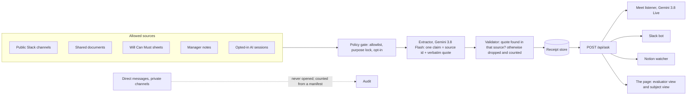

# Pik

Pik answers one question inside the tools a team already uses: **who is the best person for this?** It answers from what people actually wrote and did, with the receipt attached, and the person it names sees the same page. Nobody is scored.

Built by Carl Kho and Steven Yang (team hyderabaddies) at the Recruit Holdings Innovation Cup, San Francisco, September 25 to 27, 2026.

**Demo video:** [deck/pik_demo_90s.mp4](deck/pik_demo_90s.mp4) (90 s). **Deck:** [deck/site](deck/site/) and [deck/Pik_deck_final.pdf](deck/Pik_deck_final.pdf). **Run it yourself:** [DEMO.md](DEMO.md).

## Where it answers

| Surface | What happens |
|---|---|
| Google Meet | Pik joins the call as a participant and presents a shared page. As people talk, the words they use drift in, the people whose own receipts cover those words light up, and when the speakers agree the conclusion prints and is filed. Gemini 3.8 Live listens; Pik speaks only when addressed or when it has one clarifying question. |
| Slack | Any "who is best for..." sentence gets an answer in a thread: the person, two verbatim receipts with their sources, their load, two alternates, and one button to loop them in. |
| A ticket board (Notion) | A new ticket with no owner gets a suggested owner, the receipt that justifies it, and a link to the page. A vague ticket gets Pik's question instead. |
| The page | The same answer for both sides. The evaluator sees receipts by source. The person named sees the same receipts, no other names, and can add a note to any line before the decision is made. |

## Run it in sixty seconds

```bash
cd prototype
make run-heuristic          # no credentials, no network, deterministic
open http://localhost:8787
```

The company on the page (Kaede Works, 200 people) is fictional and generated; the fixtures live under `prototype/data/`. With Google Cloud credentials, `make run` extracts receipts with Gemini 3.8 Flash on Vertex AI, and `make live` starts the meeting listener on Gemini 3.8 Live. The Slack bot and the Notion watcher need their own tokens in `.env` (see `.env.example`). Every step, with what to say, is in [DEMO.md](DEMO.md).

## How it works



Three rules hold everywhere:

1. **A claim without a verbatim quote in a named source is dropped**, and the count of dropped claims is shown.
2. **Coverage, never a score.** "2 of 7 words in the ask have a receipt from this person" is what the engine computes. It is never sorted into a rank shown to the person, and never turned into a number about them.
3. **Both sides see the same page.** The person named can contest a line before the decision.

`POST /api/ask {question}` is the whole API. Every surface calls it and none of them ranks on its own.

## Stack

Python 3 standard library server, one HTML page (d3 for the map and the graph), `google-genai` on Vertex AI (Gemini 3.8 Flash for extraction, Gemini 3.8 Live for the meeting), `sounddevice`, `slack_bolt`, `notion-client`. Fonts: Geist and Geist Mono (OFL). World map: world-atlas land-110m.

## Repository

```
DEMO.md              how to run every surface, and what to say
prototype/           the product: engine.py, server.py, live.py, surfaces/, ui/, data/, Makefile
deck/                the demo video, the deck site and its PDF
.env.example         the tokens the Slack and Notion surfaces need
```
