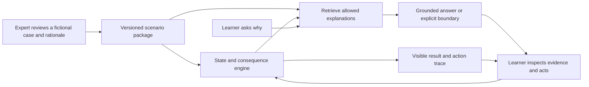

# Future-of-work opportunity research

Prepared September 25, 2026. Exploratory product hypotheses, not validated businesses. Sources read: local BRAIN.md, IDEATION.md, interviews/INTERVIEW_NOTES.md; primary public research and vendor documentation linked below. All demo people/data below are fictional. Private founder conversation is summarized only in the restricted-context note, without personal or fundraising details.

## Recommendation and evidence boundary

Do not let the strongest *interview evidence* automatically dictate the most ambitious *product*. Shion proves a workflow exists and that she actively uses Claude. She has not proved the residual pain is expensive, frequent, or purchasable. Koki describes rapid prototyping as an existing coping mechanism and explicitly downplays frustration. Neither interview establishes willingness to pay.

Take three Odyssey paths into the VP interview: (A) remove a handoff, (B) collapse conversation into a working experiment, (C) make expert experience available to people who cannot access it today. The most promising synthesis for Carl's motivation is **an expert-approved, interactive work rehearsal**: an engineer teaches one real scenario once; candidates or new hires can experience it, ask questions and practice. This connects cloning, a simulated world, career access, and Shion's scarce mentor coordination without claiming that simulated personalities predict employment success. It needs fresh validation.

Recruit judges already know AI hiring automation. Recruit's September 4, 2026 results commentary emphasizes recruiter productivity and hiring outcomes; a generic AI candidate summary will face an obvious substitution question. [Recruit, 2026-09-04](https://recruit-holdings.com/en/blog/post_20260904_0001/). The promising question is what is newly possible, which person benefits, and what evidence would make us stop.

## Three Odyssey paths and six bounded ideas

### A1. The handoff that prepares itself

**One sentence:** When Shion introduces a student to an engineer, a sourced, recipient-appropriate briefing is already drafted in the communication tool she actually uses.

**User/buyer:** Recruiter user; recruiting operations leader possible buyer. Communication channel unverified: email is a hypothesis, not an established interview fact.

**Evidence:** Strongest local workflow evidence: export Salesforce to Excel, combine entry sheets and recordings, use corporate Claude, deliver profiles to engineers excluded from Salesforce. Remaining pain after Claude is unknown. Market context from Recruit is proxy evidence only.

**Substitutes:** Her existing Claude + Excel process, CRM automation, ordinary templates. Win only if collection/checking/sharing takes meaningful effort after summarization.

**75-second demo:** 0–15 show three fictional records and an introduction draft; 15–35 request a briefing for a named engineer; 35–50 inspect a claim's source and flag a conflict; 50–65 switch HR view to mentor view to demonstrate intentional omission of internal-only fields; 65–75 add a new note and update only the affected sentence. Final result is an ordinary draft, not another dashboard.

**Real mechanism / seeded parts:** Real extraction, citations, field-level access filter, draft update. Seeded records and recipient roles. No real Salesforce connector necessary; say explicitly it is an export-based prototype.

**Measurement:** Minutes assembling and checking per candidate/batch, correction rate, recipient preparedness. Count review time; do not claim time saved until timed comparison.

**Kill criterion:** Shion says existing Claude is quick enough, packet work is infrequent, or approved data cannot reach the intended recipient. Do not bypass the access boundary.

### A2. Find the available mentor without exposing the HR file

**One sentence:** Ask for a mentor with a specific experience and language; the system finds an opted-in person and prepares the manager approval handoff.

**User/buyer:** Global TA / early-career programs; potential recruiting or learning budget owner.

**Evidence:** Shion coordinates 10–20 employees annually and relies on colleagues' knowledge and repeat lists. The scale of unresolved work is small until demonstrated across teams. Performance records are not necessary to solve this version.

**Substitutes:** Slack DMs, spreadsheet of volunteers, existing talent directory. The product must reduce coordination and uncover a useful person outside the existing list.

**75-second demo:** Ask in plain language for a Japanese/English-speaking engineer who has mentored first-time interns; reveal three fictional opted-in profiles with reasons; choose one; show calendar availability and a draft manager request; change the requirement and show a newly relevant mentor. Candidate information is not broadcast to all matches.

**Real / seeded:** Real matching and rationale over consented profile fields; synthetic directory and calendar; approval simulation marked as such.

**Measurement:** Time to confirmed suitable mentor, number of coordination messages, acceptance rate. **Kill:** existing list handles nearly all cases or managers, not discovery, are the bottleneck. Do not convert hidden performance evaluations into a ranking.

### B1. Meeting-to-experiment: the room leaves with something testable

**One sentence:** During a product discovery meeting, spoken constraints become two working alternatives that the customer can try before the call ends.

**User/buyer:** Product agency or enterprise innovation team that repeatedly turns customer discovery into prototypes; agency lead or product head buyer. Narrow customer is crucial.

**Evidence:** Koki's search-versus-recommendation debate is a concrete episode, but he already prototypes rapidly and reports little frustration. Generic meeting context is crowded: Granola supports in-meeting questions, PRD creation, and sharing meeting context into coding tools via MCP. [Granola product](https://www.granola.ai/chat), [MCP documentation](https://docs.granola.ai/article/granola-mcp), accessed 2026-09-25.

**Differentiator to test:** Explicit uncertainty → controlled alternatives → observed user interaction. Merely generating UI from a transcript is weak against a note-taker plus coding assistant.

**90-second demo:** 0–15 customer says construction workers need work near home; 15–35 two functioning experiences appear (search and recommendation); 35–55 judge adds an unplanned constraint, e.g. no car, only evenings; 55–75 both adapt and the judge performs the same task; 75–90 show which assumptions remain untested and save a concrete next experiment. Do not claim the judge's one interaction validates a market.

**Real / seeded:** Real speech/transcript extraction and bounded generation/configuration, real filtering and interactive UI; synthetic job inventory and prebuilt component grammar. Disclose the grammar. This delivers responsive magic without pretending an arbitrary production app appeared from nothing.

**Measurement:** Time from disputed requirement to usable comparison, number of mismatches identified before handoff. **Kill:** customer says the limiting factor is authority or access to users, not making alternatives; existing tools are equally quick; live agent interrupts enough to harm the discussion.

### B2. Teach it once: a visible rehearsal before invisible execution

**One sentence:** An operations expert demonstrates a repetitive exception, explains the judgment, and sees the assistant rehearse it on a new case before authorizing use.

**User/buyer:** Service operations team with recurring exceptions; operations manager. Start with harmless sandbox cases such as a missing field in an internal request, not payments or hiring decisions.

**Evidence:** External evidence supports knowledge transfer as a mechanism, not this product. NBER's 2023 study of 5,179 support agents reported 14% average productivity improvement and 34% among novice/lower-skilled agents; it suggested dissemination of experienced agents' practices. Do not apply those percentages to the demo or recruiting. [NBER, April 2023; revised November 2023](https://www.nber.org/papers/w31161).

**Substitutes:** Written SOP, workflow automation, human training, general computer-use agents. Differentiation is eliciting the exception rule and testing it rather than replaying clicks.

**90-second demo:** Expert handles fictional request A; system asks “what would make you escalate instead?”; expert states a condition; request B has changed layout but same rule; assistant completes sandbox steps; request C violates the rule and pauses with the reason. End with a trace comparing novice behavior, expert rule, and assistant behavior.

**Real / seeded:** Real rule extraction, state transition and task execution in controlled UI; seeded requests. No claim of general employee cloning from one example.

**Measurement:** Correct novel-case completion, escalation precision, expert review time. **Kill:** rule is already fully captured in a simple form, demonstrations cannot capture needed context, or no measurable frequent exception exists.

### C1. Borrow an expert's judgment: an interactive apprenticeship

**One sentence:** A senior worker turns approved real decisions into practice situations that teach newcomers what to notice, when to act, and when to ask for help.

**User/buyer:** New hires/trainees; learning or operations leader. For Shion, engineer mentors could author a small preview of engineering work that students explore before a live meeting. That application is unvalidated.

**Why now / social impact:** Japan's challenge is also transferring capability when experienced labor is scarce. Recruit Works Institute's 2023 simulation projects a 2040 labor shortfall around 11 million; this is a modeled scenario, not a current vacancy count or product TAM. [Research project](https://www.works-i.com/research/project/futureofwork/). Japan's 2025 SME White Paper includes AI-assisted transfer of tacit craft knowledge; its page describes turning experience and intuition into explicit knowledge. [METI SME White Paper, 2025](https://www.chusho.meti.go.jp/pamflet/hakusyo/2025/chusho/b1_1_4.html). This is evidence of relevance, not purchase intent for our product.

**Substitutes:** Delphi Digital Minds, internal knowledge search, training videos, mentor office hours. Delphi already offers interactive expertise and repeated-question handling. [Delphi product](https://www.delphi.ai/), accessed 2026-09-25. Differentiate by decisions with consequences and expert-approved feedback on attempted work.

**90-second demo:** A fictional senior engineer teaches a support incident with two subtle clues; trainee enters a small simulated office and receives a task; they choose an action and see consequences; ask the expert model “why not restart it?”; it retrieves the specific approved example; change one clue and the recommended action changes; ask an out-of-scope question and it escalates. The magic is transferable judgment, not face/voice mimicry.

**Real / seeded:** Real retrieval from approved scenario records, grounded explanation, stateful branching, scope checks; seeded environment, expert notes and visual world. Label model as AI representation; no claim that it is the actual person.

**Measurement:** Transfer to a held-out scenario, expert interruptions avoided, time to competent completion. **Kill:** answers cannot beat documents on held-out scenarios, expert authoring/review is too costly, or the worker does not want this use of their knowledge.

### C2. Try the job before choosing the job

**One sentence:** A student spends ten minutes inside a realistic workday, collaborating with fictional colleagues, and leaves knowing whether the work interests them and what they need to learn.

**User/buyer:** Students/career changers; employer early-career marketing or university careers buyer. Free-to-learner is a plausible model, not a pricing conclusion.

**Evidence/substitute:** Forage already sells employer-designed simulations and offers them free to learners; its catalog demonstrates category adoption. Vendor outcome claims are observational/marketing, not proof that simulations cause employment gains. [Forage about](https://www.theforage.com/about), [simulation catalog](https://www.theforage.com/simulations), accessed 2026-09-25. A generic virtual internship is not novel; dynamic coworkers, changed constraints and learner-controlled questioning must add value.

**90-second demo:** Student enters a Habbo-like office for a fictional engineering role; a colleague requests help prioritizing a bug; student inspects evidence and asks questions; another colleague changes the deadline; consequences become visible; learner receives an artifact of what they tried and a comparison of two role styles. Finish by showing the student can reset, learn, and choose what to share.

**Real / seeded:** Real agent dialogue anchored to scenario rules, persistent task state, actual work artifact; seeded fictional coworkers and tasks. Do not show a magical compatibility percentage or infer employability from simulated agents chatting with each other.

**Measurement:** Role understanding before/after, voluntary completion, learner preference clarity, employer willingness to sponsor, authoring cost. **Kill:** fun does not improve role understanding, employers only want automated ranking, or scenario accuracy requires too much expert labor. Do not claim bias-free assessment; keep this exploratory/training unless assessment validity is separately established.

## Observable Intuition: what can and cannot be concluded

Public homepage now identifies itself as **Collective Intuition**, with a July 2026 manifesto. It describes making organizational state/action/consequence learnable, deploying in large enterprises, and models private to each customer. It does not publicly demonstrate a validated full cognitive clone of an employee or name the financial company in Carl's question. [Homepage](https://observableintuition.com/), accessed 2026-09-25.

The public enterprise terms, version 1.0 (effective at first Order Form; no fixed publication date shown), prohibit using customer data to benefit other customers or third-party models without written consent; assign lawful rights/consents to the customer; provide for role-based controls, encryption, a data-processing addendum and human review. Storage region follows the Order Form; without an agreed restriction, the terms permit processing in any jurisdiction. They expressly do not establish that a particular security certification already exists. These are public contractual commitments, not evidence of a named bank's consent process or successful implementation. [Enterprise terms](https://www.observableintuition.com/terms-of-service), accessed 2026-09-25.

The May 28, 2026 public privacy policy primarily concerns website/demo-contact data. Do not cite it as though it explains employee observation deployments. [Privacy](https://www.observableintuition.com/privacy).

Restricted-context note, not for a public pitch: Carl's September 9 conversation reported limited capture modalities, including screen/UI state, click coordinates and keystroke timing rather than key contents, with faces blurred and audio excluded by policy. This is an unverified founder account of design choices, **not** proof of enterprise or individual consent, regulator approval, or anonymization. Screenshots can still contain sensitive information. We do not have the private agreement and cannot answer how that particular customer approved deployment.

Useful design inference for our demo: use an explicitly approved set of professional examples, show scope and deletion controls, preserve recipient permissions, and distinguish “expert-inspired answer” from the person's actual decision. Data minimization makes review easier; it does not itself supply permission.

## Questions that select among directions

1. VP: “Where does a capable employee still need to wait for another person's experience or judgment? Tell us the last actual case.” Follow with frequency, consequence, current workaround and budget owner. This can distinguish knowledge transfer from mere paperwork.
2. Shion tomorrow: “After Claude creates the profile, what work is still left before an engineer can use it?” Then ask for an example packet/process, with redacted or fictional content.
3. Engineer/mentor: “What do students or new colleagues repeatedly need to experience or try before your advice makes sense?” Ask whether a practice scenario would reduce repetition or just create more review work.

## What not to claim in the pitch

- A workaround equals a painful business; a macro labor forecast equals our TAM; a competitor's customer count equals our demand.
- A seeded showcase is live integration; a prebuilt world is generated from nothing; a simulated council predicts the judges; one demo proves time savings.
- A model speaking like someone can predict their work performance or chemistry with another person. For now, role-play the environment and observe actual learner choices.

## Practical prioritization

Best fit for **Carl's energy + future-of-work magic:** C1, with C2's playful interface and B2's demonstration of a changed-condition test. Most defensible near-term interview evidence: A1. Fastest Astra-style wow: B1, but weakest differentiation unless tied to a specific repeated customer problem. Do not combine all six in one hackathon build. Interview evidence tomorrow should choose one narrow entry point and one measurable result.

---

# Judges, audience, competition, and rehearsal design

Research date: September 25, 2026. Read-only source review. This is preparation, not a prediction of judges' preferences or scores. Council roles below are fictional expertise lenses, not impersonations.

## Verified event requirements

Source: [attachments/InnovationCup2026_Day1_Slide.pdf](../../attachments/InnovationCup2026_Day1_Slide.pdf), pages 7–19, 21, 27. Extracted full text and visually inspected schedule, rubric, submission, preliminary and final slides. Also extracted all slides and speaker notes from `hackathon_template.pptx`.

- Theme (pp11–12): envision a product driving innovation in the future of work. Work includes individuals, teams, organizations, labor systems, society. No requirement to fit Recruit's businesses. AI optional. Clear problem, target user, approach matter more than stack.
- Rubric (p14): Potential Impact 40% covers BOTH social impact (problem importance/scale, meaningful user/society benefit) and business potential (demand, market opportunity, sustainable growth). Creativity & Innovation 30%: original insight, novel approach/combination, clear differentiation. Technical Architecture 30%: appropriate technology, realistic design, PoC demonstrating the key idea, credible practical path. No official numerical split inside the 40% category.
- Sunday September 27 11:00 AM PDT submission: public GitHub repository, link to demo or prototype video up to 1.5 minutes, PDF deck. Submit via Recruit Community Workspace Slack `#announcements-all`. No changes after deadline; lateness disqualifies (p17).
- Prelim: Sunday 1:30–2:45 PM, all teams; 3-minute presentation + 1.5-minute Q&A. Laptop ready beforehand. Order announced Saturday 6:30 PM (p18).
- Final: Sunday 3:10–3:55 PM, 3 teams; 6-minute presentation + 6-minute Q&A. Same slides/demos allowed with more detail; prepare final beforehand because there is no setup time after results (p19). Interpretation: include needed final detail before submission rather than assume post-deadline edits allowed.
- Grand prize $20,000 plus conditional $30,000 if project becomes a business, with 3-month acceleration. Two special awards $10,000 each (pp21–22). Do not call the conditional amount guaranteed.
- Original, previously unpublished output made during hackathon. No pre-opening code or existing self-authored libraries; public OSS allowed with licenses and substantial components disclosed. Pre-event discussion/ideas allowed (p15). Revisit Astra's concept if useful, but rebuild rather than reuse pre-event personal code.
- p27: no personal information in prompts; do not reuse AI-suggested ideas as-is. Treat this research as inputs for Carl and Steven to synthesize and validate. Fictional demo data helps comply with the specific event restriction.

### Saturday is mentoring and work, not documented industry rotations

All times PDT, September 26 (pp7–9):

| Time | Published schedule |
|---|---|
| 6:00 AM–12:30 PM | Free time, technical support 10–11 AM |
| 12:30 PM | Gather |
| 12:30–2:30 PM | Lunch and mentoring |
| 2:30–5 PM | Work |
| 5–6 PM | Mentoring |
| 6–6:40 PM | Work / announcements |
| 6:40 PM–midnight | Work / free time, technical support 8–9 PM |
| Midnight–6 AM | Restricted entry/exit, direct hotel travel only |

Hiro: reserve 30-minute spot via thread posted Friday 7 PM, Golden Gates (1F). Walk-in mentoring: in front of Amazing Grace (1F), preferences can be requested. Channel `#ask-mentors-techsupporters`. No published guarantee of external-industry interviewees. No VP midnight appointment is in this schedule; Carl's interview information is separate and appointment remains unconfirmed.

### Template requirements

Eight sections in this order: Title; Problem; Inspiration; Solution Overview; Impact; Differentiation; Technical Design; Future Roadmap. Layout can change; required labels must be addressed. Problem + insight max 200 words, differentiation max100, technical max150, roadmap max75. Solution needs a visual; architecture needs diagram. At least one supported impact number, labeled VERIFIED / RESEARCH / CALCULATED / ILLUSTRATIVE, with inputs, method, source, sample/conditions, assumptions. Speaker notes say member names/roles belong in Slack submission, although title placeholder includes members: minor source inconsistency, prioritize notes or clarify if relevant. No need to cram names in pitch.

## Actual people and evidence-based relevance

### Jim Giles — CTO, Indeed

Event deck p16 identifies him. Indeed's February 16, 2026 appointment announcement says he previously led engineering for Google Docs/Sheets/Slides/Drive and founded Workspace AI platform. He describes a career interest in improving work and simplifying hiring. This makes real workflow value and integration credible rehearsal lenses, but does not establish how he will judge.

Primary source: [Indeed appointment announcement](https://www.indeed.com/news/releases/indeed-appoints-jim-giles-as-chief-technology-officer?co=US). Japanese corroboration: [Indeed leadership, Japanese](https://jp.indeed.com/about/leadership).

Inferred rehearsal questions: Which recurring task disappears? Why will a user adopt this inside current tools? Does a hiring product improve opportunity for the candidate as well as throughput for the employer? Where does unreliable output make the process worse?

### Robert Hohman — Glassdoor co-founder and former CEO

Event deck's title is the appropriate event label; do not call him current CEO. His authored 2015 Glassdoor mission post describes making employer culture, pay and interview information accessible so people can make better workplace decisions. His earlier career includes Expedia booking engineering and Hotwire leadership. Those are public facts, not a license to infer private investment preferences.

Primary sources: [Hohman's Glassdoor mission post](https://www.glassdoor.com/blog/ceo-robert-hohman-talks-about-the-glassdoor-mission/); [US Economic Development Administration historical biography](https://www.eda.gov/strategic-initiatives/national-advisory-council-on-innovation-and-entrepreneurship/board/2014-16/Robert-Hohman).

Inferred rehearsal questions: What information imbalance does this remove? Who pays and who benefits? Does the worker gain agency? Why would either side trust the information? What differentiated value survives once incumbents add similar model features?

### Damien Contreras — Data Cloud Specialist, Strategic AI, Google Cloud

Event deck p16 gives title. Particularly relevant primary artifact: he authored a live Godot/Google Cloud AI gaming demo. It uses telemetry and screenshots for proactive contextual assistance and adaptive game difficulty, with an accompanying published codebase. Thus a playful live world is plausibly legible to this audience; it is not novel simply because it is a game or changes live. The article is personal, not official Google policy.

Sources: [Contreras, Retro Tech Revolution](https://medium.com/google-cloud/next25-retro-tech-revolution-04d260746cf3), [GoogleCloudDevRel repository](https://github.com/GoogleCloudDevRel/next25-retro-tech-revolution). Public profile search also matches Google, but no need to infer views from liked posts.

Inferred rehearsal questions: What event triggers an intervention? What happens during inference delay? Is data collection necessary and proportionate? Can you demonstrate a novel input altering output? Why is a simulated world the right interface for this work outcome?

### Ho Joon Cha — Applied AI Architect, OpenAI (event title)

OpenAI Academy lists him as Solutions Engineer in a May 19, 2026 enterprise workspace-agent webinar discussing deployment, approvals, safeguards and governance. Titles differ by source/date; use event title for event materials. Public evidence supports an enterprise implementation lens, not attributing particular opinions to him.

Primary source: [OpenAI Academy enterprise agent event](https://academy.openai.com/public/events/workspace-agents-guidance-for-chatgpt-enterprise-admins-zs4dny9yey).

Inferred rehearsal questions: What does the model decide vs deterministic software? What permissions does execution require? How are harmful errors caught? How do evaluations distinguish useful behavior from a polished single run? What can you show actually working now?

## Fictional council rubric

Every rehearsal must begin: “Fictional critique generated for preparation. These are not statements by the actual judges, and scores do not predict judging.” Use role names, not judge names in dialogue: Workflow & Scale; Worker Value & Business; Real-time Systems; Enterprise AI Reliability.

Use actual 40/30/30 category weights. Proposed internal anchors (not organizer-issued subcriteria scores):

- Impact /40: 0–10 clear target and observed problem; 0–10 measurable benefit with credible baseline; 0–10 buyer/demand/adoption; 0–10 social benefit and foreseeable exclusion addressed.
- Creativity /30: 0–10 non-obvious insight; 0–10 differentiated mechanism against real alternatives; 0–10 useful new interaction/outcome.
- Technical /30: 0–10 demonstrated core mechanism; 0–10 feasible architecture/data access; 0–10 reliability, human control and path beyond fixture data.

Rate evidence separately: observed interview, external research, tested PoC, assumption. A beautiful rendering does not promote assumptions into evidence. Reviewer disagreement should remain visible. At least one critic should argue why an apparently winning idea loses. Report score ranges or rank instability, not “winning probability.”

For ten independent passes, vary the stress test rather than repeating a friendly panel: 1 baseline; 2 buyer skeptical; 3 incumbent comparison; 4 worker downside; 5 data access unavailable; 6 novel input; 7 latency/outage; 8 small-team feasibility; 9 social scale; 10 final head-to-head using the same frozen evidence packet. Keep a full transcript with pitch, stage directions, questions, answers, critique and revised recommendation. Each includes prelim and final assessment, and explicit demo truth table.

## Three idea families through four expertise lenses

| Idea | Workflow & Scale | Worker Value & Business | Real-time Systems | Enterprise AI Reliability |
|---|---|---|---|---|
| Employee expertise clone | Which expert interruptions or blocked decisions recur? | Who controls likeness/knowledge? Is worker helped or merely replaced? What does buyer pay for? | How does new evidence update advice without full retraining? | Access boundaries, revoked permission, uncertainty, no pretending to be the person |
| Work-trial universe | Which real task does simulation represent? | Does candidate learn about employer too? Who gets excluded by games/language/time? | Can changing a scenario produce meaningful behavior rather than cosmetic animation? | No unvalidated personality/hiring scores; show task evidence and human judgment |
| Live meeting-to-prototype agent | Which decision currently waits days for a shared artifact? | Is saved time real vs simply moving work to cleanup? Who buys? | Interruption, latency and novel constraint handling live | Requirements vs suggestions distinguished; safe execution and undo; trace decision to artifact |

### Demo truth table, applied to every idea

Label fictional people/data. State which inputs are fixed, which outputs are prerecorded, which transformations execute live, and what remains proposed. Fixtures are useful for reproducibility; hardcoding the claimed key technical behavior cannot demonstrate that behavior. Submitted video may be prerecorded, clearly presented as a recording. A valid narrow PoC can be compelling: prove one surprising transformation on a judge-supplied variation. Do not imply production integration or customer approval from a local mock.

## Time-boxed presentation design

Prelim 180 seconds: title 10; problem25; observed insight20; solution/demo55; measured impact25; differentiation15; architecture20; roadmap10. This preserves section order by placing live demo inside solution. Q&A90: two substantive answers with supporting evidence ready. Technical diagram remains visible long enough to understand, not decorative.

Final360 seconds: title10; problem40; insight30; solution/demo100; impact55; differentiation35; architecture60; roadmap30. Q&A360: expect buyer/demand, comparison, evidence quality, privacy/data access, failed-input behavior and long-term roadmap. All durations are suggestions, not rules.

Standalone90-second demo: 0–12 specific person and stuck moment; 12–25 input and baseline; 25–60 core transformation; 60–75 new constraint or failure handled; 75–90 resulting usable artifact and boundary of what actually works. Avoid a tour of settings. The audience should be able to describe the before-and-after without saying “AI dashboard.”

## Widening beyond recruiting: evidence added after baseline councils

The Japanese Ministry of Health, Labour and Welfare's 2025 Foreign Employment Survey, published August 31, 2026, reports that 46.2% of responding establishments cited difficulty communicating because of Japanese proficiency and related factors. Valid responses covered 3,919 establishments and 14,248 workers; the establishment frame required at least five insured employees and one foreign worker. This is an employer-reported communication issue, not a measure of worker competence or demand for our product. [Japanese press-release PDF, pp1–2](https://www.mhlw.go.jp/content/11655000/001742821.pdf).

Product hypothesis: a newcomer rehearses a difficult customer conversation in their preferred language, then practices the workplace-language version, with the same underlying task and visible uncertainty. Hospitality/service onboarding is one possible entry point. A supervisor validates the scenario; the worker chooses what to share. Show an actual task consequence, not just translation. The buyer would be a training/operations manager; no such buyer has been interviewed here. Kill it if translation plus existing training is adequate, or authoring/review costs exceed the benefit. This is a cross-industry challenger for later rounds, not additional evidence validating Shion's use case.

Another concrete Japanese precedent is the SME White Paper's Tayama Studio case, which describes making tacit craft knowledge teachable through combined training and technology initiatives. Treat it as a knowledge-transfer precedent, not proof that AI alone reduced training time. [2025 SME White Paper](https://www.chusho.meti.go.jp/pamflet/hakusyo/2025/chusho/b1_1_4.html).

Broader research therefore supports investigating access to experience. It does not establish that an animated world is necessary, that an employer will pay, or that a simulated task predicts hiring success. Those are separate questions for tomorrow's interviews and an actual held-out task trial.

## Odyssey exercise: ten-year futures, worked backward

These are imaginative scenarios, not forecasts. Their purpose is to recover playfulness without committing to an enormous build.

**If we follow today's path:** An introduction no longer starts with someone assembling a packet. People carry an accurate, permissioned account of what a collaborator needs to know, updated at the moment of handoff. The narrow weekend experiment is one briefing with a changed source and two recipient permissions. The ten-year question is whether coordination can become an ambient service; the near-term question is whether any meaningful work remains after today's tools.

**If this path disappears:** Meetings become places where people try alternatives rather than describe them. A customer changes a constraint and the room experiences the consequence immediately. The weekend experiment is one disputed workflow with two live, bounded alternatives. The ten-year question is how decision-making changes when experimentation becomes conversational; the near-term question is which repeated decisions are constrained by experiment cost rather than organizational authority.

**If money and permission to be weird were no issue:** A person could visit possible working lives before choosing one, and practice unfamiliar decisions with an expert's approved experience. A tiny office world is one possible doorway; a familiar inbox could be another. The weekend experiment is one consequential task with a changed condition and grounded feedback. The ten-year question is whether access to experience can become less dependent on network, geography and spare mentor time. The near-term question is whether anyone learns something consequential that the cheaper alternative fails to teach.

The scope discipline is not to make the ambition small. It is to make one surprising piece of the ambition observable this weekend. None of these requires pretending the whole future is already built.

## One buildable mechanism for the ambitious path

Proposed architecture, not implemented:

The state engine owns what happened. The model can interpret a question and explain it; it must not invent a different outcome to make its answer sound convincing. The UI can be an inbox, task workspace or playful room depending on the user's actual context. The engine and learning outcome should survive removing the decorative world.

Weekend scope: one case, one meaningful variable that changes the consequence, one source-grounded explanation, one unsupported-question path and one useful output artifact. Longer-term possibility: expert-reviewed scenario authoring and a reusable library. That expansion is a roadmap hypothesis, not an already solved scalability claim.
